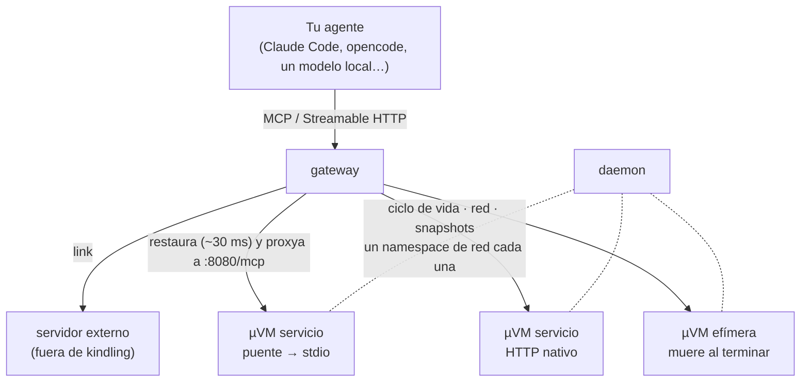

<p align="center">
  
</p>

<p align="center">
  <a href="https://github.com/juan52878911/kindling/releases"></a>
  <a href="https://github.com/juan52878911/kindling/actions/workflows/ci.yml"></a>
  
  
</p>

<p align="center"><a href="README.md">English</a> · <b>Español</b></p>

# kindling

Un runtime de microVMs Firecracker con snapshots dorados: máquinas que despiertan en
milisegundos desde un fichero en disco, con aislamiento a nivel de kernel, detrás de un CLI
al estilo de docker llamado `kling`. Lo que corre dentro lo decides tú, y `kling` crece con
extensiones.

> Estado: **v0.7.0 — sandboxes para agentes de código.** `kling` gestiona microVMs con
> red, snapshots dorados, aislamiento, volúmenes persistentes, imágenes por capas, eventos,
> constructores de imágenes, un API del daemon documentado y sandboxes de usar y tirar
> con exec en streaming. Alojar servidores MCP bajo
> demanda — el uso para el que nació kindling — vive ahora en la extensión
> **[kindling-mcp](https://github.com/juan52878911/kindling-mcp)**, que añade `kling mcp`,
> `kling add`, `kling connect`, `kling gateway` y el resto al mismo comando `kling`. En el
> [CHANGELOG](CHANGELOG.md) está lo que trajo cada versión.

**El invitado se asume hostil**: no se sabe qué código acabará corriendo dentro. En
[SECURITY.md](SECURITY.md) están el modelo de amenaza, las barreras que hay y — sobre
todo — lo que NO está resuelto todavía.

## De un vistazo

Cada número de abajo está medido, no estimado — el cómo y el dónde, en las secciones
enlazadas:

| | Medido |
|---|---|
| Descongelar una herramienta | **~30 ms** — imperceptible dentro de una llamada |
| Acción efímera, de punta a punta | **19 ms** (2 ms de ejecución real) |
| Llamada a herramienta, en caliente | **9 ms** |
| RAM de una máquina `warm` | **0** — es un fichero en disco, no un proceso |
| Densidad | **142 microVMs en 3,9 GB** de RAM del host |
| 10 instancias de un mismo dorado | **+68 MiB** en total (12× más denso que arrancar en frío) |
| Disco por servicio, con imágenes por capas | **1300 MiB → 433 MiB** en un parque de 7 servicios |
| 20 llamadas concurrentes, mismo servicio | p50 **4,66 s** (eran 44 s antes de v0.4) |

## Índice

<details open>
<summary><b>Desplegar / plegar</b></summary>

**La idea**
· [Por qué microVMs y no contenedores](#por-qué-microvms-y-no-contenedores)
· [Arquitectura](#arquitectura)
· [Números medidos](#números-medidos)

**Primeros pasos**
· [Instalación](#instalación)
· [Dejar el runtime listo](#dejar-el-runtime-listo--kling-up)
· [Conectar con el daemon](#conexión)
· [Configuración](#configuración)
· [En un Mac (Apple Silicon)](#en-un-mac-apple-silicon)

**El CLI**
· [kling](#kling)
· [Snapshots dorados](#snapshots-dorados)
· [Ciclo de vida y robustez](#ciclo-de-vida-y-robustez)
· [Red](#red-un-namespace-por-microvm)

**Sandboxes**
· [Sandboxes para agentes de código](#sandboxes-para-agentes-de-código)

**Extensiones**
· [Extensiones: servidores MCP y más](#extensiones)
· [kindling-mcp](#kindling-mcp-servidores-mcp-bajo-demanda)
· [Escribir una extensión](#escribir-una-extensión)

**Almacenamiento**
· [Volúmenes](#volúmenes-lo-que-sobrevive-a-la-microvm)
· [Una biblioteca de paquetes compartida](#una-biblioteca-de-paquetes-compartida)
· [Qué persiste y qué no](#qué-persiste-y-qué-no)

**Rendimiento y densidad**
· [Coste en disco](#coste-en-disco)
· [Imágenes por capas](#imágenes-por-capas-una-base-por-familia-de-runtime)
· [Densidad](#densidad-por-qué-el-snapshot-dorado-lo-cambia-todo)
· [Devolver la RAM: squeeze, top, /metrics](#devolver-la-ram-squeeze-top-y-metrics)
· [Despertares más rápidos](#despertares-más-rápidos-hijo-caliente--bundle--techo-de-cpu)

**Seguridad**
· [Aislamiento](#aislamiento)
· [Egress: none, internet, allowlist](#egress-none-internet-o-una-allowlist-de-dominios)
· [Secretos vía MMDS](#secretos-que-nunca-tocan-un-snapshot-mmds)

**Operación**
· [Informe de topología](#informe-de-topología)
· [Memoria: real vs caché](#memoria-qué-es-real-y-qué-es-caché)

**Referencia**
· [Requisitos](#requisitos)
· [Scripts](#scripts)
· [Mapa de la documentación](#mapa-de-la-documentación)
· [Hoja de ruta](#hoja-de-ruta)

</details>

## Por qué microVMs y no contenedores

Un servidor MCP es un proceso de Node o Python de 50-100 MB. Meterlo en una microVM no
ahorra recursos frente a un contenedor — cuesta más, porque cada microVM arranca su
propio kernel.

La razón de hacerlo es otra: **una IA local ejecutando herramientas arbitrarias de código
abierto es código no confiable**. El aislamiento de un contenedor es un namespace del
kernel compartido; el de una microVM es una frontera de hipervisor. Esa es la única
justificación honesta del proyecto, y conviene tenerla clara antes de escribir una línea
más.

## Arquitectura



El **gateway** recibe la llamada, restaura el snapshot que corresponde, proxya la
petición y siega la microVM cuando expira su TTL. Dentro del invitado llama siempre al
mismo sitio, `:8080/mcp`, hable el servidor stdio (con `kling-bridge` traduciendo) o
Streamable HTTP nativo (sin nada en medio).

El **daemon** gestiona el ciclo de vida y es el único que alcanza a los invitados: sus IP
solo existen en la red del host. Por eso expone `POST /machines/{ref}/guest`, que reenvía
una petición HTTP al servidor de dentro. Sin él, `kling mcp import` solo funcionaría
ejecutando el CLI en el propio host — por SSH la sonda no tiene ruta y agota el tiempo.

## Números medidos

Medidos en Proxmox (Intel i7-8700T) con Firecracker v1.16.1 corriendo **anidado** dentro
de una VM, kernel 6.1.177 y un rootfs Ubuntu 24.04 de 800 MB:

| Operación | Tiempo |
|---|---|
| Arranque en frío | **2.643 ms** |
| Crear el snapshot | 305 ms |
| **Restaurar desde snapshot** | **~30 ms** |

Se reproducen con `scripts/40-bench-boot.sh`.

**La conclusión que define la arquitectura:** 2,6 s en frío hacen inviable el modelo de
una-microVM-por-petición. Los 125 ms que anuncia Firecracker asumen un kernel recortado y
un rootfs mínimo en metal desnudo. Con snapshot/restore, 30 ms son imperceptibles dentro
de una llamada a herramienta.

Por tanto: **cada herramienta arranca una vez, se congela con el servidor MCP ya
escuchando, y el gateway la restaura bajo demanda.** El snapshot no es una optimización
opcional; es lo que sostiene todo lo demás.

---

# Primeros pasos

## Instalación

**Opción rápida — binarios precompilados (recomendada):**

```sh
# macOS / Linux — una línea, sin dependencias
curl -fsSL https://raw.githubusercontent.com/juan52878911/kindling/main/scripts/install.sh | sh

# Servidores MCP: instala encima la extensión kindling-mcp
curl -fsSL https://raw.githubusercontent.com/juan52878911/kindling-mcp/main/scripts/install.sh | sh

# Versión concreta (por defecto instala la última release):
curl -fsSL .../install.sh | sh -s -- --tag v0.4.0

# Prefijo personalizado:
curl -fsSL .../install.sh | sh -s -- --prefix ~/.local
```

Los binarios se publican en
[Releases](https://github.com/juan52878911/kindling/releases) para **linux/amd64**,
**linux/arm64**, **darwin/amd64** y **darwin/arm64**. Cada release lleva un
`SHA256SUMS`, y el script de instalación verifica el checksum antes de mover nada al
disco. **Windows no está soportado** — el código usa syscalls POSIX (`syscall.Kill`,
`Setsid`, `Stat_t`).

**Desde fuentes — `make`:**

```sh
make install                              # el CLI en tu máquina
make deploy HOST=ssh://juan@192.168.2.60  # el daemon en el host con KVM
```

`make install` elige el primer directorio escribible de tu PATH y **no pide sudo**:
instalar una herramienta de usuario no debería requerirlo. Fuérzalo con
`make install PREFIX=/usr/local` si la prefieres de sistema.

`make deploy` compila para `linux/amd64`, copia el binario y la unidad de systemd, y
arranca el servicio. La unidad entrega el socket al usuario con el que entras por SSH,
para no tener que correr el cliente entero bajo sudo. La compilación es paramétrica por
arquitectura con `GOARCH`: para desplegar a un host arm64, `make deploy GOARCH=arm64
HOST=ssh://...` (el binario sale como `kling-linux-arm64`).

Detalles del ciclo de releases: [`docs/releases.md`](docs/releases.md).

## Dejar el runtime listo — `kling up`

```sh
kling up        # comprueba KVM, nftables, el usuario kindling, artefactos e imágenes
kling status    # diagnóstico de una pasada: daemon, gateway y los agentes que encuentre
```

`kling up` **imprime** los comandos que necesitan privilegios en vez de ejecutarlos:
dejar que un instalador toque nftables y cree usuarios de sistema por su cuenta es pedir
una confianza que no hace falta pedir. El kernel y la imagen base van dentro del binario,
así que no hay ningún script que correr antes.

Los dos fallos silenciosos que caza — los que cuestan una tarde si se cuelan — son un
`nft` ausente (las microVMs arrancan sin red) y un usuario `kindling` ausente
(Firecracker acaba corriendo como root).

## Conexión

El mismo binario es CLI y daemon. `kling daemon` corre donde esté KVM; el CLI le habla
por un socket Unix, en local o a través de SSH:

```sh
export KLING_HOST=ssh://juan@192.168.2.60   # daemon remoto
export KLING_HOST=/run/kling.sock           # daemon local
```

**El daemon nunca escucha en un puerto de red.** Controlar microVMs equivale a root en su
host: puede montar discos y arrancar kernels arbitrarios. Exponerlo por TCP repetiría el
error que le ha costado a Docker una década de servidores comprometidos. Para el acceso
remoto usa SSH con la misma técnica que `docker context`: en vez de exigir socat o nc al
otro lado, invoca `kling dial-stdio`, que puentea la tubería SSH con el socket local.

## Configuración

Contextos con nombre, al estilo de `docker context`, para no cargar con `KLING_HOST`:

```sh
kling context add lab ssh://juan@192.168.2.60 -description "Proxmox de casa"
kling context use lab
kling context ls
```

Y valores por defecto, para no repetir las mismas opciones en cada `run`:

```sh
kling config set defaults.image min
kling config set defaults.ttl_seconds 600
kling config set gateway.idle 5m
kling config show
```

El fichero vive en `~/.config/kling/config.json` — también en macOS: `UserConfigDir()`
lo pondría bajo `~/Library/Application Support`, que está bien para apps de escritorio
pero sorprende en un CLI.

**Precedencia:** `-H` > `$KLING_HOST` > contexto activo > socket local. El flag siempre
gana, así que una invocación puntual no te obliga a cambiar de contexto.

El autocompletado viene con el binario: `source <(kling completion bash)` o
`source <(kling completion zsh)`.

## En un Mac (Apple Silicon)

Firecracker no corre nativo en macOS. En un **M3 o superior** con macOS 15+ corre dentro
de una VM Linux aarch64 con virtualización anidada — **soportado, con límites**: los
arranques en frío son más lentos bajo KVM anidado (~16 s por réplica nueva frente a ~3 s
en Linux nativo, con palancas medidas para bajarlo a ~2,5 s), así que vale para
desarrollo local y evaluación, no para alta concurrencia.

```sh
make deploy-mac HOST=ssh://...   # atajo: despliegue GOARCH=arm64 a la VM de Lima
```

La receta reproducible completa — configuración de Lima, requisitos de nested virt, y
las tres palancas medidas para acelerar el arranque en frío (`-bundle`, `-cpu-pct 100`,
modo http-proxy) — está en [`docs/mac-arm64.md`](docs/mac-arm64.md).

---

# El CLI

## kling

> Las transcripciones de abajo están reproducidas tal cual: lo que ves aquí es lo que la
> herramienta imprime de verdad (el CLI habla inglés).

```
$ kling info
endpoint:     ssh://juan@192.168.2.60
daemon:       0.1.0
root:         /var/lib/kindling
KVM:          yes
firecracker:  Firecracker v1.16.1
machines:     7

$ kling run -name mcp-demo
efad9e5f7003  mcp-demo  booted cold in 54 ms

$ kling freeze mcp-demo
efad9e5f7003  warm  (754 ms, 256 MiB on disk)

$ kling ps
ID             NAME       IMAGE     STATE   CPU/MEM    DISK   EGRESS   AGE   LAST OP
efad9e5f7003   mcp-demo   default   warm    1/256MiB   81M    none     17s   freeze 754ms, 256MiB

$ kling thaw mcp-demo
efad9e5f7003  running  (22 ms)
```

El estado **`warm`** es lo que separa a kindling de un runtime de contenedores: la
máquina está congelada en disco, no quema ni CPU ni RAM, y despierta en decenas de
milisegundos.

## Snapshots dorados

Congela una máquina una vez e instancia N copias que **comparten su memoria**:

```
$ kling commit plantilla golden
golden  golden snapshot  (80M of memory)
instantiate with:  kling run -from golden

$ kling run -from golden -name g1
a3f9...  g1  instantiated from golden in 34 ms

$ kling snapshots
NAME     IMAGE     CPU/MEM    MEMORY   DISK   INSTANCES   AGE
golden   default   1/256MiB   80M      80M    10          21s

$ kling events
23:52:20  machine.frozen   mcp-demo  frozen in 754 ms (256 MiB on disk)
23:52:20  machine.thawed   mcp-demo  thawed in 22 ms
```

`kling commit` **exige que el invitado esté sirviendo** antes de congelar un dorado
(`-wait`, 60 s por defecto). Un snapshot tomado antes de tiempo restaura en 26 ms y luego
no contesta — minutos u horas después, con un error que no menciona el commit. Si el
invitado no sirve, commit se niega y explica la cadena entera; `-force` salta la
comprobación y `-replace` sustituye un snapshot existente de forma atómica.

Por defecto el snapshot se congela con un **hijo caliente sin ligar** dentro, así que el
dorado no paga el arranque del runtime al restaurar (arrancar `node` son 300-500 ms de
cualquier despertar). Eso triplica aproximadamente el coste en disco del snapshot — 39 MB
→ 120 MB en un servicio node — así que `kling commit -warm=false` cambia latencia de
despertar por disco cuando alojas muchos servicios.

## Ciclo de vida y robustez

```sh
$ kling run -image min -ttl 300 -cpu-pct 25 -egress internet
$ kling logs <ref> -tail 50        # consola serie: la única ventana hacia dentro
```

- **`-ttl`** congela la máquina por sí sola pasado ese tiempo. Congela, no mata: deja de
  costar CPU y RAM, pero vuelve en ~30 ms. Es lo que hace serverless el modelo.
- **`-cpu-pct`** acota el uso de CPU con su propio cgroup (50% de un core por defecto).
- **Reconciliación al arrancar**: el daemon compara su estado guardado con la realidad
  del host, readopta las microVMs que siguen vivas y limpia namespaces y cgroups
  huérfanos.
- **Guardián continuo**: cada 10 s comprueba que lo que dice estar `running` corre de
  verdad. Una máquina cuyo proceso desapareció pasa a `failed` y libera sus recursos.
- **Los bucles de fondo contienen sus pánicos.** Cada iteración del reconciliador, el
  segador y el persistidor de estado va envuelta en un `recover()`: un nil-pointer en un
  bucle de fondo mataba el daemon y dejaba huérfanas todas las microVMs.

**Reiniciar el daemon no mata las microVMs.** La unidad lleva `KillMode=process`; sin
eso systemd arrastra el cgroup entero y se lleva por delante las máquinas en marcha.

### Medido con 8 instancias

```
RAM añadida:          113 MiB   (14 MiB por instancia)
conectividad:         9/9
VMM sin privilegios:  9/9
cgroups activos:      9
```

## Red: un namespace por microVM

```
$ kling topo
kindling  ssh://juan@192.168.2.60
          KVM ok · Firecracker v1.16.1

  host  172.30.0.0/16
   ├─◆ golden           golden snapshot · 82M shared memory
   │  ├── g3             running  172.30.0.18     ⌀   384K  thaw 28ms
   │  ├── g2             running  172.30.0.14     ⌀   384K  thaw 26ms
   │  └── g1             running  172.30.0.10     ⌀   384K  thaw 41ms
   │
   └─◆ (booted cold)
      └── plantilla      running  172.30.0.6      ⌀     8M  boot 46ms

  4 running · 0 warm · 0 stopped   disk: 9M own + 83M shared
  egress:  ⌀ isolated   → internet (private networks are always blocked)
```

**El problema:** un snapshot graba el nombre del dispositivo TAP del host. Si N
instancias restauran del mismo dorado, las N piden el mismo TAP y chocan. Y no se puede
reasignar sin más: Firecracker no permite parchear `host_dev_name`.

**La solución:** un namespace de red por microVM. Dentro de cada uno el TAP se llama
siempre `tap0` y el invitado tiene siempre la misma IP, así que **un snapshot vale para
todas**. Toda la diferenciación ocurre en el host, al otro lado de un veth:

```
        host                  │  netns kl-<id>          │  microVM
 vh-<id> 172.30.a.b/30 ◄─veth─► vg-<id> 172.30.a.b+1    │
                              │ tap0    172.16.0.1/30   ├─ eth0 172.16.0.2
```

El invitado se configura solo desde el parámetro `ip=` del kernel, sin necesitar
herramientas de red dentro de la imagen. Desde el host cada máquina es alcanzable en la
IP de su namespace, que hace DNAT hacia el invitado.

Es el mismo enfoque que usa AWS Lambda, y por la misma razón.

---

# Sandboxes para agentes de código

Un agente escribe un script y necesita ejecutarlo sin tocar tu máquina. `kling` le da
una microVM de usar y tirar: despierta de un snapshot en milisegundos, no tiene red salvo
que se pida, transmite la salida de lo que se le mande ejecutar y se destruye sola al
vencer su tiempo de vida.

```sh
kling images toolchain                          # una imagen con node, npm, python3 y pip
kling sandbox create -image toolchain -name sb  # ~5 s en frío
kling cp ./analisis.py sb:/tmp/
kling exec sb -- python3 /tmp/analisis.py       # la salida llega según sale
kling shell sb                                  # o una terminal interactiva dentro
kling cp sb:/tmp/resultado.json .
kling sandbox rm sb
```

`kling shell sb` abre una terminal de verdad dentro, con `vim`, historial y Ctrl-C
interrumpiendo lo de dentro y no la sesión. `kling exec` termina con el código del
comando remoto, separa stdout de stderr, acepta stdin con `-i` y con `-timeout` mata al
grupo de procesos entero. Prepara una plantilla una
vez (`kling run -allow-exec`, instala lo que haga falta, `kling commit`) y cada sandbox
creado con `-from` arranca en **~300 ms** con todo dentro — cinco en paralelo tardaron
0,57 s en el laboratorio.

La ejecución es **opt-in al arrancar**: viaja en la línea de comandos del kernel, que
solo escribe el host, y se congela con la memoria. Una microVM de servicio nunca la
tiene, y un snapshot sin ella no puede convertirse en sandbox. Guía:
[`docs/exec-sandbox.md`](docs/exec-sandbox.md).

---

# Extensiones

`kling` es el único comando que tecleas. Lo que no es del núcleo de microVMs llega como
**extensión**: un ejecutable llamado `kling-<nombre>` en tu `PATH` que declara qué
subcomandos añade. `kling` lo descubre, lo enseña en `kling help` y en el completado de la
shell, y le pasa el control cuando tecleas uno de sus comandos — códigos de salida,
señales y terminal incluidos. Los comandos del núcleo ganan siempre.

```sh
kling plugins                   # qué hay instalado, qué añade, y por qué no si no puede
source <(kling completion zsh)  # recarga el completado tras instalar una
```

## kindling-mcp: servidores MCP bajo demanda

Coge cualquier servidor MCP de código abierto — de npm o de PyPI, hable stdio o
Streamable HTTP nativo — y conviértelo en un servicio que despierta bajo demanda desde un
snapshot dorado. Es para lo que se construyó kindling, y vive en su propio repositorio:
**[juan52878911/kindling-mcp](https://github.com/juan52878911/kindling-mcp)**.

```sh
curl -fsSL https://raw.githubusercontent.com/juan52878911/kindling-mcp/main/scripts/install.sh | sh
kling mcp search filesystem
kling add io.github.domdomegg/filesystem-mcp
kling connect -all -install all
```

Trae el catálogo, el puente stdio→HTTP, el gateway con sesiones, réplicas y modo efímero,
la entrada única `_all`, la reparación de tipos, la autocuración y la conexión con tu
agente de IA. Los números medidos de arriba se tomaron con ella.

| kindling | kindling-mcp |
|---|---|
| v0.6.x, v0.7.x | v0.1.x |

Si vienes de v0.5 o anterior: el daemon migra en su sitio snapshots, catálogos, salud y
links; instala kindling-mcp y todos los comandos que usabas siguen funcionando.

## Escribir una extensión

Una extensión responde a `--kling-manifest` con un manifiesto JSON (nombre, versión,
versión mínima del núcleo, comandos, claves de configuración tipadas, ganchos para
`kling status` y `kling up`, unidades de systemd) y después recibe sus comandos. Habla con
el daemon solo por su API HTTP: las anotaciones de snapshots, un almacén clave-valor, los
constructores de imágenes con nombre y los ficheros dentro de imágenes están para que una
extensión nunca toque las tripas del daemon. Las extensiones en Go lo tienen todo en
`pkg/plugin`, `pkg/api`, `pkg/config`, `pkg/guest` y `pkg/scheduler`.

El protocolo está en [`docs/extensions.md`](docs/extensions.md) y el API del daemon en
[`docs/api.md`](docs/api.md).

---

# Almacenamiento

## Volúmenes: lo que sobrevive a la microVM

El overlay de cada máquina muere con ella. Un **volumen** es lo contrario: un fichero
ext4 en el host, enganchado como un disco propio — de `vdc` en adelante, hasta cuatro —
que persiste.

```sh
kling volume create notas -size 2G
kling mcp import notas-mcp -volume notas          # o: kling add <servidor> ...
kling run -name apuntes -volume notas:/data       # o una microVM a mano
kling volume ls
```

```
NAME     LOGICAL   ON DISK   USED BY
notas    2.0G      4.0M      notas-a3f9
```

**Por qué un disco y no un directorio del host.** La petición natural es "monta
`~/notas` dentro". No se hace: Firecracker no tiene virtio-fs, y más importante, un
directorio del host montado en escritura le da al invitado — que se asume hostil — un
canal directo al sistema de ficheros del host. Eso tiraría por la borda justo la frontera
que justifica usar microVMs en vez de contenedores. El fichero es disperso, así que solo
ocupa lo que de verdad se escribe.

**Un volumen se declara al importar, no después.** Firecracker no puede añadir discos a
una VM restaurada, así que el dispositivo tiene que estar presente cuando se congela el
dorado. Un servicio importado sin volumen no puede ganar uno sin reimportar, y kling lo
dice exactamente así en vez de fallar dentro del invitado.

**Quién lo monta.** El puente, no el init de la imagen — así ninguna imagen base necesita
reconstruirse. Los puntos de montaje viajan en la línea de comandos del kernel
(`kling.volume=/data,/libs:ro`), lo que significa que el mismo dorado funciona con
volúmenes distintos.

**Un escritor, o muchos lectores.** No es una política, es física: ext4 no tolera dos
sistemas montándolo en escritura. Cada uno cachea metadatos que el otro no ve, y el
resultado es corrupción. Leer es otra cosa: si nadie escribe, los bloques no cambian. Así
que kling permite **un** escritor exclusivo **o** tantos lectores como quieras, y nunca
ambos a la vez.

La regla se aplica en el camino de arranque, no solo al borrar: quien monta un volumen es
tan peligroso como quien lo elimina. `kling volume rm` se niega mientras una microVM lo
tenga montado — borrar el fichero por debajo corrompería su sistema de ficheros — y un
`run` o un `import` que rompería la regla del único escritor se rechaza igual, nombrando
la máquina que lo retiene y, cuando leer basta, enseñándote el `-volume <nombre>:ro` que
sí funcionaría.

**Sobrevive a que maten la máquina.** Parar una microVM es matar el VMM, que desde el
punto de vista del invitado es indistinguible de un corte de luz. Por eso un volumen se
formatea **con journal** — a diferencia de los overlays, que son desechables — y por eso
el daemon pide al invitado que vuelque su caché a disco antes de matarlo. Sin lo primero,
el sistema de ficheros queda inconsistente y sin nada que reproducir; sin lo segundo,
pierdes justo lo último escrito. Cada arranque va precedido de un `e2fsck -p`, que en un
volumen sano cuesta milisegundos.

## Una biblioteca de paquetes compartida

Es lo que permite no duplicar las mismas dependencias en cada imagen:

```sh
kling volume create libs -size 2G

# la imagen con los instaladores, una vez:
kling images toolchain

# poblarla DENTRO de una microVM de un solo uso, que se destruye al terminar:
kling volume populate libs -- npm install --prefix /data --ignore-scripts lodash axios zod
kling volume populate libs -- pip install --target /data requests

# y consumirla desde tantas microVMs como haga falta:
kling mcp import mi-servicio -volume libs:/libs:ro
kling run -name otra -volume libs:/libs:ro
```

El modo viaja pegado al punto de montaje en la línea de comandos del kernel
(`kling.volume=/libs:ro`), así que el puente no puede leer uno sin el otro. Dentro se
monta con `MS_RDONLY` **y** `noload`: sin `noload`, ext4 intentaría reproducir el journal
al montar — que es una escritura — y varios invitados haciéndolo a la vez contra el mismo
fichero es precisamente la corrupción que el modo solo-lectura existe para evitar. El
disco va marcado como solo-lectura también en el propio Firecracker, así que la barrera
no depende de que el invitado se porte bien: escribir recibe `EROFS`.

**Instalar es ejecutar código de terceros**, así que `volume populate` lo hace dentro de
una microVM con el volumen montado en escritura y la destruye al terminar — en vez de en
un chroot en el host, que sacaría esa ejecución fuera de la frontera que justifica el
proyecto. La capacidad de ejecutar comandos la enciende el kernel (`kling.exec=1`) y solo
la pone el daemon, solo para esas máquinas: una microVM de servicio ni siquiera tiene esa
ruta registrada.

### Varios volúmenes en la misma microVM

Los dos usos naturales se estorbaban: un servicio quiere su propio almacenamiento en
escritura **y** la biblioteca compartida en solo lectura. `-volume` se puede repetir, y
el orden en que los escribes es el orden de los discos (`vdc`, `vdd`, …):

```sh
kling mcp import mi-servicio -volume data:/data -volume libs:/libs:ro
```

```
NAME     LOGICAL   ON DISK   USED BY
data     2.0G      97M       mi-servicio-1a98a4 (writing)
libs     2.0G      109M      mi-servicio-1a98a4, otra-mas
```

Cuatro es el techo, porque cada uno es un disco y los discos se nombran por letra.

**El conjunto de discos queda fijado al congelar.** Firecracker no añade ni quita discos
en una VM restaurada — solo deja reapuntar cada uno a otro fichero — así que cambiar
cuántos volúmenes lleva un servicio significa reimportarlo, y kling lo dice exactamente
así en vez de fallar dentro del invitado.

### Los paquetes se encuentran solos

Con todo montado, el puente mira dentro de cada volumen y exporta `NODE_PATH` y
`PYTHONPATH` al servidor MCP:

| Qué contiene el volumen | Qué se exporta |
|---|---|
| `<vol>/node_modules` | `NODE_PATH=<vol>/node_modules` |
| `<vol>/*.dist-info` (`pip install --target`) | `PYTHONPATH=<vol>` |
| `<vol>/lib/python*/site-packages` (`pip install --prefix`) | esa ruta en `PYTHONPATH` |

Se calcula al arrancar y no al construir la imagen porque el punto de montaje se decide
al arrancar: un `NODE_PATH` horneado en la imagen empezaría a mentir en cuanto montaras
la biblioteca en otro sitio. Y se comprueba que el directorio exista antes de añadirlo —
un volumen de datos corriente no acaba en `PYTHONPATH`, porque un `json.py` que hubiera
dentro taparía el módulo de la biblioteca estándar y el fallo afloraría lejísimos de su
causa. Lo que la imagen ya trae instalado va **primero**: actualizar el volumen no debe
cambiar en silencio la versión que usa un servicio que ya funcionaba.

## Qué persiste y qué no

Conviene tenerlo claro, porque no es obvio:

| | Sobrevive |
|---|---|
| Estado de un servicio **efímero** | nada: la microVM muere tras cada acción |
| Estado de un servicio **persistente** | congelados y descongelados de SU instancia |
| | pero **no** a que esa instancia se borre |
| Un **volumen** | a todo: stop, rm, reimportar — es un ext4 con journal en el host |
| Imagen base y snapshot dorado | a todo: son ficheros en el host |

Un servicio persistente conserva su contenido mientras viva su instancia; la instancia se
congela al quedar ociosa y vuelve intacta. Pero si esa instancia se borra — limpieza
manual, `kling rm`, reinstalar el servicio — el estado de su **overlay** se va con ella.

Para datos que deben sobrevivir a todo, dale al servicio un
[volumen](#volúmenes-lo-que-sobrevive-a-la-microvm) al importarlo, o apunta las
herramientas al [servicio de memoria enlazado](https://github.com/juan52878911/kindling-mcp/blob/main/README.es.md#traer-tu-propio-servicio-de-memoria)
compartido por todas.

---

# Rendimiento y densidad

## Coste en disco

La imagen base **no se copia**: se monta en solo lectura y la comparten todas las
microVMs. Cada máquina solo carga con su propio overlay disperso, montado con overlayfs
por `/sbin/overlay-init` dentro del invitado.

| | |
|---|---|
| Imagen base `min` (Alpine), compartida | **17 MB**, una vez |
| Imagen base `default` (Ubuntu), compartida | 386 MB |
| Por máquina en marcha | **~8 MB** |
| Por máquina `warm`, imagen `min` | **~35 MB** |
| Por máquina `warm`, imagen `default` | ~82 MB |

Antes de los overlays, cada máquina copiaba los 800 MB completos: tres máquinas costaban
2,4 GB; ahora cuestan 386 MB + 25 MB.

**Una máquina `warm` no consume RAM.** `freeze` mata el proceso de Firecracker; lo que
queda es un fichero. Su coste es disco, no memoria.

Firecracker vuelca la memoria entera al congelar, pero casi todo son páginas a cero.
kindling las perfora con `fallocate --dig-holes`: el kernel devuelve ceros al leer un
agujero, que es exactamente lo que había, así que el restore ni se entera.

**256 MB → 81 MB, y el `thaw` sigue siendo ~30 ms.**

### Qué determina ese coste

Dos mediciones que deberían guiar cualquier optimización futura:

| RAM asignada | Coste congelada |
|---|---|
| 512 MiB | 86 MB |
| 256 MiB | 81 MB |
| 96 MiB | 80 MB |

**Asignar más RAM es casi gratis** una vez el fichero es disperso: lo que se guarda es el
working set real, no la RAM reservada. Bajar `-mem` no es la palanca.

La palanca es lo que arranca dentro:

| Invitado | Coste congelada |
|---|---|
| Ubuntu 24.04 + systemd | 82 MB |
| Alpine sin systemd (imagen `min`) | **35 MB** |

Casi la mitad del coste era userspace de Ubuntu que una herramienta efímera no toca
nunca. `scripts/70-build-minimal-image.sh` construye la imagen `min`: Alpine con
`/sbin/overlay-init` y sin gestor de servicios, arrancando directo en `/entrypoint`.

## Imágenes por capas: una base por familia de runtime

Una imagen monolítica de servicio copia la base entera — y en un servicio node, ~130 MiB
son nodejs+npm repetidos idénticos en cada imagen. Las imágenes por capas lo separan:
**una base compartida de solo lectura por familia de runtime + una capa de servicio
pequeña de solo lectura (solo el delta) + el overlay por máquina que ya existía** — el
mismo modelo de las imágenes OCI, construido con whiteouts de overlayfs.

```sh
sudo BRIDGE=<ruta> ./scripts/70-build-minimal-image.sh node     # base con nodejs+npm
sudo BRIDGE=<ruta> ./scripts/70-build-minimal-image.sh python   # base con python3+pip

kling add <servidor>              # elige la base 'node'/'python' solo
kling add <servidor> -base min    # fuerza la base mínima (capa estilo monolítico)
```

El parque real, reimportado por capas sobre la base `node`:

| servicio | antes | después |
|---|---|---|
| context7 | 129 MiB | 39 MiB |
| everything | 134 MiB | 39 MiB |
| fetch | 164 MiB | 77 MiB |
| filesystem-mcp | 135 MiB | 36 MiB |
| memory | 139 MiB | 37 MiB |
| sequentialthinking | 128 MiB | 38 MiB |
| wikipedia-mcp-server | 471 MiB | 54 MiB |
| **total** | **1300 MiB** | **320 MiB** + 113 de base compartida |

**Un 67% menos de disco**, catálogos idénticos, arranque y thaw sin cambios. El puente va
horneado en la base, así que actualizarlo es **un** fichero (`kling mcp refresh-bridge min`)
en vez de N. El diseño completo, mediciones y trampas: [`docs/three-layers.md`](docs/three-layers.md).

`kling images ls` enseña la columna `BASE` y cuenta cada base una vez en el total;
`kling images rm` se niega a retirar una imagen que sea base de otra capa, respalde un
dorado o tenga una máquina viva.

## Densidad: por qué el snapshot dorado lo cambia todo

Un snapshot dorado es un artefacto **de una imagen, no de una máquina**: congelas una vez
y N instancias restauran del mismo fichero. Como Firecracker lo **mapea** en vez de
reservar memoria anónima, el kernel comparte esas páginas entre todas las instancias y
cada una solo paga lo que escribe.

Medido instanciando de una en una y mirando la RAM del sistema:

| | 10 desde un dorado | 10 en frío |
|---|---|---|
| RAM total añadida | **+68 MiB** | +824 MiB |
| Por máquina | **6,8 MiB** | 82 MiB |
| Tiempo por máquina | ~40 ms | ~2,6 s hasta userspace |

**12x de densidad.** La prueba de que las páginas se comparten está en el hueco entre dos
números: la suma de RSS de los diez procesos daba 258 MiB, pero la RAM del sistema solo
subió 68 MiB. Los 190 MiB de diferencia son páginas compartidas que cada proceso cuenta
como suyas.

Llevado más lejos en una prueba de estrés sobre un host de 4 GB: **142 microVMs
simultáneas en 3,9 GB**, con la memoria libre plana mientras el PSS total crecía — y un
rechazo determinista y explicado en la 143 en vez de un OOM. Detalles en
[`docs/estabilidad.md`](docs/estabilidad.md).

Si lo que buscas es densidad, hay además una palanca opt-in del lado del host: **zram**
(swap comprimido en RAM) para las páginas anónimas que divergen entre copias — guía
medida en [`docs/densidad-zram.md`](docs/densidad-zram.md).

## Devolver la RAM: squeeze, top y /metrics

```sh
kling top                # PSS por microVM y del host; -watch 2s para refrescar
kling squeeze <ref>...   # globo: reclama la memoria libre del invitado para el host
```

`kling top` informa de **PSS**, no RSS — con instancias copy-on-write, el RSS cuenta la
misma página compartida N veces y exagera el uso una barbaridad. El gateway expone además
`/metrics` con la misma contabilidad, incluido el `mem.file` compartido.

`kling squeeze` infla el dispositivo balloon dentro de un invitado en marcha para que las
páginas que no está usando de verdad vuelvan al host — útil tras el pico de arranque de
un servicio, cuando su régimen permanente es mucho menor que su pico.

```sh
kling run -image toolchain -mem 512 -mem-max 2048 -name trabajo
kling resize trabajo -mem 1536   # sube o baja, sin reiniciar
```

Firecracker no puede añadir memoria a una VM en marcha, así que la elasticidad funciona
al revés: la máquina arranca con el techo y el globo retiene la diferencia. Medido en el
laboratorio, la memoria disponible del invitado pasó de 399 a 1.398 MiB y bajó a 270 MiB
sin reiniciar. El daemon, además, aprieta los globos por su cuenta antes de rechazar una
máquina nueva por falta de memoria.

## Despertares más rápidos: hijo caliente · bundle · techo de CPU

Tres palancas medidas, del trabajo de rendimiento de v0.3–v0.4:

- **El hijo caliente** (por defecto, [ver commit](#snapshots-dorados)): el dorado se
  congela con el runtime ya arrancado. El despertar baja de 4.350 ms a **175–202 ms**, y
  una ráfaga de 20 llamadas concurrentes de 44 s a **4,66 s**.
- **El veredicto de integridad se recuerda.** Un dorado es inmutable desde que se
  congela; hashear su overlay de 512 MiB en cada instanciación era el 67% del despertar.
  Se verifica una vez por vida del daemon (y se re-verifica si cambian tamaño o fecha).
- **En Mac/arm64**: `kling add -bundle` (esbuild, 1205 ficheros → 1) y
  `kling mcp import -cpu-pct 100` se acumulan para llevar un `initialize` en frío de
  ~16 s a ~2,5 s. El desglose está en [`docs/mac-arm64.md`](docs/mac-arm64.md).

Para los servicios populares, `kling gateway -keepwarm N` mantiene caliente la instancia
primaria de los N servicios persistentes más usados, sacando el arranque en frío del
camino crítico del todo.

---

# Seguridad

El invitado es código de terceros: asúmelo hostil. El modelo de amenaza completo —
incluido **lo que no está resuelto** — está en [SECURITY.md](SECURITY.md).

## Aislamiento

| Barrera | Cómo |
|---|---|
| Daemon inalcanzable por red | Solo socket Unix; acceso remoto exclusivamente por SSH |
| VMM sin privilegios | `setpriv` a un usuario de servicio: **CapEff 0**, `no_new_privs`, solo el grupo `kvm` |
| Sin acceso a la LAN | Egress `none` por defecto; con `internet`, las redes privadas siguen bloqueadas |
| Sin degradar a los vecinos | 128 MiB/s de disco y 16 MiB/s de red por máquina; cgroup de CPU por máquina; tope de 256 |
| Sin claves repetidas | virtio-rng + `CONFIG_VMGENID`: el invitado resiembra al restaurar |
| Sin secretos en snapshots | los secretos se inyectan por sesión vía MMDS, solo en la máquina viva |

Verificado **desde dentro del invitado**, que es la única medición que cuenta:

```
RESULT 192.168.2.100:   BLOCKED        (host Proxmox)
RESULT 192.168.2.1:     BLOCKED        (router de casa)
RESULT 10.10.10.1:      BLOCKED        (túnel WireGuard)
RESULT 169.254.169.254: BLOCKED        (metadatos de cloud)
RESULT 1.1.1.1:         REACHABLE
```

## Egress: none, internet, o una allowlist de dominios

```sh
kling run -egress none                          # por defecto: responde a quien la invoca, no inicia nada
kling run -egress internet                      # sale a internet, nunca a rangos privados
kling run -egress allowlist -allow api.github.com,pypi.org
```

El tercer modo es **fail-closed**: solo salen los dominios declarados, resueltos
dinámicamente (DNS → ipset), y todo lo demás — incluidos todos los rangos privados —
sigue bloqueado. Un valor de egress desconocido es un **error**, no una caída al modo más
permisivo. La política viaja con el snapshot del servicio, así que un servicio curado o
reimportado la conserva.

## Secretos que nunca tocan un snapshot: MMDS

Un snapshot congelado es un fichero en disco que sobrevive a la máquina — el sitio
equivocado para una clave de API. Los secretos se inyectan en la microVM **viva** a
través del MMDS de Firecracker (el servicio de metadatos de la microVM):

```sh
kling mmds <ref> -f store.json     # o el JSON por stdin
```

El almacén lleva variables comunes y secretos por sesión indexados por `Mcp-Session-Id`;
el puente le entrega a cada sesión los suyos. Una máquina que ha recibido secretos **ya
no puede congelarse** — se impone, no se aconseja — así que ningún secreto acaba dentro
de un fichero de snapshot.

---

# Operación

## Informe de topología

```sh
kling export -o topologia.html
```

Autocontenido: sin CDN, sin fuentes remotas, sin peticiones al abrirlo — describe la
topología de un homelab y no tiene por qué contárselo a nadie. Se genera en **tu**
máquina, no en el daemon.

Es el mismo árbol de siempre — el host a la izquierda, sus servicios en columna, las
instancias a la derecha — pero navegable: cada caja con hijos se abre y se cierra, y la
que elijas se detalla debajo.

```
                        ┌ eco ──────────┐
                        │ 2 tools       │  no instances · ~250 ms
                        └───────────────┘
                        ┌ engram ───────┐
                        │ 11 tools      │  doesn't run here
 ┌ host ────────────┐   └───────────────┘
 │ ssh://…2.60    − ├───┌ filesystem ───┐   ┌ fs-66e51d ────┐
 └──────────────────┘   │ 14 tools      ├───┤ 244f32b7      │  172.30.0.54 · thaw 30 ms
                        └───────────────┘   └───────────────┘
```

El borde te dice el estado: verde sirviendo, ámbar dormido, gris punteado listo pero sin
instancia, azul externo. Un servicio punteado no está roto — aparece solo en cuanto
alguien lo llama, y la anotación gris de la derecha dice cuánto costará.

### Cuatro vistas del mismo sistema

| vista | qué enseña |
|---|---|
| **Topología** | el host, sus servicios y las instancias vivas de cada uno |
| **Capas** | lo que atraviesa una llamada: gateway → agregador → microVM → kernel, rootfs, overlay, puente → servidor MCP |
| **MCP** | el catálogo completo: cada servicio con sus herramientas, marcando cuáles escriben |
| **Red** | quién puede salir a internet y quién está aislado, namespace a namespace |

### Profundizar

Pinchar una caja la abre. Si quieres bajar un nivel del todo, el panel ofrece **Drill
down**: ese nodo pasa a ser la raíz y aparece una miga de pan para volver.

```
catalog › filesystem
```

El panel de abajo cambia con lo que selecciones: los datos del nodo, el flujo paso a paso
de una llamada a ese servicio, y — si escribe algo — dónde acaba lo que escribe.

Los nodos se agrupan por la etiqueta `service`, y en su defecto por su snapshot de
origen: dos máquinas del mismo snapshot comparten memoria y van juntas aunque nadie las
etiquetara.

```sh
kling run -from eco -service eco -label tier=prod
```

```
Watch what it writes
Writes via create_directory, edit_file, move_file, write_file.
Lives as long as the instance does → save it to engram.
```

Ese aviso — "ojo con lo que escribe; vive lo que viva la instancia, así que guárdalo en
engram" — es la regla que más confusión causa: el overlay de una microVM muere con ella.
Si una herramienta necesita persistir un fichero, una fila de base de datos o cualquier
otra cosa, el destino correcto es un
[volumen](#volúmenes-lo-que-sobrevive-a-la-microvm) o el servicio de memoria enlazado,
no el overlay del invitado. La vista Capas lo marca en el propio nodo del overlay.

## Memoria: qué es real y qué es caché

Tras muchos ciclos de freeze y thaw, el hipervisor puede enseñar la VM del laboratorio al
80% de memoria. Casi todo es **caché de disco**, no uso real:

```
Cached:      2.9 GiB    ← lo que ves en el panel
AnonPages:   273 MiB    ← memoria de procesos, el número real
```

Se puede comprobar soltándola: la caché cae de 3.098 a 178 MiB, el uso se asienta en
~600 MiB y las microVMs siguen respondiendo. Es memoria reclamable; el kernel la libera
bajo presión.

Dos cosas ayudan:

- **`qemu-guest-agent` en la VM del laboratorio.** Sin él, el hipervisor no distingue uso
  de caché e informa de todo lo que el invitado haya tocado alguna vez. Con él, el panel
  pasó de 3,26 GiB a 961 MiB para el mismo estado real.
- **kindling suelta la caché de página del fichero de memoria tras congelar.** Ese
  fichero se escribe entero y se relee para perforarlo, y luego nadie lo toca hasta que
  alguien descongele esa máquina concreta. Bajó la acumulación de ~150 MiB a ~54 MiB por
  ciclo.

Los snapshots **dorados** no se sueltan a propósito: ahí la caché es precisamente lo que
permite que N instancias compartan páginas.

---

# Referencia

## Requisitos

- Un host con KVM y `cpu: host` (o equivalente) para que pasen las extensiones de
  virtualización
- Si corre anidado, virtualización anidada activada en el host padre
- `firecracker` + `jailer`, `e2fsprogs`, `squashfs-tools`, `curl`, `jq`
- En **macOS**: Apple Silicon M3+ con macOS 15+, vía una VM Linux con virtualización
  anidada — ver [En un Mac](#en-un-mac-apple-silicon)

## Scripts

| | |
|---|---|
| `scripts/install.sh` | Instalador curl-pipe-sh: descarga el binario de la release y verifica SHA256 |
| `scripts/release.sh` | Crea el tag y lo pushea; dispara el workflow de release |
| `scripts/10-provision-lab.sh` | Crea la VM del laboratorio en Proxmox |
| `scripts/20-install-firecracker.sh` | Instala Firecracker y jailer desde la última release |
| `scripts/30-fetch-artifacts.sh` | Descubre y descarga kernel + rootfs desde CI |
| `scripts/40-bench-boot.sh` | Mide arranque en frío, snapshot y restore |
| `scripts/50-prepare-image.sh` | Inyecta `overlay-init` y registra la imagen base |
| `scripts/70-build-minimal-image.sh` | Construye la imagen base `min`, o una base de familia de runtime (`node`, `python`) |
| `scripts/71-build-glibc-base.sh` | Construye la base glibc con `chrome-headless-shell` (35% menos disco, arranque 3,4× más rápido que el Chromium de Alpine) |
| `scripts/81-base-image.sh` | El constructor de imágenes `base`: una capa con paquetes y el agente de invitado genérico (`kling images build -builder base`) |

## Mapa de la documentación

| Documento | Qué cubre |
|---|---|
| [`docs/README.md`](docs/README.md) | Índice de todo lo que hay bajo `docs/` |
| [`docs/extensions.md`](docs/extensions.md) | El protocolo de extensiones: manifiesto, despacho, ganchos, unidades |
| [`docs/api.md`](docs/api.md) | El API HTTP del daemon sobre el que se construyen las extensiones |
| [`docs/exec-sandbox.md`](docs/exec-sandbox.md) | Sandboxes, exec en streaming y copia de ficheros para agentes de código |
| [`SECURITY.md`](SECURITY.md) | Modelo de amenaza, barreras, y lo que NO está resuelto |
| [`CHANGELOG.md`](CHANGELOG.md) | Cambios por versión; notas de release de [v0.2.0](docs/RELEASE-v0.2.0.md) y [v0.3.0](docs/RELEASE-v0.3.0.md) |
| [`docs/mac-arm64.md`](docs/mac-arm64.md) | Apple Silicon: la receta con Lima, límites, y palancas del arranque en frío |
| [`docs/three-layers.md`](docs/three-layers.md) | Imágenes por capas: diseño, mediciones, familias de runtime |
| [`docs/estabilidad.md`](docs/estabilidad.md) | La auditoría de estabilidad y determinismo: causas raíz, números antes/después |
| [`docs/densidad-zram.md`](docs/densidad-zram.md) | zram para densidad: cuándo ayuda, y cómo medirlo |
| [`docs/hallazgos.md`](docs/hallazgos.md) | Notas de campo — cosas que cuestan horas descubrir por tu cuenta |
| [`docs/releases.md`](docs/releases.md) | Cómo se construyen y publican las releases |

## Hoja de ruta

- [x] **Fase 1** — Laboratorio: una microVM que arranca, snapshot/restore medido
- [x] **Fase 1.5** — `kling`: ciclo de vida, estados, eventos, transporte local y SSH
- [x] **Fase 1.6** — Overlays, snapshots dispersos y dorados con memoria compartida
- [x] **Fase 2** — Red TAP con un namespace por microVM
- [x] **Fase 2.5** — Endurecimiento: privilegios soltados, egress filtrado, límites de caudal
- [x] **Fase 2.6** — Imagen mínima, TTL, cgroups de CPU, reconciliación y guardián
- [x] **Fase 3** — Un servidor MCP real dentro, hablando Streamable HTTP nativo, sin puente
- [x] **Fase 4** — Gateway: enrutar llamada → restaurar → proxy → segar al quedar ocioso
- [x] **Fase 5** — Puente stdio→HTTP: también los servidores que solo hablan por tuberías
- [x] **v0.2.0** — Instalable y autenticado: `kling up`, token del gateway, volúmenes, catálogo
- [x] **v0.3.0** — Denso y paralelo: réplicas, capas, secretos MMDS, allowlist, Mac arm64
- [x] **v0.4.0** — Se recupera solo: `heal`, `verify` de verdad, salud del tráfico, auditoría de supuestos

### Lo que sigue sin resolver

La hoja de ruta está completa; el proyecto no. Lo que queda, ordenado por cuánto duele:

- **Un sistema de ficheros escribible compartido entre microVMs.** Un volumen tiene un
  solo escritor por la física de ext4; el estado compartido entre servicios sigue
  pasando por un servicio de memoria enlazado.
- **Las barreras que faltan** están en [SECURITY.md](SECURITY.md): sin chroot por defecto
  (el jailer es opt-in), cuota de disco blanda, sin cifrado en reposo, dorados sin firmar.
- **`playwright` como imagen monolítica de 2,5 GiB** — el navegador merece su propia
  familia de base ([`docs/three-layers.md`](docs/three-layers.md)).

## Notas de campo

Ver [docs/hallazgos.md](docs/hallazgos.md) — cosas que cuestan horas de descubrir por tu
cuenta, como que las URLs de artefactos de todos los tutoriales de internet devuelven 404.
