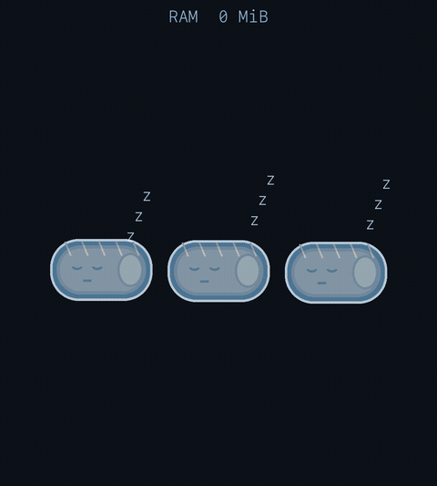
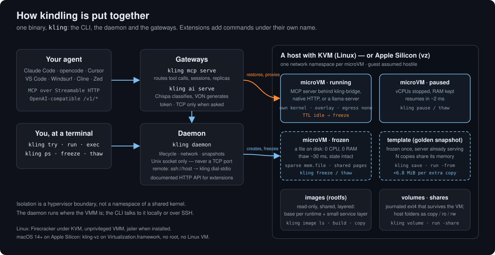
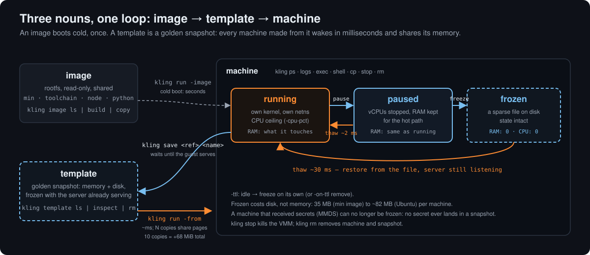

<p align="center">
  
</p>

<p align="center">
  <a href="https://github.com/juan52878911/kindling/releases"></a>
  <a href="https://github.com/juan52878911/kindling/actions/workflows/ci.yml"></a>
  <a href="LICENSE"></a>
  
  
</p>

<p align="center"><a href="README.md">English</a> · <b>Español</b></p>

# kindling

**MicroVMs Firecracker que despiertan de un fichero en ~30 ms y cuestan 0 RAM mientras
duermen — para servidores MCP, sandboxes de agentes y modelos pequeños, en tu propio
hardware Linux o Apple Silicon.**

Un solo binario estático, `kling`, con un CLI al estilo de docker. Arrancas una máquina
una vez, la congelas con su servidor ya escuchando, y el gateway la despierta por cada
llamada: aislamiento a nivel de kernel para código en el que no confías, al coste en
reposo de un fichero en disco.

<p align="center">
  
</p>

## Pruébalo en 30 segundos

En un host Linux con KVM (o un Mac con Apple Silicon — ver [Instalación](#instalación)):

```sh
curl -fsSL https://raw.githubusercontent.com/juan52878911/kindling/main/scripts/install.sh | sh
kling up                       # comprueba KVM, nftables y el usuario kindling; imprime los comandos con privilegios, no los ejecuta
kling try -- uname -a          # una microVM de usar y tirar: la crea, ejecuta, devuelve el código de salida y la borra
```

Así se ve contra un daemon de verdad (grabado, no tecleado a mano):

<p align="center">
  
</p>

Después, aloja tu primer servidor MCP y conecta tu agente:

```sh
kling plugin install mcp                              # la extensión MCP, de la misma release
kling mcp add io.github.domdomegg/filesystem-mcp      # lo empaqueta, lo arranca una vez y lo deja congelado como servicio
kling connect -all -install all                       # Claude Code, opencode, Cursor, VS Code, Windsurf, Cline, Zed
```

## Por qué kindling

Cada número está medido en el laboratorio del proyecto y documentado donde se tomó. Nada
de lo que sigue es una estimación.

| | Medido | Dónde |
|---|---|---|
| Despertar una máquina congelada (thaw) | **~30 ms**, con el servidor ya escuchando | [manual: números medidos](docs/handbook.es.md#números-medidos), `scripts/40-bench-boot.sh` |
| Despertar una máquina pausada | **~2,2 ms** hasta la primera respuesta, visto por el cliente | [`docs/despertar.md`](docs/despertar.md) |
| Una máquina congelada mientras duerme | **0 CPU, 0 RAM** — un fichero disperso de 35-82 MB | [manual: coste en disco](docs/handbook.es.md#coste-en-disco) |
| Densidad desde un snapshot dorado | **142 microVMs en 3,9 GB** de RAM del host (invitados Alpine `min` de 1 vCPU y 64 MiB); 10 copias = **+68 MiB** en total | [`docs/estabilidad.md`](docs/estabilidad.md), [manual: densidad](docs/handbook.es.md#densidad-por-qué-el-snapshot-dorado-lo-cambia-todo) |
| Acción MCP efímera, de punta a punta | **19 ms** (2 ms de ejecución); llamada a una herramienta caliente **9 ms** | [`ext/mcp/README.es.md`](ext/mcp/README.es.md) |
| Contexto que paga el agente por tus herramientas | **≈248 tokens** para 3 servicios con las meta-herramientas perezosas frente a **≈4327** con 28 esquemas cargados | [`ext/mcp/README.es.md`](ext/mcp/README.es.md) |
| Sandbox desde el fondo precalentado | **16 ms** reclamarla frente a 683 ms crearla desde el snapshot | [`ext/sandbox/CHANGELOG.md`](ext/sandbox/CHANGELOG.md) |
| Un LLM pequeño (Qwen2.5-1.5B) hasta el primer token | **0,41 s** desde su dorado frente a **9,1 s** en frío, en un i7-8700T | [`docs/von.md`](docs/von.md#x86-sin-anidar-i7-8700t) |
| Clasificador diminuto (Chispa) por predicción | **1,5-6 µs**, sin daemon, con `confident`/`escalate` calibrado | [`docs/chispa.md`](docs/chispa.md) |
| Disco de un parque de 7 servicios MCP, imágenes por capas | **1300 MiB → 433 MiB** | [`docs/three-layers.md`](docs/three-layers.md) |
| Memoria copia-en-escritura en un Mac (laboratorio anidado) | **~40× menos RAM** que procesos nativos para réplicas restauradas | [`docs/mac-arm64.md`](docs/mac-arm64.md) |

La idea que lo sostiene todo: un arranque en frío de Firecracker con un rootfs real son
segundos, no los 125 ms del folleto. Así que **cada herramienta arranca una vez, se
congela con su servidor sirviendo y se restaura bajo demanda**. El snapshot no es una
optimización; es la arquitectura.

## Para qué se usa

| | Quieres… | Empieza por |
|---|---|---|
| **Alojar servidores MCP** | correr cualquier servidor MCP de código abierto (npm o PyPI, stdio o HTTP) en su propia microVM y conectar Claude Code, opencode o Cursor con un comando; secretos inyectados en vivo, nunca en un snapshot | [guía](docs/guides/mcp-servers.md) · [`ext/mcp`](ext/mcp/README.es.md) |
| **Aislar a un agente de IA** | dejar que un agente ejecute el código que acaba de escribir, sin red salvo que se pida, exec en streaming, copia de ficheros, plantillas que restauran en ~300 ms y N sandboxes en paralelo | [guía](docs/guides/sandboxes-for-agents.md) · [`docs/exec-sandbox.md`](docs/exec-sandbox.md) |
| **Servir modelos pequeños serverless** | un clasificador Chispa en microsegundos, un LLM local tras un API compatible con OpenAI que despierta por petición y se congela al quedar ocioso, con una cascada que solo se activa cuando una evaluación demuestra que ayuda | [guía](docs/guides/serverless-ai.md) · [`docs/ai-gateway.md`](docs/ai-gateway.md) |
| **Llevarlo todo desde un portátil** | el daemon en una máquina Linux con KVM manejado por SSH, o nativo en Apple Silicon con el backend `vz` | [daemon remoto](docs/guides/remote-daemon-ssh.md) · [macOS](docs/guides/quickstart-macos.md) |
| **Pedir sandboxes con kubectl** | un operador fino: objetos `kind: Sandbox`, las microVMs siguen fuera del clúster | [guía](docs/guides/kubernetes-operator.md) |

## Instalación

**Binarios pre-compilados (recomendado).** linux/amd64, linux/arm64, darwin/amd64 y
darwin/arm64; cada release trae un `SHA256SUMS` y el instalador lo verifica antes de mover
nada al disco. Windows no está soportado.

```sh
curl -fsSL https://raw.githubusercontent.com/juan52878911/kindling/main/scripts/install.sh | sh
curl -fsSL .../install.sh | sh -s -- --with mcp,sandbox    # extensiones de la misma release
curl -fsSL .../install.sh | sh -s -- --tag v0.15.0         # una versión concreta
curl -fsSL .../install.sh | sh -s -- --prefix ~/.local --no-rc   # sin tocar el rc de tu shell
```

**Desde Claude Code.** El repositorio es su propio marketplace de plugins;
`/kindling:setup` pregunta dónde deben correr las microVMs y qué piezas quieres, ejecuta el
instalador de arriba y termina con `kling doctor`. Desde una terminal, `install.sh --claude`
hace lo mismo.

```
/plugin marketplace add juan52878911/kindling
/plugin install kindling@kindling
/kindling:setup
```

El plugin trae además el agente `kindling-dev`, al que Claude recurre para medir el riesgo
antes de editar (con [chrono](https://github.com/juan52878911/chrono)), ejecutar código en
sandboxes desechables, usar los servidores MCP alojados y entrenar clasificadores Chispa
([`plugins/claude-code/README.md`](plugins/claude-code/README.md)).

**Desde fuentes.** `make install` deja `kling` en el primer directorio escribible de tu
PATH sin sudo; `make deploy HOST=ssh://usuario@host` compila el daemon para el host con
KVM, copia el binario y la unidad de systemd y lo arranca ([`docs/releases.md`](docs/releases.md)).

**Kubernetes.** `kindling-operator` se publica como `ghcr.io/juan52878911/kindling-operator:<versión>`
con sus manifiestos en cada release ([guía](docs/guides/kubernetes-operator.md)).

Tras cualquiera de ellas: `kling doctor` imprime una línea ✓/✗ por pieza, con el arreglo al
lado de cada ✗.

## Cómo funciona

<p align="center">
  
</p>

- **El daemon** es dueño de las máquinas y nunca escucha en un puerto de red: socket Unix
  en local, SSH en remoto (`kling context add lab ssh://usuario@host`). Controlar microVMs
  es root en su host; kindling no pone eso en TCP.
- **Los gateways** van delante para las dos cosas que llaman los agentes: `kling mcp serve`
  enruta llamadas a herramientas MCP (sesiones, réplicas, modo efímero, una sola entrada
  `_all`) y `kling ai serve` clasifica con Chispa y genera con modelos pequeños.
- **Tres sustantivos**: una *imagen* (rootfs) arranca en frío una vez; `kling save` convierte
  esa máquina en una *plantilla* (snapshot dorado); `kling run -from` saca *máquinas* de ella
  en milisegundos que comparten su memoria. Una máquina está `running`, `paused` (RAM
  conservada, vuelve en ~2 ms) o `frozen` (un fichero, vuelve en ~30 ms).

<p align="center">
  
</p>

- **El aislamiento** es una frontera de hipervisor: cada microVM tiene su kernel, su
  namespace de red, salida `none` por defecto (`internet` nunca llega a redes privadas,
  `allowlist` cierra por defecto), un VMM sin privilegios con cero capacidades, y secretos
  entregados por MMDS solo a la máquina viva — una máquina que recibió secretos ya no se
  puede congelar.

La versión larga, con transcripciones y cada medida: [`docs/handbook.es.md`](docs/handbook.es.md).

## Comparativa

*Septiembre de 2026. Las cifras de terceros salen de su documentación y blogs públicos; las
de kindling, de este repositorio. La tabla completa con fuentes: [`docs/compare.md`](docs/compare.md).*

kindling toca cuatro categorías a la vez, y cada una tiene un líder que hace esa cosa con
más pulido: sandboxes hospedados para agentes (E2B, Daytona, Modal, Vercel, Cloudflare,
Blaxel, Morph), runtimes de microVM auto-alojados (microsandbox, Arrakis, Kata, Apple
`container`, Docker Sandboxes), gateways MCP (Docker MCP Gateway, ToolHive, Smithery) y
serving de modelos con escala a cero y enrutado (llama-swap, vLLM semantic-router).

| Elige **kindling** cuando… | Elige otra cosa cuando… |
|---|---|
| tus herramientas casi nunca corren y quieres que no cuesten nada mientras esperan — `frozen` es 0 RAM y vuelve en ~30 ms con el estado intacto | quieres un sandbox hospedado hoy y no quieres operar nada: E2B, Vercel Sandbox, Cloudflare |
| el código de dentro no es de fiar y un kernel compartido no basta: Firecracker/KVM en Linux, `vz` en Apple Silicon | necesitas ramificar un sandbox *vivo* en N copias: Morph (Infinibranch) |
| alojas servidores MCP para Claude Code, opencode o Cursor y los quieres aislados, conectados con un comando, con secretos que nunca pisan un snapshot | quieres MCP con RBAC de empresa, registro y soporte: ToolHive, Docker MCP Gateway |
| un binario estático y el mismo modelo *congelar y despertar* para herramientas, sandboxes y modelos pequeños, en tu hardware | necesitas Kubernetes multinodo con scheduler real y alta disponibilidad: Kata Containers |
| un homelab o una máquina en el borde con KVM, muchas herramientas y datos que no salen de casa | solo quieres contenedores locales con imágenes OCI y sin snapshots: Docker Sandboxes, Apple `container`, microsandbox |

Tres diferenciadores honestos: (1) microVMs que despiertan de un fichero en ~30 ms y
cuestan 0 RAM dormidas — 142 máquinas (invitados Alpine de 1 vCPU y 64 MiB) en 3,9 GB,
en tu propio hardware; (2) cualquier servidor MCP, stdio o HTTP, aislado en su microVM y
conectado a tu agente con un comando, con secretos que nunca tocan el snapshot; (3) un
binario estático, sin dependencias, el mismo modelo para herramientas, sandboxes y modelos
pequeños, en Linux/KVM o Apple Silicon nativo.

Lo que no es: no es un SaaS, no está medido contra E2B ni Daytona en igualdad de
condiciones, no está auditado, no es multi-host más allá de un reparto entre daemons por
hueco libre, y macOS es un entorno de desarrollo (cada restauración cuesta ~350 MiB por VM,
sin construir imágenes, sin techo de CPU).

## Límites honestos

- **El daemon necesita KVM en Linux**, o Apple Silicon con macOS 14+ para el backend `vz`.
  Ni Windows, ni Mac Intel, ni VPS sin virtualización anidada.
- **macOS no es Linux.** Las restauraciones con `vz` copian ~350 MiB por VM (no se comparte
  la memoria del dorado), no se construyen imágenes (se copian desde un daemon Linux arm64),
  no hay techo de CPU ni jailer. Bien para desarrollar; Linux para densidad
  ([`docs/mac.md`](docs/mac.md)).
- **La virtualización anidada es más lenta.** Arranques en frío medidos en 2,6 s anidado en
  Proxmox y ~16 s en una VM Lima en Apple Silicon (con palancas hasta ~2,5 s). El thaw sigue
  en milisegundos en los dos casos.
- **La seguridad es un modelo de amenaza, no un certificado.** Jailer solo si está
  instalado, sin autorización por operación en el socket del daemon, cuotas de disco
  blandas, sin cifrado en reposo por parte de kindling. Todo listado en [SECURITY.md](SECURITY.md).
- **Un host por daemon.** El reparto entre hosts es una elección por hueco libre en
  `ext/sandbox`; el operador de Kubernetes es una réplica sin elección de líder.
- **Un volumen tiene un escritor** (física de ext4); el estado compartido entre servicios va
  por un servicio de memoria enlazado.
- **Proyecto joven, un mantenedor.** Medido, documentado y rápido; todavía no lo ha
  maltratado nadie más que su autor.

## Guías

Las guías están en inglés; el resto de `docs/` mantiene el castellano.

| Guía | Léela si… |
|---|---|
| [Quickstart on Linux](docs/guides/quickstart-linux.md) | tienes una máquina Linux con KVM y 15 minutos |
| [Quickstart on macOS (vz)](docs/guides/quickstart-macos.md) | tienes un Mac con Apple Silicon y quieres microVMs en él |
| [Remote daemon over SSH](docs/guides/remote-daemon-ssh.md) | el daemon vive en un servidor y trabajas desde un portátil |
| [Host MCP servers for Claude Code / opencode / Cursor](docs/guides/mcp-servers.md) | quieres las herramientas de tu agente aisladas y bajo demanda |
| [Safe sandboxes for AI agents](docs/guides/sandboxes-for-agents.md) | un agente tiene que ejecutar código sin tocar tu máquina |
| [Serverless AI: Chispa + a local LLM behind `kling ai`](docs/guides/serverless-ai.md) | quieres clasificar en microsegundos y generar con escala a cero |
| [Kubernetes operator](docs/guides/kubernetes-operator.md) | quieres que `kubectl apply` reparta sandboxes |
| [Writing an extension](docs/guides/writing-an-extension.md) | quieres `kling loquesea` |
| [Troubleshooting with `kling doctor`](docs/guides/troubleshooting.md) | algo sale en rojo |

El índice de todo lo que hay en `docs/`, con una tabla de «¿qué guía necesito?»:
[`docs/README.md`](docs/README.md).

## Preguntas frecuentes

**¿Es un runtime de contenedores?** No. Un contenedor es un namespace de un kernel
compartido; una microVM tiene su propio kernel detrás de un hipervisor. kindling cuesta más
que un contenedor por máquina y existe porque el código de dentro se asume hostil.

**¿Por qué no una microVM por petición?** Porque un arranque en frío con un rootfs real son
segundos. kindling arranca una vez, congela con el servidor sirviendo y restaura en ~30 ms.
El modo efímero (una microVM por acción) existe y cuesta 19 ms de punta a punta gracias a un
fondo precalentado.

**¿Una máquina congelada de verdad no cuesta nada?** Cuesta disco: de 35 MB (imagen `min`)
a ~82 MB (Ubuntu) por máquina, en un fichero disperso. Mientras duerme no existe ningún
proceso.

**¿Qué sobrevive?** Un volumen sobrevive a todo (ext4 con journal en el host). Un servicio
persistente sobrevive a sus congelaciones y descongelaciones, pero no al borrado de su
instancia. Una acción efímera no conserva nada. Detalles en el
[manual](docs/handbook.es.md#qué-persiste-y-qué-no).

**¿Puedo montar una carpeta del host?** Sí: `-share ORIGEN:DESTINO[:copy|ro|rw]` — una
copia de solo lectura por defecto, o en vivo a través de un agente FUSE servido con `os.Root`
para que nada se escape de la carpeta ([`docs/compartir.md`](docs/compartir.md)).

**¿Corre en mi Mac?** Nativo en Apple Silicon con macOS 14+ (backend `vz`), o contra un
daemon Linux por SSH. Mac Intel y Windows: no.

**¿Qué servidores MCP funcionan?** Cualquiera de npm o PyPI que hable stdio (`kling-bridge`
lo convierte en HTTP dentro de la VM), cualquiera que hable Streamable HTTP nativo, y
servidores externos que enlaces con `kling mcp link`. `kling mcp search` te dice qué puede
empaquetar sin intervención.

**¿Dónde van los secretos?** Por MMDS a la máquina viva (`kling machine secret`), por
sesión. Nunca a un snapshot: una máquina con secretos se niega a congelarse.

**¿Es código abierto?** Sí, Apache-2.0 ([LICENSE](LICENSE)). Las contribuciones se aceptan
bajo la misma licencia, sin CLA ([CONTRIBUTING.md](CONTRIBUTING.md)).

## Más

- **Documentación**: [`docs/README.md`](docs/README.md) (índice), [`docs/handbook.es.md`](docs/handbook.es.md)
  (la versión larga), [`docs/api.md`](docs/api.md) (API del daemon), [CHANGELOG](CHANGELOG.md).
- **Recursos**: benchmarks, ejemplos, releases y comunidad en [`docs/resources.md`](docs/resources.md).
- **Ejemplos**: [`examples/ci-triage`](examples/ci-triage) (Chispa + VON sobre logs de CI),
  [`examples/domotica`](examples/domotica) (una habitación domótica sobre modelos serverless;
  un programa aparte, no un subcomando de `kling`), [`examples/hello-extension`](examples/hello-extension).
- **Seguridad**: modelo de amenaza, barreras y lo que no está resuelto, en [SECURITY.md](SECURITY.md).
- **Contribuir**: [CONTRIBUTING.md](CONTRIBUTING.md). Los bugs van con la salida de
  `kling doctor`: [abrir un issue](https://github.com/juan52878911/kindling/issues/new/choose).
- **Licencia**: Apache-2.0 — ver [LICENSE](LICENSE) y [NOTICE](NOTICE).
