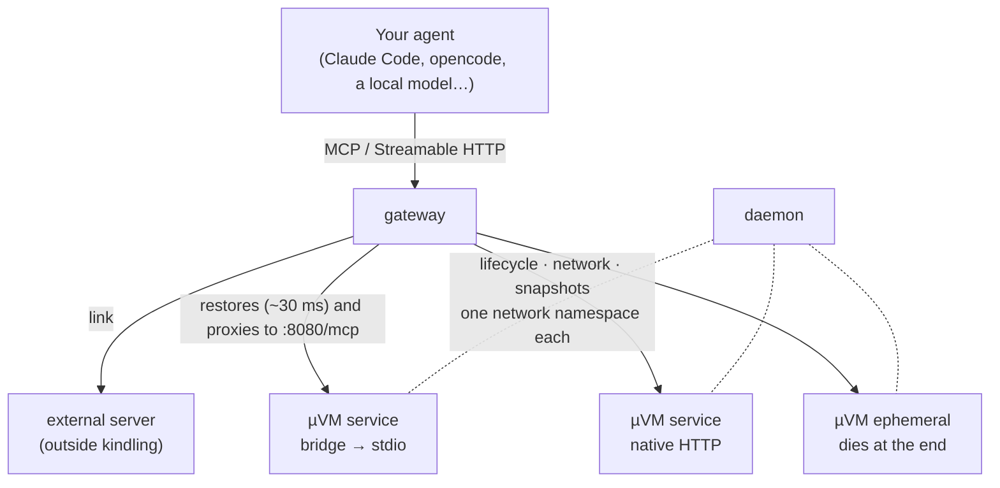

<p align="center">
  
</p>

<p align="center">
  <a href="https://github.com/juan52878911/kindling/releases"></a>
  <a href="https://github.com/juan52878911/kindling/actions/workflows/ci.yml"></a>
  
  
</p>

<p align="center"><b>English</b> · <a href="README.es.md">Español</a></p>

# kindling

Serverless MCP tools on Firecracker microVMs. Take any open source MCP server and turn
it automatically into a service that comes up on demand, in milliseconds, with
kernel-level isolation.

> Status: **v0.4.0 — the whole circuit works, and it heals itself.** `kling` manages
> microVMs behind a docker-like interface, with networking, golden snapshots, isolation,
> persistent volumes, layered images, events, an MCP gateway with sessions, per-service
> replicas and a **stdio→HTTP bridge**: any open source MCP server — npm or PyPI, stdio
> or native Streamable HTTP — can be hosted on demand. See the
> [CHANGELOG](CHANGELOG.md) for what each version brought.

**The guest is assumed hostile**: there is no telling which MCP server will end up being
hosted. See [SECURITY.md](SECURITY.md) for the threat model, the barriers in place and
— above all — what is NOT solved yet.

## At a glance

Every number below is measured, not estimated — the how and where is in the linked
sections:

| | Measured |
|---|---|
| Thaw a frozen tool | **~30 ms** — imperceptible inside a tool call |
| Ephemeral action, end to end | **19 ms** (2 ms of actual execution) |
| Tool call, hot | **9 ms** |
| RAM of a `warm` machine | **0** — it is a file on disk, not a process |
| Density | **142 microVMs in 3.9 GB** of host RAM |
| 10 instances from one golden snapshot | **+68 MiB** total (12× denser than cold boots) |
| Disk for a service, layered images | **1300 MiB → 433 MiB** for a 7-service fleet |
| 20 concurrent calls, same service | p50 **4.66 s** (was 44 s before v0.4) |

## Table of contents

<details open>
<summary><b>Expand / collapse</b></summary>

**The idea**
· [Why microVMs and not containers](#why-microvms-and-not-containers)
· [Architecture](#architecture)
· [Measured numbers](#measured-numbers)

**Getting started**
· [Installation](#installation)
· [Getting the runtime ready](#getting-the-runtime-ready--kling-up)
· [Connecting to the daemon](#connecting)
· [Configuration](#configuration)
· [On a Mac (Apple Silicon)](#on-a-mac-apple-silicon)

**The CLI**
· [kling](#kling)
· [Golden snapshots](#golden-snapshots)
· [Lifecycle and robustness](#lifecycle-and-robustness)
· [Networking](#networking-one-namespace-per-microvm)

**MCP services**
· [Catalog: search and add](#catalog-searching-for-and-adding-mcp-servers)
· [Turning any server into a service](#turning-any-mcp-server-into-a-service)
· [The stdio→HTTP bridge](#any-mcp-server-hosted-on-demand)
· [Sessions and parallel replicas](#sessions-and-parallel-replicas)
· [Ephemeral mode](#ephemeral-mode-one-microvm-per-action)
· [Ephemeral or persistent, decided automatically](#ephemeral-or-persistent-decided-automatically)
· [One entry point for every service](#a-single-entry-point-for-every-service)
· [Type repair](#type-repair)
· [Connecting your agent](#connecting-it-to-your-ai-agent)
· [Migrating an existing MCP](#migrating-an-existing-mcp-without-breaking-anything)
· [External servers and usage memory](#bring-your-own-memory-service)

**Storage**
· [Volumes](#volumes-what-outlives-the-microvm)
· [A shared package library](#a-shared-package-library)
· [What persists and what does not](#what-persists-and-what-does-not)

**Performance and density**
· [Disk cost](#disk-cost)
· [Layered images](#layered-images-one-base-per-runtime-family)
· [Density](#density-why-the-golden-snapshot-changes-everything)
· [Giving RAM back: squeeze, top, /metrics](#giving-ram-back-squeeze-top-and-metrics)
· [Faster wake-ups](#faster-wake-ups-warm-child--bundle--cpu-ceiling)

**Security**
· [Isolation](#isolation)
· [Egress: none, internet, allowlist](#egress-none-internet-or-an-allowlist-of-domains)
· [Secrets via MMDS](#secrets-that-never-touch-a-snapshot-mmds)

**Operations**
· [The MCP gateway](#mcp-gateway)
· [Self-healing](#self-healing-kling-mcp-heal)
· [Verifying services](#verifying-a-service-for-real)
· [Keeping images current](#the-bridge-lives-inside-every-image)
· [Topology report](#topology-report)
· [Memory: real vs cache](#memory-what-is-real-and-what-is-cache)

**Reference**
· [Requirements](#requirements)
· [Scripts](#scripts)
· [Documentation map](#documentation-map)
· [Roadmap](#roadmap)

</details>

## Why microVMs and not containers

An MCP server is a 50-100 MB Node or Python process. Putting it inside a microVM does not
save resources compared to a container — it costs more, because every microVM boots its
own kernel.

The reason to do it is a different one: **a local AI running arbitrary open source tooling
is untrusted code**. A container's isolation is a namespace of the shared kernel; a
microVM's is a hypervisor boundary. That is the project's only honest justification, and
it is worth being clear about it before writing another line.

## Architecture



The **gateway** takes the call, restores the matching snapshot, proxies the request and
reaps the microVM once its TTL expires. Inside the guest it always calls the same place,
`:8080/mcp`, whether the server speaks stdio (with `kling-bridge` translating) or native
Streamable HTTP (with nothing in between).

The **daemon** manages the lifecycle and is the only one that can reach the guests: their
IPs only exist on the host's network. That is why it exposes `POST /machines/{ref}/guest`,
which forwards an HTTP request to the server inside. Without it, `kling mcp import` would
only work by running the CLI on the host itself — over SSH the probe has no route and
times out.

## Measured numbers

Measured on Proxmox (Intel i7-8700T) with Firecracker v1.16.1 running **nested** inside a
VM, kernel 6.1.177 and an 800 MB Ubuntu 24.04 rootfs:

| Operation | Time |
|---|---|
| Cold boot | **2,643 ms** |
| Snapshot creation | 305 ms |
| **Restore from snapshot** | **~30 ms** |

Reproduce them with `scripts/40-bench-boot.sh`.

**The conclusion that defines the architecture:** 2.6 s cold makes the one-microVM-per-request
model unworkable. The 125 ms Firecracker advertises assume a trimmed kernel and a minimal
rootfs on bare metal. With snapshot/restore, 30 ms is imperceptible inside a tool call.

Therefore: **every tool boots once, is frozen with the MCP server already listening, and
the gateway restores it on demand.** The snapshot is not an optional optimization; it is
what holds everything else up.

---

# Getting started

## Installation

**Quick option — pre-built binaries (recommended):**

```sh
# macOS / Linux — one line, no dependencies
curl -fsSL https://raw.githubusercontent.com/juan52878911/kindling/main/scripts/install.sh | sh

# To include kling-bridge (the daemon needs it when it rebuilds images):
curl -fsSL https://raw.githubusercontent.com/juan52878911/kindling/main/scripts/install.sh | sh -s -- --bridge

# A specific version (it installs the latest release by default):
curl -fsSL .../install.sh | sh -s -- --tag v0.4.0

# Custom prefix:
curl -fsSL .../install.sh | sh -s -- --prefix ~/.local --bridge
```

Binaries are published on
[Releases](https://github.com/juan52878911/kindling/releases) for **linux/amd64**,
**linux/arm64**, **darwin/amd64** and **darwin/arm64**. Every release ships a
`SHA256SUMS`, and the install script verifies the checksum before moving anything onto
disk. **Windows is not supported** — the code uses POSIX syscalls (`syscall.Kill`,
`Setsid`, `Stat_t`).

**From source — `make`:**

```sh
make install                              # CLI on your machine
make deploy HOST=ssh://juan@192.168.2.60  # daemon on the host with KVM
```

`make install` picks the first writable directory on your PATH and **does not ask for
sudo**: installing a user tool should not require it. Force it with
`make install PREFIX=/usr/local` if you prefer it system-wide.

`make deploy` builds for `linux/amd64`, copies the binary and the systemd unit, and starts
the service. The unit hands the socket to the user you SSH in as, so you don't have to run
the entire client under sudo. The build is arch-parametric with `GOARCH`: to deploy to an
arm64 host use `make deploy GOARCH=arm64 HOST=ssh://...` (the binary comes out as
`kling-linux-arm64`).

Release cycle details: [`docs/releases.md`](docs/releases.md).

## Getting the runtime ready — `kling up`

```sh
kling up        # checks KVM, nftables, the kindling user, artifacts and images
kling status    # one-pass diagnosis: daemon, gateway and the agents it finds
```

`kling up` **prints** the commands that need privileges instead of running them: letting an
installer touch nftables and create system users on its own is asking for trust that does not
need to be asked for. The kernel and the base image ship inside the binary, so there is no
script to run first.

The two silent failures it catches — the ones that cost you an afternoon if they slip
through — are a missing `nft` (microVMs boot with no network) and a missing `kindling` user
(Firecracker ends up running as root).

## Connecting

The same binary is both CLI and daemon. `kling daemon` runs wherever KVM is; the CLI
talks to it over a Unix socket, locally or through SSH:

```sh
export KLING_HOST=ssh://juan@192.168.2.60   # remote daemon
export KLING_HOST=/run/kling.sock           # local daemon
```

**The daemon never listens on a network port.** Controlling microVMs is equivalent to
root on their host: it can mount disks and boot arbitrary kernels. Exposing it over TCP
would repeat the mistake that has cost Docker a decade of compromised servers. For remote
access it uses SSH with the same technique as `docker context`: instead of requiring
socat or nc on the far end, it invokes `kling dial-stdio`, which bridges the SSH pipe to
the local socket.

## Configuration

Named contexts, in the style of `docker context`, so you don't have to carry `KLING_HOST`
around:

```sh
kling context add lab ssh://juan@192.168.2.60 -description "Home Proxmox"
kling context use lab
kling context ls
```

And defaults, so you don't repeat the same options on every `run`:

```sh
kling config set defaults.image min
kling config set defaults.ttl_seconds 600
kling config set gateway.idle 5m
kling config show
```

The file lives at `~/.config/kling/config.json` — on macOS too: `UserConfigDir()` would
put it under `~/Library/Application Support`, which is right for desktop apps but
surprising for a CLI.

**Precedence:** `-H` > `$KLING_HOST` > active context > local socket. The flag always
wins, so a one-off invocation doesn't force you to switch contexts.

Shell completion ships with the binary: `source <(kling completion bash)` or
`source <(kling completion zsh)`.

## On a Mac (Apple Silicon)

Firecracker does not run natively on macOS. On **M3 or newer** with macOS 15+ it runs
inside an aarch64 Linux VM with nested virtualization — **supported, with limits**: cold
starts are slower under nested KVM (~16 s per new replica vs ~3 s on native Linux, and
there are measured levers to bring that down to ~2.5 s), so it's good for local
development and evaluation, not high-concurrency workloads.

```sh
make deploy-mac HOST=ssh://...   # shortcut: GOARCH=arm64 deploy to the Lima VM
```

The full reproducible recipe — Lima config, nested-virt requirements, and the three
measured levers for faster cold starts (`-bundle`, `-cpu-pct 100`, http-proxy mode) — is
in [`docs/mac-arm64.md`](docs/mac-arm64.md).

---

# The CLI

## kling

> The transcripts below are reproduced verbatim: what you see here is what the tool
> actually outputs.

```
$ kling info
endpoint:     ssh://juan@192.168.2.60
daemon:       0.1.0
root:         /var/lib/kindling
KVM:          yes
firecracker:  Firecracker v1.16.1
machines:     7

$ kling run -name mcp-demo
efad9e5f7003  mcp-demo  booted cold in 54 ms

$ kling freeze mcp-demo
efad9e5f7003  warm  (754 ms, 256 MiB on disk)

$ kling ps
ID             NAME       IMAGE     STATE   CPU/MEM    DISK   EGRESS   AGE   LAST OP
efad9e5f7003   mcp-demo   default   warm    1/256MiB   81M    none     17s   freeze 754ms, 256MiB

$ kling thaw mcp-demo
efad9e5f7003  running  (22 ms)
```

The **`warm`** state is what sets kindling apart from a container runtime: the machine is
frozen on disk, burns neither CPU nor RAM, and wakes up in tens of milliseconds.

## Golden snapshots

Freeze a machine once and instantiate N copies that **share its memory**:

```
$ kling commit plantilla golden
golden  golden snapshot  (80M of memory)
instantiate with:  kling run -from golden

$ kling run -from golden -name g1
a3f9...  g1  instantiated from golden in 34 ms

$ kling snapshots
NAME     IMAGE     CPU/MEM    MEMORY   DISK   INSTANCES   AGE
golden   default   1/256MiB   80M      80M    10          21s

$ kling events
23:52:20  machine.frozen   mcp-demo  frozen in 754 ms (256 MiB on disk)
23:52:20  machine.thawed   mcp-demo  thawed in 22 ms
```

`kling commit` **requires the guest to be serving** before it freezes a golden snapshot
(`-wait`, 60 s by default). A snapshot taken too early restores in 26 ms and then never
answers — minutes or hours later, with an error that does not mention the commit. If the
guest is not serving, commit refuses and explains the whole chain; `-force` skips the
check, `-replace` swaps an existing snapshot atomically.

By default the snapshot is frozen with a **warm, unbound child process** inside, so the
golden does not pay the runtime's cold start on restore (`node` starting is 300-500 ms of
any wake-up). It roughly triples the snapshot's disk cost — 39 MB → 120 MB on a node
service — so `kling commit -warm=false` trades wake-up latency for disk when you host
many services.

## Lifecycle and robustness

```sh
$ kling run -image min -ttl 300 -cpu-pct 25 -egress internet
$ kling logs <ref> -tail 50        # serial console: the only window inside
```

- **`-ttl`** freezes the machine by itself once that time passes. Freeze, not kill: it
  stops costing CPU and RAM, but comes back in ~30 ms. It is what makes the model
  serverless.
- **`-cpu-pct`** bounds CPU usage with its own cgroup (50% of a core by default).
- **Reconciliation at startup**: the daemon compares its saved state against the host's
  reality, re-adopts the microVMs that are still alive and cleans up orphaned namespaces
  and cgroups.
- **Continuous watchdog**: every 10 s it checks that whatever claims to be `running` is
  actually running. A machine whose process disappeared moves to `failed` and releases its
  resources.
- **Background loops contain their panics.** Each iteration of the reconciler, the reaper
  and the state persister is wrapped in a `recover()`: a nil-pointer in a background loop
  used to kill the daemon and orphan every microVM.

**Restarting the daemon does not kill the microVMs.** The unit carries `KillMode=process`;
without it systemd drags the whole cgroup down and takes the running machines with it.

### Measured with 8 instances

```
RAM añadida:          113 MiB   (14 MiB por instancia)
conectividad:         9/9
VMM sin privilegios:  9/9
cgroups activos:      9
```

## Networking: one namespace per microVM

```
$ kling topo
kindling  ssh://juan@192.168.2.60
          KVM ok · Firecracker v1.16.1

  host  172.30.0.0/16
   ├─◆ golden           golden snapshot · 82M shared memory
   │  ├── g3             running  172.30.0.18     ⌀   384K  thaw 28ms
   │  ├── g2             running  172.30.0.14     ⌀   384K  thaw 26ms
   │  └── g1             running  172.30.0.10     ⌀   384K  thaw 41ms
   │
   └─◆ (booted cold)
      └── plantilla      running  172.30.0.6      ⌀     8M  boot 46ms

  4 running · 0 warm · 0 stopped   disk: 9M own + 83M shared
  egress:  ⌀ isolated   → internet (private networks are always blocked)
```

**The problem:** a snapshot records the name of the host's TAP device. If N instances
restore from the same golden snapshot, all N ask for the same TAP and collide. And you
cannot just reassign it: Firecracker does not allow patching `host_dev_name`.

**The solution:** one network namespace per microVM. Inside each one the TAP is always
called `tap0` and the guest always has the same IP, so **one snapshot works for all of
them**. All the differentiation happens on the host, on the far side of a veth:

```
        host                  │  netns kl-<id>          │  microVM
 vh-<id> 172.30.a.b/30 ◄─veth─► vg-<id> 172.30.a.b+1    │
                              │ tap0    172.16.0.1/30   ├─ eth0 172.16.0.2
```

The guest configures itself from the kernel's `ip=` parameter, with no need for networking
tools inside the image. From the host each machine is reachable at its namespace's IP,
which DNATs to the guest.

It is the same approach AWS Lambda uses, and for the same reason.

---

# MCP services

## Catalog: searching for and adding MCP servers

You don't need to know how to package anything. `kling` talks to the official registry
(`registry.modelcontextprotocol.io`):

```sh
kling search filesystem                    # what is out there, and what it can package on its own
kling add io.github.domdomegg/filesystem-mcp
```

`kling add` builds the image, boots a template, asks it what it can do, freezes it as a
golden snapshot and stores its catalog. From then on, listing its capabilities **does not
wake the microVM**.

It packages **npm and PyPI** servers that speak stdio (npm wins when a server publishes
on both). When `search` says a server cannot be packaged unattended, it explains why and
what the alternative is, instead of failing halfway through the build. Useful flags:

| Flag | What it does |
|---|---|
| `-bundle` | collapses `node_modules` into **one** file with esbuild — measured 1205 files → 1, cold `initialize` ~7 s → ~2.5 s. The main lever on Mac/arm64 |
| `-base node` / `-base python` | builds a small **layer** on a shared runtime base instead of a monolithic image ([layered images](#layered-images-one-base-per-runtime-family)); picked automatically when a base named after the runtime family exists |
| `-env KEY=value` | bakes environment switches into the entrypoint (plain text: for toggles, **not secrets** — those go [via MMDS](#secrets-that-never-touch-a-snapshot-mmds)) |
| `-cmd "..."` | overrides the inferred start command (PyPI entry points are inferred by convention and verified at build time) |
| `-volume name[:/mount][:ro]` | attach [persistent storage](#volumes-what-outlives-the-microvm), repeatable |
| `-dry-run` | show what it would do without doing it |

kindling also **auto-detects capabilities**: if a server needs a browser, internet egress
or native binaries, the image and the machine's network policy are configured
accordingly — a browser-based server gets a shared Chromium with one context per session.

## Turning any MCP server into a service

```sh
sudo ./scripts/80-mcp-image.sh stdio filesystem \
     -n "@modelcontextprotocol/server-filesystem" -- mcp-server-filesystem /data

kling mcp import filesystem
```

`mcp import` does the whole cycle:

```
Importing "filesystem" from image "filesystem"

  1/5  starting the template... ✓ 0aeee853 at 172.30.0.6
  2/5  waiting for the MCP server... ✓
  3/5  asking what it can do... ✓ 14 tool(s)
  4/5  freezing as golden snapshot... ✓
  5/5  saving the catalog... ✓
```

Step 3 is **introspection**: the server is asked what it can do exactly once, and step 5
stores that catalog alongside the snapshot. The template's memory, vCPUs, egress policy,
volumes and labels all end up **baked into the snapshot** — and are reused verbatim when
the service is [healed](#self-healing-kling-mcp-heal) or refreshed.

**`-n` pre-installs the npm packages into the image.** That is not convenience: microVMs
boot with no internet egress, so an `npx -y` at runtime would fail to download.

### Listing the inventory does not touch the services

Without a persisted catalog, asking "what tools are there?" forces a `tools/list` against
every server, and that **wakes their microVMs**. One inventory question would end up
booting twenty machines.

With `mcp import`, the catalog lives on disk next to the snapshot:

```sh
kling mcp list -v          # every tool, without starting anything
kling mcp refresh <svc>    # recapture after updating the server
```

Verified: listing the full inventory through the aggregator leaves the machine counter at
**0**.

### Three things to know when packaging a node server

- **`-n` pre-installs the npm package.** microVMs boot with no internet egress: an
  `npx -y` would fail to download.
- **The `entrypoint` is PID 1 and the kernel gives it no PATH.** Without setting it, the
  binaries npm installs are not found: `executable file not found in $PATH`.
- **The directories the server expects must exist INSIDE the image.** `server-filesystem`
  wants `/data`; creating it on the host does nothing.
- **If the server speaks HTTP, it has to listen where it is told.** The entrypoint sets
  `PORT=8080` and the server must serve the protocol at `/mcp`: that is what the gateway
  looks for.

## Any MCP server, hosted on demand

Most open source MCP servers only speak **stdio**: a persistent child process you talk to
over pipes. There is no port to call, and the client dictates the lifecycle. It is the
opposite of invocable on demand.

`kling-bridge` runs **inside** the microVM, launches the server as a child and exposes its
protocol over Streamable HTTP:

```
gateway ──HTTP──> kling-bridge ──stdin/stdout──> MCP server
```

From the outside, a stdio server looks HTTP-native. Wrapping one is a single line:

```sh
make bridge
sudo ./scripts/80-mcp-image.sh stdio files -p "nodejs npm" -- \
     npx -y @modelcontextprotocol/server-filesystem /data

kling run -name files-tmpl -image files -service files
kling commit files-tmpl files && kling stop files-tmpl
```

### Servers that already speak HTTP

If the server speaks **native Streamable HTTP** there is no need for a bridge: it listens
itself and the gateway talks to it directly. The `http` mode accepts the same options:

```sh
sudo ./scripts/80-mcp-image.sh http everything -p "nodejs npm" \
     -n "@modelcontextprotocol/server-everything" -- mcp-server-everything streamableHttp

kling mcp import everything -image everything
```

Two conditions, and the generated entrypoint sets both:

- **listen on `$PORT` (8080)**, which is where the gateway looks inside the guest
- **serve the protocol at `/mcp`**, which is the path it calls

Tested with `@modelcontextprotocol/server-everything`, the protocol's reference server.
The image carries no `kling-bridge` anywhere:

```
$ kling connect everything
Status:    ✓ mcp-servers/everything v2.0.0 · 12 tool(s): echo, get-sum, …

$ call_tool everything.get-sum {"a":100,"b":23}
The sum of 100 and 23 is 123.
```

There is a third mode: the bridge can also act as an **HTTP/SSE proxy** for servers that
speak HTTP but should still start under the bridge's supervision — useful for stateless
services, where a single warm server process is shared and frozen alive inside the
snapshot (measured on `context7`: first `initialize` 25.7 s as stdio → 2.4 s steady as
http-proxy).

### The full circuit

```
local model   ──>  gateway  ──>  microVM  ──>  MCP server
 (your Mac)       (Proxmox)     (Firecracker)   (stdio or HTTP)
```

[examples/agent/agent.py](examples/agent/agent.py) closes it: an MCP client plus a
tool-calling loop against ollama.

```
$ python3 examples/agent/agent.py "usa echo para decir hola"
→ kindling-echo v1.0.0  sesión b2787e00
→ herramientas: echo, session_info
→ llamando echo({"text": "hola"})
← hola
```

The model knows nothing about microVMs: it asks for a tool and the tool shows up. If it
had not been used for a while it was frozen, and waking it costs milliseconds.

| Path | Latency |
|---|---|
| Cold MCP handshake, from the Mac | **310 ms** |
| Tool call, hot | **9 ms** |

## Sessions and parallel replicas

MCP identifies conversations with `Mcp-Session-Id`, and a stdio server is **single-session
by nature**: its state lives in the process. Hence:

- **The bridge launches one child process per session.** Two concurrent conversations do
  not trample each other's state.
- **The gateway routes stickily.** The same session always goes back to the same microVM;
  sending it to another instance would find a server without that state.
- **The same tool can be used in parallel.** When concurrent sessions exceed what one
  instance can serve, the gateway creates **replicas per service** on demand from the
  golden snapshot (copy-on-write, so they share memory). Verified with 4 concurrent
  sessions against a service whose bridge caps at 1 session each.
- **When a bridge hits its session cap**, it recycles the most idle session instead of
  refusing, so clients reconnect cleanly.

Demonstrated with the `session_info` tool, which reports its pid and its call count:

```
session 1 (3 extra calls):  pid=305 llamadas_en_esta_sesion=5
session 2 (freshly created): pid=309 llamadas_en_esta_sesion=1
```

## Ephemeral mode: one microVM per action

```sh
kling gateway -ephemeral -prewarm 3
```

Every call gets **its own microVM**: one is taken from the pool of pre-warmed machines, it
serves the action and is destroyed. It is born, acts and dies.

```
action 1: 19 ms   pid=305 llamadas_en_esta_sesion=1
action 2: 24 ms   pid=305 llamadas_en_esta_sesion=1
action 3: 19 ms   pid=305 llamadas_en_esta_sesion=1
```

`llamadas_en_esta_sesion=1` **in all of them**: no action sees what the previous one did.

### From 350 ms to 19 ms

Profiling an unoptimized ephemeral action:

| Stage | Cost |
|---|---|
| Restore the microVM | 131 ms |
| Wait for networking to come back | 53 ms |
| `initialize` (launches the MCP server) | 61 ms — **with node it is 300-500 ms** |
| `tools/call` | 9 ms |
| Destroy the machine | ~100 ms |

Everything except `tools/call` can be paid up front or afterwards:

- **`-prewarm N`** keeps N instances already restored and **with their MCP session open**.
  The call skips restoring, waiting for the network and initializing.
- **Destruction is asynchronous.** It used to sit in a `defer`, so the client waited for
  the namespace teardown and the file deletion: 100 ms on top of a 2 ms call. The machine
  dies all the same; the client just no longer waits for it to happen.

Result: **2 ms of actual execution, 19 ms end to end.**

The trade-off is that there is no state between calls. Tools that need it — memory,
step-by-step reasoning — have to use the session-based route (`/mcp/<service>`), which
keeps the process alive.

## Ephemeral or persistent: decided automatically

An ephemeral microVM dies with everything of its own, memory **and disk**. So the question
is not "does the server keep state?" but:

> does something one call writes have to be visible to a later call?

`kling mcp import` infers it from the catalog and says so:

```
eco          EPHEMERAL    because it only queries: nothing to preserve
notas        PERSISTENT   because it writes with guardar_nota and reads with session_info
filesystem   PERSISTENT   because it writes with write_file and reads with read_file
memory       PERSISTENT   because read_graph suggests it accumulates context
thinking     PERSISTENT   because sequentialthinking suggests it accumulates context
```

**`filesystem` is persistent too**, even though it may not look like it: it writes to the
guest's disk, which is exactly as volatile as its memory.

The reliable signal is structural — the server exposing both writing and reading tools at
once — with a handful of words matched against the tool NAME for servers that only have
one. Looking for those words in the descriptions classified everything as persistent:
"session" or "sequence" show up in passing in almost any text.

You can force it with `-stateful` or `-ephemeral`.

### When in doubt, persistent

Getting it wrong towards ephemeral produces **silent loss**: the call answers fine and what
was written disappears. Getting it wrong towards persistent only costs one frozen
instance, which spends neither CPU nor RAM.

The aggregator flags it in its inventory so the model knows:

```
memory [remembers between calls]: create_entities, add_observations, ...
filesystem: read_text_file, write_file, list_directory, ...
```

### Persistent does not mean always on

A persistent service keeps its state, but **stops consuming when it is done**. Measured
with `-idle 30s`:

```
write /data/note.txt              →  Successfully wrote
read /data/note.txt (another call) →  "this must survive"

running:      running   41 MiB above baseline
after 35 s:   warm      RAM back to 0   (freeze 661 ms)
on return:    "this must survive"       (thaw 18 ms)
```

Freezing is not shutting down: the instance stops existing as a process — zero CPU, zero
RAM — but its state stays on disk and comes back in milliseconds. The cost is the memory
file: 151 MiB for this service while it is frozen.

## A single entry point for every service

An MCP client loads the definitions of **all** tools when it connects. With twenty
services of ten tools each that is two hundred JSON schemas in the model's context before
it starts working.

```sh
kling connect -all -install opencode              # every service
kling connect -all -only eco,notas -install opencode   # only some
kling connect -all -expand                        # full catalog
```

The `/mcp/_all` endpoint is an MCP server that routes to the others. It has two modes:

**`proxy`** (default) — exposes **four meta-tools** instead of N:

| | |
|---|---|
| `list_services` | which servers exist and how many tools each one has |
| `find_tools` | search by keyword; returns names and descriptions, **without schemas** |
| `describe_tool` | the full schema of a single tool |
| `call_tool` | executes, routing to whichever microVM is needed |

The model searches for what it needs, asks for the schema of what it is going to use, and
calls.

**`expand`** — flattens the catalog with `service.tool` names, for clients that work better
with everything loaded.

### Which one is cheaper depends on how many tools you have

The `proxy` mode has a **fixed cost** of ~300 tokens; `expand` grows with every tool. With
few tools, proxy comes out **more expensive**. That is why `connect -all` measures it
against your real catalog and tells you:

```
Context cost, with your current catalog:
  proxy    3 definitions   ≈  248 tokens
  expand  28 definitions   ≈ 4327 tokens
  → The proxy mode you're using saves 4079 tokens.
```

The crossover sits around 8 tools. With 28, proxy saves **17x**; with 200, tens of
thousands of tokens in every conversation.

### The inventory travels in the handshake

Tool names are cheap — 27 of them take ~100 tokens — what is expensive are the argument
schemas. That is why `initialize` returns the **full inventory** in its `instructions`
field:

```
Available tools, grouped by service:

filesystem: read_text_file, write_file, list_directory, ...
memory [remembers between calls]: create_entities, ...

Call them with call_tool and the full service.tool name
(e.g. filesystem.read_text_file). If you don't know its arguments,
ask describe_tool first. find_tools is for searching by keyword.
```

That way the model knows what is there **from the first moment** and goes straight to
`call_tool`, instead of spending a call on discovery. Three meta-tools remain:
`find_tools`, `describe_tool` and `call_tool`.

### Bilingual search

The model asks in the user's language and the tools are described in English. Searching
"leer un fichero de texto" against *"Read the complete contents of a file"* did not match a
single term, so `find_tools` returned junk. A table of domain synonyms — leer/read,
fichero/file, carpeta/directory… — fixes it without pulling in a search engine.

## Type repair

Several MCP clients and models mangle JSON types before sending them: arrays arrive as
objects with `"0"`, `"1"` keys, numbers as strings, booleans as `"true"`. The server
rejects them with "expected array, received object", and from the outside it looks like a
tool failure when the tool never even saw the call.

Since the catalog stores each tool's declared schema, the aggregator undoes the damage
before forwarding. Four broken shapes are recognized where the schema asks for an array:

| What arrives | Repaired to |
|---|---|
| `{"0":…,"1":…}` indexed object | `[…,…]` |
| `"[{…}]"` string with JSON inside | `[{…}]` |
| `{…}` a bare object | `[{…}]` |
| `{"paths":{"paths":[…]}}` wrapped | `[…]` |

Only what contradicts the schema is converted: a legitimate object is left untouched.
Every repair is logged, and if a server rejects the arguments **despite** the repair, what
was sent to it gets logged too — without that it is impossible to know what shape the
client gave them.

## Connecting it to your AI agent

```sh
kling connect                          # step-by-step guide
kling connect eco                      # URL, status and configuration
kling connect eco -install opencode    # writes it for you
kling connect eco -install claude-code
kling connect -all -install all        # every detected agent at once
```

Seven clients are supported with `-install`: **Claude Code, opencode, Cursor, VS Code,
Windsurf, Cline and Zed** — or `-install all` to write to every one it detects.

`connect` **actually checks the service** — it does a real MCP `initialize` and lists the
tools — before handing you anything. A configuration that looks right and does not respond
is worse than none at all, because the failure shows up inside the agent and is far more
expensive to diagnose there.

```
Service:   eco
Endpoint:  http://192.168.2.60:8080/mcp/eco
Status:    ✓ kindling-echo v1.0.0 · 2 tool(s): echo, session_info
```

With `-install` it backs up the file before touching it (`.kling-backup`) and preserves the
rest of the configuration. For Claude Code it uses `claude mcp add` if the CLI is
available, which is the official route, and only writes the JSON if it is not.

`gateway.url` is the address **agents** use to reach the gateway, which need not be the
listen address:

```sh
kling config set gateway.url http://192.168.2.60:8080
```

## Migrating an existing MCP without breaking anything

```sh
kling migrate <mcp> -install <client>
```

`migrate` moves an MCP server you already use into kindling **keeping the entry's name
and the tools' names** — it connects through the per-service endpoint, so skills and
prompts that referenced `filesystem.read_text_file` keep working without a rewrite. That
is the difference from adding the server by hand and pointing your agent at the
aggregator, where names change.

## Bring your own memory service

A [volume](#volumes-what-outlives-the-microvm) gives one service durable storage, but it
has **one writer**: it cannot be shared read-write across microVMs (an ext4 mounted twice
read-write corrupts itself — NFS or virtio-fs would add a lot of machinery for something
an MCP server already solves). For state that many tools and the model itself should
share, link an **external** MCP server:

```sh
kling mcp link engram http://192.168.2.3:9100/mcp -description "shared memory"
kling mcp unlink engram
```

It does not run in a microVM: it stays where it already was, and kindling only routes to
it. It shows up in the aggregator as one more service, so any tool — and the model — can
save to it and read from it.

### If your server speaks stdio

The same bridge used inside the microVMs works on your machine:

```sh
make bridge-local
./kling-bridge-local -- engram mcp --tools=agent
kling mcp link engram http://127.0.0.1:9100/mcp
```

Since v0.4.0 the local bridge listens on `127.0.0.1:9100` **by default**: what it wraps
is usually your personal memory, it does not authenticate, and `/reset` would be reachable
by anyone who can reach the port. If the gateway runs on another machine, exposing it is
still one explicit flag: `-listen 0.0.0.0:9100`.

## Usage memory (optional)

Off by default: kindling does not write into anyone's memory unless asked. The bridge
binary is always installed, though, so turning it on is one command rather than a project.

```sh
kling memory status            # whether it is on and against what
kling memory install-service   # leaves the local bridge as a permanent service (macOS)
kling memory enable            # uses engram; -service <svc> for another one
kling memory disable
```

When it is on, the gateway records in the memory service which tool resolved each request,
and uses that history to rank subsequent searches better:

```
search "leer un fichero de texto"  →  filesystem.read_text_file
use the tool                       →  "hello from kindling"
engram then holds:  kindling: request "leer un fichero de texto"
                    was resolved with tool filesystem.read_text_file
```

It stores nothing of its own: it leans on whichever MCP service you linked, and looks
through that service's catalog for a writing tool instead of assuming any particular API.

## Official MCP servers running

Anthropic's official servers, hosted as microVMs:

```sh
sudo ./scripts/80-mcp-image.sh stdio filesystem \
     -n "@modelcontextprotocol/server-filesystem" -- mcp-server-filesystem /data
kling mcp import filesystem
```

```
SERVICE      TOOLS   CATALOG   HEALTH         MEMORY   INSTANCES
everything   13      6m ago    healthy (6m)   128M     1
thinking     1       3h ago    healthy (1h)   121M     1
memory       9       3h ago    healthy (2h)   122M     1
filesystem   14      3h ago    healthy (1h)   125M     1
notas        2       3h ago    healthy (3h)   42M      1
eco          2       3h ago    healthy (3h)   42M      1
engram       11      2h ago    —              —        external: http://192.168.2.3:9100/mcp

52 tool(s) across 7 service(s) (6 microVM, 1 external).
```

`everything` is the protocol's reference server and speaks **native Streamable HTTP**: it
carries no bridge. The rest speak stdio and are wrapped. From the outside you cannot tell
them apart.

Real usage, through the aggregator and on single-use microVMs:

```
filesystem.read_text_file  /data/test.txt     ->  "hello from kindling"   (31 ms)
memory.create_entities     kindling/project   ->  entity created          (31 ms)
everything.get-sum         {"a":100,"b":23}   ->  "The sum … is 123."     (native)
```

**31 ms per action**, each one on its own machine, which dies when it finishes.

---

# Storage

## Volumes: what outlives the microVM

Each machine's overlay dies with it. A **volume** is the opposite: an ext4 file on the host,
attached as a disk of its own — `vdc` onwards, up to four of them — that persists.

```sh
kling volume create notes -size 2G
kling mcp import notes-mcp -volume notes          # or: kling add <server> ...
kling run -name jottings -volume notes:/data      # or a microVM by hand
kling volume ls
```

```
NAME     LOGICAL   ON DISK   USED BY
notes    2.0G      4.0M      notes-a3f9
```

**Why a disk and not a host directory.** The natural request is "mount `~/notes` inside".
It isn't done: Firecracker has no virtio-fs, and more importantly a host directory mounted
read-write hands the guest — which is assumed hostile — a direct channel into the host's
filesystem. That would throw away the very boundary that justifies using microVMs instead of
containers. The file is sparse, so it only takes up what actually gets written.

**A volume is declared at import time, not later.** Firecracker cannot add drives to a
restored VM, so the device has to be present when the golden snapshot is frozen. A service
imported without a volume cannot get one without re-importing, and kling says exactly that
instead of failing inside the guest.

**Who mounts it.** The bridge, not the image's init — so no base image needs rebuilding. The
mountpoints travel on the kernel command line (`kling.volume=/data,/libs:ro`), which means
the same golden snapshot works with different volumes.

**One writer, or many readers.** That is not a policy, it is physics: ext4 does not tolerate
two systems mounting it read-write. Each one caches metadata the other cannot see, and the
result is corruption. Reading is a different matter: if nobody writes, the blocks do not
change. So kling allows **one** exclusive writer **or** as many readers as you like, and
never both at once.

The rule is enforced on the boot path, not only on delete: whoever mounts a volume is as
dangerous as whoever removes it. `kling volume rm` refuses while a microVM has it mounted —
deleting the file underneath would corrupt its filesystem — and a `run` or an `import` that
would break the one-writer rule is turned down the same way, naming the machine that holds
it and, when reading is enough, showing you the `-volume <name>:ro` that would work.

**It survives the machine being killed.** Stopping a microVM means killing the VMM, which
from the guest's point of view is indistinguishable from a power cut. That is why a volume is
formatted **with a journal** — unlike overlays, which are disposable — and why the daemon
asks the guest to flush its cache to disk before killing it. Without the first, the
filesystem is left inconsistent and with nothing to replay; without the second, you lose
exactly what was written last. Every boot is preceded by an `e2fsck -p`, which on a healthy
volume costs milliseconds.

## A shared package library

That is what makes it possible not to duplicate the same dependencies in every image:

```sh
kling volume create libs -size 2G

# the image carrying the installers, once:
kling images toolchain

# populate it INSIDE a single-use microVM, which is destroyed when it finishes:
kling volume populate libs -- npm install --prefix /data --ignore-scripts lodash axios zod
kling volume populate libs -- pip install --target /data requests

# and consume it from as many microVMs as you need:
kling mcp import my-service -volume libs:/libs:ro
kling run -name another -volume libs:/libs:ro
```

The mode travels glued to the mountpoint on the kernel command line (`kling.volume=/libs:ro`),
so the bridge cannot read one without the other. Inside, it is mounted with `MS_RDONLY`
**and** `noload`: without `noload`, ext4 would try to replay the journal at mount time —
which is a write — and several guests doing that at once against the same file is precisely
the corruption read-only mode exists to avoid. The drive is marked read-only in Firecracker
itself as well, so the barrier does not rely on the guest behaving: writing gets `EROFS`.

**Installing is running third-party code**, so `volume populate` does it inside a microVM
with the volume mounted read-write and destroys it when it is done — rather than in a chroot
on the host, which would take that execution outside the very boundary that justifies the
project. The ability to run commands is switched on by the kernel (`kling.exec=1`) and only
the daemon sets it, only for those machines: a service microVM does not even have that route
registered.

### Several volumes in the same microVM

The two natural uses were getting in each other's way: a service wants its own read-write
storage **and** the shared library read-only. `-volume` can be repeated, and the order you
write them in is the order of the disks (`vdc`, `vdd`, …):

```sh
kling mcp import my-service -volume data:/data -volume libs:/libs:ro
```

```
NAME     LOGICAL   ON DISK   USED BY
data     2.0G      97M       my-service-1a98a4 (writing)
libs     2.0G      109M      my-service-1a98a4, another-one
```

Four is the ceiling, because each one is a disk and disks are named by letter.

**The set of disks is fixed at freeze time.** Firecracker will not add or remove drives on a
restored VM — it only lets you repoint each one at a different file — so changing how many
volumes a service carries means re-importing it, and kling says exactly that instead of
failing inside the guest.

### Packages find themselves

Once everything is mounted, the bridge looks inside each volume
and exports `NODE_PATH` and `PYTHONPATH` to the MCP server:

| What the volume holds | What gets exported |
|---|---|
| `<vol>/node_modules` | `NODE_PATH=<vol>/node_modules` |
| `<vol>/*.dist-info` (`pip install --target`) | `PYTHONPATH=<vol>` |
| `<vol>/lib/python*/site-packages` (`pip install --prefix`) | that path in `PYTHONPATH` |

It is worked out at boot rather than at image build time because the mountpoint is decided at
boot: a `NODE_PATH` baked into the image would start lying the moment you mounted the library
somewhere else. And the directory is checked for existence before being added — an ordinary
data volume does not end up in `PYTHONPATH`, because a `json.py` sitting in it would shadow
the standard library module and the failure would surface nowhere near its cause. Whatever
the image already has installed comes **first**: updating the volume must not silently change
the version a service that already worked is using.

## What persists and what does not

Worth being clear about, because it is not obvious:

| | Survives |
|---|---|
| State of an **ephemeral** service | nothing: the microVM dies after every action |
| State of a **persistent** service | freezes and thaws of ITS instance |
| | but **not** that instance being deleted |
| A **volume** | everything: stop, rm, re-import — it is a journaled ext4 on the host |
| Base image and golden snapshot | everything: they are files on the host |

A persistent service keeps its contents for as long as its instance lives; the instance
freezes when idle and comes back intact. But if that instance is deleted — manual cleanup,
`kling rm`, reinstalling the service — the state in its **overlay** goes with it.

For data that must survive everything, give the service a [volume](#volumes-what-outlives-the-microvm)
at import time, or point the tools at a [linked memory service](#bring-your-own-memory-service)
shared across all of them.

---

# Performance and density

## Disk cost

The base image **is not copied**: it is mounted read-only and shared by every microVM.
Each machine only carries its own sparse overlay, mounted with overlayfs by
`/sbin/overlay-init` inside the guest.

| | |
|---|---|
| Base image `min` (Alpine), shared | **17 MB**, once |
| Base image `default` (Ubuntu), shared | 386 MB |
| Per running machine | **~8 MB** |
| Per `warm` machine, `min` image | **~35 MB** |
| Per `warm` machine, `default` image | ~82 MB |

Before overlays, every machine copied the full 800 MB: three machines cost 2.4 GB, now
they cost 386 MB + 25 MB.

**A `warm` machine consumes no RAM.** `freeze` kills the Firecracker process; what remains
is a file. Its cost is disk, not memory.

Firecracker dumps the entire memory when freezing, but most of it is zeroed pages.
kindling punches them out with `fallocate --dig-holes`: the kernel returns zeros when
reading a hole, which is exactly what was there, so the restore never notices.

**256 MB → 81 MB, and `thaw` is still ~30 ms.**

### What drives that cost

Two measurements that should guide any future optimization:

| Allocated RAM | Frozen cost |
|---|---|
| 512 MiB | 86 MB |
| 256 MiB | 81 MB |
| 96 MiB | 80 MB |

**Allocating more RAM is nearly free** once the file is sparse: what gets stored is the
real working set, not the reserved RAM. Lowering `-mem` is not the lever.

The lever is what boots inside:

| Guest | Frozen cost |
|---|---|
| Ubuntu 24.04 + systemd | 82 MB |
| Alpine without systemd (`min` image) | **35 MB** |

Nearly half the cost was Ubuntu userspace that an ephemeral tool never touches.
`scripts/70-build-minimal-image.sh` builds the `min` image: Alpine with
`/sbin/overlay-init` and no service manager, booting straight into `/entrypoint`.

## Layered images: one base per runtime family

A monolithic service image copies the whole base — and for a node service, ~130 MiB of it
is nodejs+npm repeated identically in every image. Layered images split that: **a shared
read-only base per runtime family + a small read-only service layer (only the delta) + the
per-machine overlay that already existed** — the same model OCI images use, built with
overlayfs whiteouts.

```sh
sudo BRIDGE=<path> ./scripts/70-build-minimal-image.sh node     # base with nodejs+npm
sudo BRIDGE=<path> ./scripts/70-build-minimal-image.sh python   # base with python3+pip

kling add <server>              # picks the 'node'/'python' base automatically
kling add <server> -base min    # forces the minimal base (monolithic-style layer)
```

The real fleet, re-imported in layers over the `node` base:

| service | before | after |
|---|---|---|
| context7 | 129 MiB | 39 MiB |
| everything | 134 MiB | 39 MiB |
| fetch | 164 MiB | 77 MiB |
| filesystem-mcp | 135 MiB | 36 MiB |
| memory | 139 MiB | 37 MiB |
| sequentialthinking | 128 MiB | 38 MiB |
| wikipedia-mcp-server | 471 MiB | 54 MiB |
| **total** | **1300 MiB** | **320 MiB** + 113 shared base |

**67% less disk**, identical catalogs, boot and thaw unchanged. The bridge is baked into
the base, so updating it is **one** file (`kling images refresh min`) instead of N. The
full design, measurements and gotchas: [`docs/three-layers.md`](docs/three-layers.md).

`kling images ls` shows the `BASE` column and counts each base once in the total;
`kling images rm` refuses to remove an image that is the base of another layer, backs a
golden snapshot, or has a live machine.

## Density: why the golden snapshot changes everything

A golden snapshot is an artifact **of an image, not of a machine**: you freeze once and N
instances restore from the same file. Because Firecracker **maps** it instead of reserving
anonymous memory, the kernel shares those pages across every instance and each one only
pays for what it writes.

Measured by instantiating one at a time and watching system RAM:

| | 10 from a golden snapshot | 10 cold-booted |
|---|---|---|
| Total RAM added | **+68 MiB** | +824 MiB |
| Per machine | **6.8 MiB** | 82 MiB |
| Time per machine | ~40 ms | ~2.6 s to userspace |

**12x the density.** The proof that pages are shared is in the gap between two numbers: the
sum of RSS across the ten processes came to 258 MiB, but system RAM only rose by 68 MiB.
The 190 MiB difference is shared pages that each process counts as its own.

Pushed further in a stress test on a 4 GB host: **142 concurrent microVMs in 3.9 GB**,
with free memory flat while total PSS grew — and a deterministic, explained refusal at
143 instead of an OOM. Details in [`docs/estabilidad.md`](docs/estabilidad.md).

If density is what you are after, there is also an opt-in host-side lever: **zram**
(compressed swap in RAM) for the anonymous pages that diverge between copies — measured
guidance in [`docs/densidad-zram.md`](docs/densidad-zram.md).

## Giving RAM back: squeeze, top and /metrics

```sh
kling top                # PSS per microVM and for the host; -watch 2s to refresh
kling squeeze <ref>...   # balloon: reclaims the guest's free memory for the host
```

`kling top` reports **PSS**, not RSS — with copy-on-write instances, RSS counts the same
shared page N times and overstates usage wildly. The gateway also exposes `/metrics`
with the same accounting, including the shared `mem.file`.

`kling squeeze` inflates the balloon device inside a running guest so the pages it is not
actually using go back to the host — useful after a service's startup spike, when its
steady state is much smaller than its peak.

## Faster wake-ups: warm child · bundle · CPU ceiling

Three measured levers, from the v0.3–v0.4 performance work:

- **The warm child** (default, [see commit](#golden-snapshots)): the golden freezes with
  the runtime already started. Wake-up drops from 4,350 ms to **175–202 ms**, and a 20-call
  concurrent burst from 44 s to **4.66 s**.
- **The integrity verdict is remembered.** A golden is immutable once frozen; hashing its
  512 MiB overlay on every instantiation was 67% of the wake-up. It is verified once per
  daemon lifetime (and re-verified if size or mtime change).
- **On Mac/arm64**: `kling add -bundle` (esbuild, 1205 files → 1) and
  `kling mcp import -cpu-pct 100` compound to take a cold `initialize` from ~16 s to
  ~2.5 s. The breakdown is in [`docs/mac-arm64.md`](docs/mac-arm64.md).

For popular services, `kling gateway -keepwarm N` keeps the primary instance of the N
most-used persistent services warm, taking the cold start off the critical path entirely.

---

# Security

The guest is third-party code: assume it is hostile. The full threat model — including
**what is not solved** — is in [SECURITY.md](SECURITY.md).

## Isolation

| Barrier | How |
|---|---|
| Daemon unreachable over the network | Unix socket only; remote access exclusively over SSH |
| Unprivileged VMM | `setpriv` to a service user: **CapEff 0**, `no_new_privs`, only the `kvm` group |
| No LAN access | Egress `none` by default; with `internet`, private networks stay blocked |
| No degrading the neighbours | 128 MiB/s of disk and 16 MiB/s of network per machine; CPU cgroup per machine; cap of 256 |
| No repeated keys | virtio-rng + `CONFIG_VMGENID`: the guest reseeds on restore |
| No secrets in snapshots | secrets are injected per session via MMDS, into the live machine only |

Verified **from inside the guest**, which is the only measurement that counts:

```
RESULT 192.168.2.100:   BLOCKED        (Proxmox host)
RESULT 192.168.2.1:     BLOCKED        (home router)
RESULT 10.10.10.1:      BLOCKED        (WireGuard tunnel)
RESULT 169.254.169.254: BLOCKED        (cloud metadata)
RESULT 1.1.1.1:         REACHABLE
```

## Egress: none, internet, or an allowlist of domains

```sh
kling run -egress none                          # default: answers its caller, initiates nothing
kling run -egress internet                      # out to the internet, never to private ranges
kling run -egress allowlist -allow api.github.com,pypi.org
```

The third mode is **fail-closed**: only the declared domains get out, resolved
dynamically (DNS → ipset), and everything else — including all private ranges — stays
blocked. An unknown egress value is an **error**, not a fall-through to the most
permissive mode. The policy travels with the service's snapshot, so a healed or
re-imported service keeps it.

## Secrets that never touch a snapshot: MMDS

A frozen snapshot is a file on disk that outlives the machine — the wrong place for an
API key. Secrets are injected into the **live** microVM through Firecracker's MMDS
(microVM metadata service):

```sh
kling mmds <ref> -f store.json     # or pipe the JSON through stdin
```

The store carries common variables and per-session secrets keyed by `Mcp-Session-Id`;
the bridge hands each session its own. A machine that has received secrets **can no
longer be frozen** — that is enforced, not advised — so no secret ever ends up inside a
snapshot file.

---

# Operations

## MCP gateway

Routes tool calls and wakes them on demand. It runs **separately from the daemon**, on
purpose: the daemon never listens on the network because controlling it is equivalent to
root on its host. The gateway does listen, but all it knows how to do is wake instances of
snapshots that already exist.

```sh
kling gateway -listen 127.0.0.1:8080 -idle 5m   # generates the token the first time

# The gateway REQUIRES a token: waking a snapshot is running code, and while the
# daemon protects itself by not listening, the gateway does listen.
T=$(kling config path >/dev/null && echo "$KLING_GATEWAY_TOKEN")
curl -H "Authorization: Bearer $T" http://127.0.0.1:8080/mcp/echo/
curl -H "Authorization: Bearer $T" http://127.0.0.1:8080/services
curl http://127.0.0.1:8080/healthz              # open: it is the liveness probe
```

The token is stored in `gateway.token` on the host the gateway runs on, and copied to the
client with `kling config set gateway.token …` (`kling connect` does it for you). To skip it
during development there is `-no-auth`, which insists on listening on loopback. The
gateway **never forwards its own token** to guests or third-party URLs — a compromised
MCP server must not walk away with the aggregator's credential. When one token is shared
by several tenants, **per-token quotas** keep one of them from starving the rest.

Measured end to end with a real MCP server inside the microVM:

| Path | Latency |
|---|---|
| Cold (instantiate from the golden snapshot) | **244 ms** |
| Hot | **9 ms** |
| After freezing on idle | **218 ms** (29 ms of thaw + guest networking) |

When the idle timeout expires the tool **freezes, it is not killed**: it stops costing CPU
and RAM, and the next call brings it back in milliseconds.

### Surviving reboots

```sh
sudo install -m644 packaging/kling-gateway.service /etc/systemd/system/
sudo systemctl enable --now kling-gateway
```

The gateway **does not run as root**: it only talks to the daemon over its socket and
proxies. All the privileged work stays in `kling.service`.

### Health is recorded from real traffic

The gateway already knows when a service fails — it returns a 502 — and that signal is
now **recorded** instead of thrown away: `kling mcp health` shows it, state changes are
persisted, and a later success recovers the service. This exists because nine services
once spent 26 hours down while `status` said "✓ 9": it was reporting inventory, and being
read as health.

## Self-healing: `kling mcp heal`

A host reboot invalidates **every** golden snapshot at once — Firecracker ties them to
the TSC frequency — and they used to require manual re-import. `heal` probes each
service and rebuilds **only what the TSC invalidated**: a service that is sick for any
other reason is not "fixed" by rebuilding it, and re-importing it would be noise covering
the real problem. It rebuilds with the service's **original** configuration — memory,
vCPUs, egress, volumes, labels — not the defaults.

Run it on a timer and reboots heal themselves:

```sh
sudo cp packaging/kling-heal.service packaging/kling-heal.timer /etc/systemd/system/
sudo systemctl daemon-reload && sudo systemctl enable --now kling-heal.timer
# OnBootSec=2min, OnUnitActiveSec=6h
```

## Verifying a service, for real

```sh
kling mcp verify <service>     # -deep is the default
```

A verification that cannot fail is not a verification: `verify` used to ask for
`tools/list` and exit 0 without exercising anything. Now it **calls a real tool**
(`browser_navigate` on `about:blank` in browser images) and asks the bridge's `/dns`
endpoint for the guest's nameservers and whether they resolve — so a service with a
broken egress or a dead browser fails the check instead of passing it.

## The bridge lives inside every image

It is the guest's PID 1, so it is copied in when the image is built. Updating kindling on the
host does **not** update the bridge of services that are already packaged:

```sh
kling images refresh              # all of them
kling images refresh semgrep      # just one
kling images rm <image>           # retire an image nothing uses any more
kling images recipe <image>       # how it was built
```

This is not a missing feature, it is a baffling failure if you forget it: an old bridge does
not understand the new kernel command line parameters, dies at startup and — being PID 1 —
the guest panics. Deducing from a kernel panic that an image needs updating is asking too
much.

It never touches an image some microVM is using (modifying an ext4 that another system has
mounted corrupts it, even if that system holds it read-only), it compares by content so it
does not rewrite what is already current, and it writes alongside and renames: either the old
bridge is there or the new one, never a truncated one. If the bridge no longer fits, the
image is **grown** instead of failing. Refreshing invalidates the golden snapshot, and that
is **recorded as health** — so the service shows up as needing a re-import instead of
silently breaking. On a layered image it touches the layer (or, if the bridge is baked
into the base, just the base — once for every service on it).

## Topology report

```sh
kling export -o topology.html
```

Self-contained: no CDN, no remote fonts, no requests when you open it — it describes a
homelab's topology and has no business telling anyone about it. It is generated on **your**
machine, not on the daemon.

It is the same tree as always — the host on the left, its services in a column, the
instances on the right — but navigable: every box with children opens and closes, and
whichever one you pick is detailed below.

```
                        ┌ eco ──────────┐
                        │ 2 tools       │  no instances · ~250 ms
                        └───────────────┘
                        ┌ engram ───────┐
                        │ 11 tools      │  doesn't run here
 ┌ host ────────────┐   └───────────────┘
 │ ssh://…2.60    − ├───┌ filesystem ───┐   ┌ fs-66e51d ────┐
 └──────────────────┘   │ 14 tools      ├───┤ 244f32b7      │  172.30.0.54 · thaw 30 ms
                        └───────────────┘   └───────────────┘
```

The border tells you the state: green serving, amber asleep, dotted grey ready but with no
instance, blue external. A dotted service is not broken — it appears on its own as soon as
someone calls it, and the grey annotation on the right says how much that will cost.

### Four views of the same system

| view | what it shows |
|---|---|
| **Topology** | the host, its services and the live instances of each one |
| **Layers** | what a call goes through: gateway → aggregator → microVM → kernel, rootfs, overlay, bridge → MCP server |
| **MCP** | the full catalog: every service with its tools, marking which ones write |
| **Network** | who can reach the internet and who is isolated, namespace by namespace |

### Drill down

Clicking a box opens it. If you want to go all the way down a level, the panel offers
**Drill down**: that node becomes the root and a breadcrumb appears to get back.

```
catalog › filesystem
```

The bottom panel changes with whatever you select: the node's data, the step-by-step flow
of a call to that service, and — if it writes anything — where what it writes ends up.

Nodes are grouped by the `service` label, and failing that by their source snapshot: two
machines from the same snapshot share memory and belong together even if nobody labelled
them.

```sh
kling run -from eco -service eco -label tier=prod
```

```
Watch what it writes
Writes via create_directory, edit_file, move_file, write_file.
Lives as long as the instance does → save it to engram.
```

That warning — "watch what it writes; it lives only as long as the instance does, so put it
in engram" — is the rule that causes the most confusion: a microVM's overlay dies with it. If a
tool needs to persist a file, a row in a database or anything else, the right destination
is a [volume](#volumes-what-outlives-the-microvm) or the linked memory service, not the
guest's overlay. The Layers view marks it on the `overlay propio` node itself.

## Memory: what is real and what is cache

After many freeze and thaw cycles, the hypervisor may show the lab VM at 80% memory. Almost
all of it is **disk cache**, not real usage:

```
Cached:      2.9 GiB    ← what you see in the panel
AnonPages:   273 MiB    ← process memory, the real number
```

You can check by dropping it: the cache falls from 3,098 to 178 MiB, usage settles at
~600 MiB and the microVMs keep responding. It is reclaimable memory; the kernel releases it
under pressure.

Two things help:

- **`qemu-guest-agent` in the lab VM.** Without it, the hypervisor cannot tell usage from
  cache and reports everything the guest has ever touched. With it, the panel went from
  3.26 GiB to 961 MiB for the same real state.
- **kindling drops the page cache of the memory file after freezing.** That file is written
  in full and read back to punch holes in it, and then nobody touches it until someone
  thaws that particular machine. It brought the accumulation down from ~150 MiB to ~54 MiB
  per cycle.

**Golden** snapshots are deliberately not dropped: there the cache is precisely what lets N
instances share pages.

---

# Reference

## Requirements

- A host with KVM and `cpu: host` (or equivalent) so the virtualization extensions get through
- If it runs nested, nested virtualization enabled on the parent host
- `firecracker` + `jailer`, `e2fsprogs`, `squashfs-tools`, `curl`, `jq`
- On **macOS**: Apple Silicon M3+ with macOS 15+, via a Linux VM with nested
  virtualization — see [On a Mac](#on-a-mac-apple-silicon)

## Scripts

| | |
|---|---|
| `scripts/install.sh` | curl-pipe-sh installer: downloads the release binary and verifies SHA256 |
| `scripts/release.sh` | Creates the tag and pushes it; triggers the release workflow |
| `scripts/10-provision-lab.sh` | Creates the lab VM on Proxmox |
| `scripts/20-install-firecracker.sh` | Installs Firecracker and jailer from the latest release |
| `scripts/30-fetch-artifacts.sh` | Discovers and downloads kernel + rootfs from CI |
| `scripts/40-bench-boot.sh` | Measures cold boot, snapshot and restore |
| `scripts/50-prepare-image.sh` | Injects `overlay-init` and registers the base image |
| `scripts/70-build-minimal-image.sh` | Builds the `min` base image, or a runtime-family base (`node`, `python`) |
| `scripts/71-build-glibc-base.sh` | Builds the glibc base with `chrome-headless-shell` (35% less disk, 3.4× faster startup than Alpine Chromium) |
| `scripts/80-mcp-image.sh` | Packages an MCP server (stdio + bridge, or native HTTP) into an image |

## Documentation map

| Document | What it covers |
|---|---|
| [`docs/README.md`](docs/README.md) | Index of everything under `docs/` |
| [`SECURITY.md`](SECURITY.md) | Threat model, barriers, and what is NOT solved |
| [`CHANGELOG.md`](CHANGELOG.md) | Per-version changes; release notes for [v0.2.0](docs/RELEASE-v0.2.0.md) and [v0.3.0](docs/RELEASE-v0.3.0.md) |
| [`docs/mac-arm64.md`](docs/mac-arm64.md) | Apple Silicon: the Lima recipe, limits, and cold-start levers |
| [`docs/three-layers.md`](docs/three-layers.md) | Layered images: design, measurements, runtime families |
| [`docs/estabilidad.md`](docs/estabilidad.md) | The stability & determinism audit: root causes, before/after numbers |
| [`docs/densidad-zram.md`](docs/densidad-zram.md) | zram for density: when it helps, and how to measure it |
| [`docs/hallazgos.md`](docs/hallazgos.md) | Field notes — things that take hours to figure out on your own |
| [`docs/releases.md`](docs/releases.md) | How releases are built and published |

## Roadmap

- [x] **Phase 1** — Lab: a microVM that boots, snapshot/restore measured
- [x] **Phase 1.5** — `kling`: lifecycle, states, events, local and SSH transport
- [x] **Phase 1.6** — Overlays, sparse snapshots and golden snapshots with shared memory
- [x] **Phase 2** — TAP networking with one namespace per microVM
- [x] **Phase 2.5** — Hardening: dropped privileges, filtered egress, rate limits
- [x] **Phase 2.6** — Minimal image, TTL, CPU cgroups, reconciliation and watchdog
- [x] **Phase 3** — A real MCP server inside, speaking native Streamable HTTP, no bridge
- [x] **Phase 4** — Gateway: route call → restore → proxy → reap on idle
- [x] **Phase 5** — stdio→HTTP bridge: servers that only speak over pipes, too
- [x] **v0.2.0** — Installable and authenticated: `kling up`, gateway token, volumes, catalog
- [x] **v0.3.0** — Dense and parallel: replicas, layered density, MMDS secrets, allowlist, Mac arm64
- [x] **v0.4.0** — Self-recovering: `heal`, real `verify`, health from traffic, hardening audit

### What is still unresolved

The roadmap is complete; the project is not. What remains, ordered by how much it hurts:

- **A shared writable filesystem across microVMs.** A volume has one writer by ext4's
  physics; state shared across services still goes through a linked memory service.
- **The missing barriers** are listed in [SECURITY.md](SECURITY.md): no chroot by default
  (jailer is opt-in), soft disk quotas, no encryption at rest, unsigned golden snapshots.
- **`playwright` as a monolithic 2.5 GiB image** — the browser deserves its own base
  family ([`docs/three-layers.md`](docs/three-layers.md)).

## Field notes

See [docs/hallazgos.md](docs/hallazgos.md) — things that take hours to figure out on your
own, such as the fact that the artifact URLs in every tutorial on the internet return 404.
