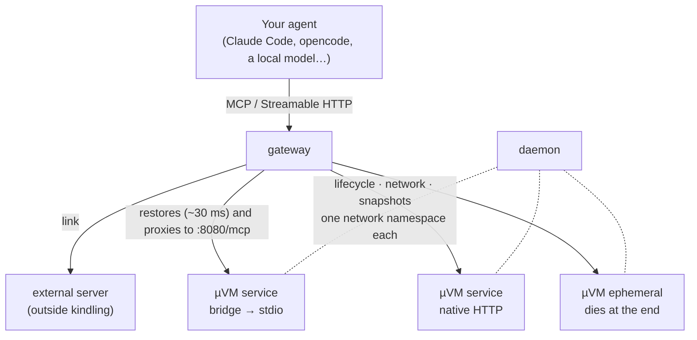

<p align="center">
  
</p>

<p align="center">
  <a href="https://github.com/juan52878911/kindling/releases"></a>
  <a href="https://github.com/juan52878911/kindling/actions/workflows/ci.yml"></a>
  
  
</p>

<p align="center"><b>English</b> · <a href="README.es.md">Español</a></p>

# kindling

A Firecracker microVM runtime with golden snapshots: machines that wake in
milliseconds from a file on disk, with kernel-level isolation, behind a docker-like CLI
called `kling`. What runs inside is up to you, and `kling` grows through extensions.

> Status: **v0.13.0 (unreleased) — one repository, one release.** `kling` manages
> microVMs with networking, golden snapshots, isolation, persistent volumes, layered
> images, events, image builders, a documented daemon API and throwaway sandboxes with
> streaming exec. Hosting MCP servers on demand — the use kindling was born for — and
> multi-tenant sandboxes are **extensions** that live in this same repository
> ([`ext/mcp`](ext/mcp), [`ext/sandbox`](ext/sandbox)) and ship in the same release:
> `kling plugin install mcp`. Every binary in a release is compatible with every other.
> See the [CHANGELOG](CHANGELOG.md) for what each version brought.

**The guest is assumed hostile**: there is no telling what code will end up running
inside. See [SECURITY.md](SECURITY.md) for the threat model, the barriers in place and
— above all — what is NOT solved yet.

## At a glance

Every number below is measured, not estimated — the how and where is in the linked
sections:

| | Measured |
|---|---|
| Thaw a frozen tool | **~30 ms** — imperceptible inside a tool call |
| Ephemeral action, end to end | **19 ms** (2 ms of actual execution) |
| Tool call, hot | **9 ms** |
| RAM of a `frozen` machine | **0** — it is a file on disk, not a process |
| Density | **142 microVMs in 3.9 GB** of host RAM |
| 10 instances from one golden snapshot | **+68 MiB** total (12× denser than cold boots) |
| Disk for a service, layered images | **1300 MiB → 433 MiB** for a 7-service fleet |
| 20 concurrent calls, same service | p50 **4.66 s** (was 44 s before v0.4) |

## Table of contents

<details open>
<summary><b>Expand / collapse</b></summary>

**The idea**
· [Why microVMs and not containers](#why-microvms-and-not-containers)
· [Architecture](#architecture)
· [Measured numbers](#measured-numbers)

**Getting started**
· [Installation](#installation)
· [Quick start](#quick-start)
· [Getting the runtime ready](#getting-the-runtime-ready--kling-up)
· [Connecting to the daemon](#connecting)
· [Configuration](#configuration)
· [On a Mac (Apple Silicon)](#on-a-mac-apple-silicon)

**The CLI**
· [kling](#kling)
· [Golden snapshots](#golden-snapshots)
· [Lifecycle and robustness](#lifecycle-and-robustness)
· [Networking](#networking-one-namespace-per-microvm)

**Sandboxes**
· [Sandboxes for code agents](#sandboxes-for-code-agents)

**Extensions**
· [Extensions: MCP servers and more](#extensions)
· [kling-mcp](#kling-mcp-mcp-servers-on-demand)
· [kling-sandbox](#kling-sandbox-multi-tenant-sandboxes)
· [Writing an extension](#writing-an-extension)

**Storage**
· [Volumes](#volumes-what-outlives-the-microvm)
· [A shared package library](#a-shared-package-library)
· [Sharing a host folder](#sharing-a-host-folder)
· [Small LLMs on demand (VON)](#small-llms-on-demand-von)
· [Chispa: a tiny classifier for small decisions](#chispa-a-tiny-classifier-for-small-decisions)
· [AI gateway](#ai-gateway-many-models-ready-none-running-247)
· [Demo: a smart-home room](#demo-a-smart-home-room-on-serverless-models)
· [What persists and what does not](#what-persists-and-what-does-not)

**Performance and density**
· [Disk cost](#disk-cost)
· [Layered images](#layered-images-one-base-per-runtime-family)
· [Density](#density-why-the-golden-snapshot-changes-everything)
· [Giving RAM back: squeeze, top, /metrics](#giving-ram-back-squeeze-top-and-metrics)
· [Faster wake-ups](#faster-wake-ups-warm-child--bundle--cpu-ceiling)

**Security**
· [Isolation](#isolation)
· [Egress: none, internet, allowlist](#egress-none-internet-or-an-allowlist-of-domains)
· [Secrets via MMDS](#secrets-that-never-touch-a-snapshot-mmds)

**Operations**
· [Topology report](#topology-report)
· [Memory: real vs cache](#memory-what-is-real-and-what-is-cache)

**Reference**
· [Requirements](#requirements)
· [Scripts](#scripts)
· [Documentation map](#documentation-map)
· [Roadmap](#roadmap)

</details>

## Why microVMs and not containers

An MCP server is a 50-100 MB Node or Python process. Putting it inside a microVM does not
save resources compared to a container — it costs more, because every microVM boots its
own kernel.

The reason to do it is a different one: **a local AI running arbitrary open source tooling
is untrusted code**. A container's isolation is a namespace of the shared kernel; a
microVM's is a hypervisor boundary. That is the project's only honest justification, and
it is worth being clear about it before writing another line.

## Architecture



The **gateway** takes the call, restores the matching snapshot, proxies the request and
reaps the microVM once its TTL expires. Inside the guest it always calls the same place,
`:8080/mcp`, whether the server speaks stdio (with `kling-bridge` translating) or native
Streamable HTTP (with nothing in between).

The **daemon** manages the lifecycle and is the only one that can reach the guests: their
IPs only exist on the host's network. That is why it exposes `POST /machines/{ref}/guest`,
which forwards an HTTP request to the server inside. Without it, `kling mcp import` would
only work by running the CLI on the host itself — over SSH the probe has no route and
times out.

## Measured numbers

Measured on Proxmox (Intel i7-8700T) with Firecracker v1.16.1 running **nested** inside a
VM, kernel 6.1.177 and an 800 MB Ubuntu 24.04 rootfs:

| Operation | Time |
|---|---|
| Cold boot | **2,643 ms** |
| Snapshot creation | 305 ms |
| **Restore from snapshot** | **~30 ms** |

Reproduce them with `scripts/40-bench-boot.sh`.

**The conclusion that defines the architecture:** 2.6 s cold makes the one-microVM-per-request
model unworkable. The 125 ms Firecracker advertises assume a trimmed kernel and a minimal
rootfs on bare metal. With snapshot/restore, 30 ms is imperceptible inside a tool call.

Therefore: **every tool boots once, is frozen with the MCP server already listening, and
the gateway restores it on demand.** The snapshot is not an optional optimization; it is
what holds everything else up.

---

# Getting started

## Installation

**Quick option — pre-built binaries (recommended):**

```sh
# macOS / Linux — one line, no dependencies
curl -fsSL https://raw.githubusercontent.com/juan52878911/kindling/main/scripts/install.sh | sh

# With extensions from the same release (MCP servers, sandboxes):
curl -fsSL .../install.sh | sh -s -- --with mcp,sandbox

# A specific version (it installs the latest release by default):
curl -fsSL .../install.sh | sh -s -- --tag v0.13.0

# Custom prefix:
curl -fsSL .../install.sh | sh -s -- --prefix ~/.local
```

Binaries are published on
[Releases](https://github.com/juan52878911/kindling/releases) for **linux/amd64**,
**linux/arm64**, **darwin/amd64** and **darwin/arm64**. Every release ships a
`SHA256SUMS`, and the install script verifies the checksum before moving anything onto
disk. **Windows is not supported** — the code uses POSIX syscalls (`syscall.Kill`,
`Setsid`, `Stat_t`).

**From source — `make`:**

```sh
make install                              # CLI on your machine
make deploy HOST=ssh://juan@192.168.2.60  # daemon on the host with KVM
```

`make install` picks the first writable directory on your PATH and **does not ask for
sudo**: installing a user tool should not require it. Force it with
`make install PREFIX=/usr/local` if you prefer it system-wide.

`make deploy` builds for `linux/amd64`, copies the binary and the systemd unit, and starts
the service. The unit hands the socket to the user you SSH in as, so you don't have to run
the entire client under sudo. The build is arch-parametric with `GOARCH`: to deploy to an
arm64 host use `make deploy GOARCH=arm64 HOST=ssh://...` (the binary comes out as
`kling-linux-arm64`).

Release cycle details: [`docs/releases.md`](docs/releases.md).

## Quick start

```sh
kling doctor                      # daemon, CLI vs daemon version, extensions, completion: each ✗ with its fix
kling try -- uname -a             # throwaway sandbox: create, run, return its exit code, delete
kling try -image toolchain        # no command: an interactive shell, deleted on exit (-keep keeps it)
kling ai up                       # AI gateway with ./ai.json or ~/.config/kling/ai.json on 127.0.0.1:8080
```

`kling doctor` exits 1 only when something fails (warnings, such as completion not being
loaded, do not count), so it also works in scripts. `kling ai up` prints the URL and a `curl` to try it before it starts
serving. When a command fails, the error comes with a second line, `try: …`, with the
next command to run (`kling doctor`, `kling ps -a`, `kling image ls`…).

A few more everyday commands:

```sh
kling help run                    # just the help for one command
kling logs -f <machine>           # follow the console until it stops running
kling template ls | inspect <name> | rm <name>
kling version                     # CLI and daemon versions (-json)
kling completion install          # writes the completion script and shows the line for your rc
```

## Getting the runtime ready — `kling up`

```sh
kling up        # checks KVM, nftables, the kindling user, artifacts and images
kling status    # one-pass diagnosis: daemon, gateway and the agents it finds
```

`kling up` **prints** the commands that need privileges instead of running them: letting an
installer touch nftables and create system users on its own is asking for trust that does not
need to be asked for. The kernel and the base image ship inside the binary, so there is no
script to run first.

The two silent failures it catches — the ones that cost you an afternoon if they slip
through — are a missing `nft` (microVMs boot with no network) and a missing `kindling` user
(Firecracker ends up running as root).

## Connecting

The same binary is both CLI and daemon. `kling daemon` runs wherever KVM is; the CLI
talks to it over a Unix socket, locally or through SSH:

```sh
export KLING_HOST=ssh://juan@192.168.2.60   # remote daemon
export KLING_HOST=/run/kling.sock           # local daemon
```

**The daemon never listens on a network port.** Controlling microVMs is equivalent to
root on their host: it can mount disks and boot arbitrary kernels. Exposing it over TCP
would repeat the mistake that has cost Docker a decade of compromised servers. For remote
access it uses SSH with the same technique as `docker context`: instead of requiring
socat or nc on the far end, it invokes `kling dial-stdio`, which bridges the SSH pipe to
the local socket.

## Configuration

Named contexts, in the style of `docker context`, so you don't have to carry `KLING_HOST`
around:

```sh
kling context add lab ssh://juan@192.168.2.60 -description "Home Proxmox"
kling context use lab
kling context ls
```

And defaults, so you don't repeat the same options on every `run`:

```sh
kling config set defaults.image min
kling config set defaults.ttl_seconds 600
kling config set gateway.idle 5m
kling config set daemon.vmm vz        # the local daemon's VMM: firecracker (Linux) or vz (macOS)
kling config show
```

`daemon.vmm` is read by the daemon running as that user; empty means the platform's
(`vz` on macOS, `firecracker` on Linux), and it is validated against the machine it
runs on. `KLING_VMM` overrides it with a backend name or a binary path.

The file lives at `~/.config/kling/config.json` — on macOS too: `UserConfigDir()` would
put it under `~/Library/Application Support`, which is right for desktop apps but
surprising for a CLI.

**Precedence:** `-H` > `$KLING_HOST` > active context > local socket. The flag always
wins, so a one-off invocation doesn't force you to switch contexts.

Shell completion ships with the binary: `source <(kling completion bash)` or
`source <(kling completion zsh)`.

## On a Mac (Apple Silicon)

**Native (v0.9, macOS 14+):** the daemon runs on the Mac itself with the `vz` backend —
one `kling-vz` helper per microVM, speaking Firecracker's API on top of
Virtualization.framework. No root, no Linux VM. Images are built on a Linux arm64 host and
streamed over with `kling image copy <name> -from ssh://user@host`. Restores cost ~350
MiB each (no shared golden memory), and there are no image builds, CPU caps or jailer.
Install, launchd agent and limits: [`docs/mac.md`](docs/mac.md).

```sh
make install && make vz && brew install e2fsprogs
kling up -check
kling image copy min -from ssh://user@linux-arm64-host
```

**Inside a Linux VM:** Firecracker does not run natively on macOS. On **M3 or newer** with macOS 15+ it runs
inside an aarch64 Linux VM with nested virtualization — **supported, with limits**: cold
starts are slower under nested KVM (~16 s per new replica vs ~3 s on native Linux, and
there are measured levers to bring that down to ~2.5 s), so it's good for local
development and evaluation, not high-concurrency workloads.

```sh
make deploy-mac HOST=ssh://...   # shortcut: GOARCH=arm64 deploy to the Lima VM
```

The full reproducible recipe — Lima config, nested-virt requirements, and the three
measured levers for faster cold starts (`-bundle`, `-cpu-pct 100`, http-proxy mode) — is
in [`docs/mac-arm64.md`](docs/mac-arm64.md).

---

# The CLI

## kling

> The transcripts below are reproduced verbatim: what you see here is what the tool
> actually outputs.

```
$ kling status -v
endpoint:     ssh://juan@192.168.2.60
daemon:       0.1.0
root:         /var/lib/kindling
KVM:          yes
firecracker:  Firecracker v1.16.1
machines:     7

$ kling run -name mcp-demo
efad9e5f7003  mcp-demo  booted cold in 54 ms

$ kling freeze mcp-demo
efad9e5f7003  warm  (754 ms, 256 MiB on disk)

$ kling ps
ID             NAME       IMAGE     STATE   CPU/MEM    DISK   EGRESS   AGE   LAST OP
efad9e5f7003   mcp-demo   default   warm    1/256MiB   81M    none     17s   freeze 754ms, 256MiB

$ kling thaw mcp-demo
efad9e5f7003  running  (22 ms)
```

The **`frozen`** state is what sets kindling apart from a container runtime: the machine is
frozen on disk, burns neither CPU nor RAM, and wakes up in tens of milliseconds.

## Golden snapshots

Freeze a machine once and instantiate N copies that **share its memory**:

```
$ kling save plantilla golden
golden  golden snapshot  (80M of memory)
instantiate with:  kling run -from golden

$ kling run -from golden -name g1
a3f9...  g1  instantiated from golden in 34 ms

$ kling template
NAME     IMAGE     CPU/MEM    MEMORY   DISK   INSTANCES   AGE
golden   default   1/256MiB   80M      80M    10          21s

$ kling events
23:52:20  machine.frozen   mcp-demo  frozen in 754 ms (256 MiB on disk)
23:52:20  machine.thawed   mcp-demo  thawed in 22 ms
```

`kling save` **requires the guest to be serving** before it freezes a golden snapshot
(`-wait`, 60 s by default). A snapshot taken too early restores in 26 ms and then never
answers — minutes or hours later, with an error that does not mention the commit. If the
guest is not serving, commit refuses and explains the whole chain; `-force` skips the
check, `-replace` swaps an existing snapshot atomically.

By default the snapshot is frozen with a **warm, unbound child process** inside, so the
golden does not pay the runtime's cold start on restore (`node` starting is 300-500 ms of
any wake-up). It roughly triples the snapshot's disk cost — 39 MB → 120 MB on a node
service — so `kling save -warm=false` trades wake-up latency for disk when you host
many services.

## Lifecycle and robustness

```sh
$ kling run -image min -ttl 300 -cpu-pct 25 -egress internet
$ kling logs <ref> -tail 50        # serial console: the only window inside
```

- **`-ttl`** freezes the machine by itself once that time passes. Freeze, not kill: it
  stops costing CPU and RAM, but comes back in ~30 ms. It is what makes the model
  serverless.
- **`-cpu-pct`** bounds CPU usage with its own cgroup (50% of a core by default).
- **Reconciliation at startup**: the daemon compares its saved state against the host's
  reality, re-adopts the microVMs that are still alive and cleans up orphaned namespaces
  and cgroups.
- **Continuous watchdog**: every 10 s it checks that whatever claims to be `running` is
  actually running. A machine whose process disappeared moves to `failed` and releases its
  resources.
- **Background loops contain their panics.** Each iteration of the reconciler, the reaper
  and the state persister is wrapped in a `recover()`: a nil-pointer in a background loop
  used to kill the daemon and orphan every microVM.

**Restarting the daemon does not kill the microVMs.** The unit carries `KillMode=process`;
without it systemd drags the whole cgroup down and takes the running machines with it.

### Measured with 8 instances

```
RAM añadida:          113 MiB   (14 MiB por instancia)
conectividad:         9/9
VMM sin privilegios:  9/9
cgroups activos:      9
```

## Networking: one namespace per microVM

```
$ kling topo
kindling  ssh://juan@192.168.2.60
          KVM ok · Firecracker v1.16.1

  host  172.30.0.0/16
   ├─◆ golden           golden snapshot · 82M shared memory
   │  ├── g3             running  172.30.0.18     ⌀   384K  thaw 28ms
   │  ├── g2             running  172.30.0.14     ⌀   384K  thaw 26ms
   │  └── g1             running  172.30.0.10     ⌀   384K  thaw 41ms
   │
   └─◆ (booted cold)
      └── plantilla      running  172.30.0.6      ⌀     8M  boot 46ms

  4 running · 0 warm · 0 stopped   disk: 9M own + 83M shared
  egress:  ⌀ isolated   → internet (private networks are always blocked)
```

**The problem:** a snapshot records the name of the host's TAP device. If N instances
restore from the same golden snapshot, all N ask for the same TAP and collide. And you
cannot just reassign it: Firecracker does not allow patching `host_dev_name`.

**The solution:** one network namespace per microVM. Inside each one the TAP is always
called `tap0` and the guest always has the same IP, so **one snapshot works for all of
them**. All the differentiation happens on the host, on the far side of a veth:

```
        host                  │  netns kl-<id>          │  microVM
 vh-<id> 172.30.a.b/30 ◄─veth─► vg-<id> 172.30.a.b+1    │
                              │ tap0    172.16.0.1/30   ├─ eth0 172.16.0.2
```

The guest configures itself from the kernel's `ip=` parameter, with no need for networking
tools inside the image. From the host each machine is reachable at its namespace's IP,
which DNATs to the guest.

It is the same approach AWS Lambda uses, and for the same reason.

---

# Sandboxes for code agents

An agent writes a script and needs to run it without touching your machine. `kling`
gives it a throwaway microVM: it wakes from a snapshot in milliseconds, has no network
unless asked for, streams the output of whatever it is told to run, and destroys itself
when its lifetime runs out.

```sh
kling image toolchain                          # an image with node, npm, python3 and pip
kling sandbox create -image toolchain -name sb  # ~5 s cold
kling cp ./analysis.py sb:/tmp/
kling exec sb -- python3 /tmp/analysis.py       # output arrives as it is produced
kling shell sb                                  # or an interactive terminal inside
kling cp sb:/tmp/result.json .
kling sandbox rm sb
```

`kling shell sb` opens a real terminal inside, with `vim`, history and Ctrl-C
interrupting what runs inside instead of the session. `kling exec` exits with the remote
exit code, separates stdout from stderr, takes stdin with `-i` and kills the whole
process group on `-timeout`. Prepare a template once
(`kling run -allow-exec`, install what you need, `kling save`) and every sandbox
created with `-from` starts in **~300 ms** with it already inside — five in parallel took
0.57 s in the lab.

Exec is **opt-in at boot**: it travels in the kernel command line that only the host
writes, and it is frozen with the memory. A service microVM never has it, and a snapshot
without it cannot become a sandbox. Guide: [`docs/exec-sandbox.md`](docs/exec-sandbox.md).

---

# Extensions

`kling` is the only command you type. What is not part of the microVM core arrives as an
**extension**: an executable called `kling-<name>` that declares which subcommands it
adds. `kling` discovers it, shows it in `kling help` and in shell completion, and hands
over control when you type one of its commands — exit codes, signals and terminal
included. Core commands always win.

The official extensions live in this repository and ship in every release, with the same
version as the core:

```sh
kling plugin install mcp        # MCP servers on demand (brings kling-bridge along)
kling plugin install sandbox    # multi-tenant sandboxes: gateway, templates, prewarmed pool
kling plugin ls                 # what is installed, where from (path + sha256), and its status
kling plugin disable ai         # switch one off without removing it; also for built-ins
kling completion install         # reload completion after installing one
```

`kling plugin install` downloads `kling-<name>-<os>-<arch>` from the release that matches
your `kling`, **verifies it against the release's `SHA256SUMS` before writing it**, checks
its manifest and drops it in `~/.local/share/kling/plugins` (or the first directory of
`$KLING_PLUGIN_PATH`). `@v0.13.0`, `-from https://…` and `-file PATH` pick another source;
`kling plugin rm <name>` removes it. `ai` is a **built-in extension** (`kling ai model`,
`kling ai chispa`, the AI gateway): it lives inside the `kling` binary but is listed,
documented and switched off the same way.

Since 0.14 an extension's commands live **under its name**: `kling mcp add`, `kling mcp
serve`, `kling sbx ls`. Only `connect` is promoted to the top level. The old loose verbs
(`kling add`, `kling gateway`, `kling models`, `kling chispa`, `kling commit`, `kling
snapshots`, `kling rmi`, `kling images`, `kling plugins`, `kling info`) keep working as
silent aliases; 0.15 will warn once per process and 0.16 removes the extension ones.
`commit`, `snapshots` and `plugins` stay for good.

## kling-mcp: MCP servers on demand

Take any open source MCP server — npm or PyPI, stdio or native Streamable HTTP — and turn
it into a service that wakes on demand from a golden snapshot. This is what kindling was
built for; it lives in [`ext/mcp`](ext/mcp).

```sh
kling plugin install mcp
kling mcp search filesystem
kling mcp add io.github.domdomegg/filesystem-mcp
kling connect -all -install all
```

It brings the catalog, the stdio→HTTP bridge, the gateway with sessions, replicas and
ephemeral mode, the single `_all` entry point, type repair, self-healing and the
connection to your AI agent. The measured numbers above were taken with it. Its guide is
[`ext/mcp/README.md`](ext/mcp/README.md).

Upgrading from v0.5 or earlier: snapshots, catalogs, health and links are migrated in
place by the daemon; install the extension and every command you used keeps working.

## kling-sandbox: multi-tenant sandboxes

[`ext/sandbox`](ext/sandbox) puts a gateway in front of `kling sandbox`: tenants with
tokens and quotas, templates, and a pool of prewarmed sandboxes that are claimed in
milliseconds instead of created. It also ships `kindling-operator`, which runs the same
thing from Kubernetes ([`docs/kubernetes.md`](docs/kubernetes.md)).

```sh
kling plugin install sandbox
```

## Writing an extension

The ten-minute version is [`docs/extensions.md`](docs/extensions.md), built around
[`examples/hello-extension`](examples/hello-extension): one `main.go` with
`plugin.Main`, `go build -o ~/.local/share/kling/plugins/kling-hello`, and `kling hello`
works, with its help, completion and config key.

An extension answers `--kling-manifest` with a JSON manifest (name, version, minimum core
version, commands, typed configuration keys, hooks for `kling status` and `kling up`,
systemd units, companion executables) and then receives its commands. It talks to the daemon only through its
HTTP API: snapshot annotations, a key-value store, named image builders and files inside
images are there so extensions never touch the daemon's internals. Go extensions get it
all from `pkg/plugin`, `pkg/api`, `pkg/config`, `pkg/guest` and `pkg/scheduler`.

The protocol is in [`docs/extensions.md`](docs/extensions.md) and the daemon API in
[`docs/api.md`](docs/api.md).

---

# Storage

## Volumes: what outlives the microVM

Each machine's overlay dies with it. A **volume** is the opposite: an ext4 file on the host,
attached as a disk of its own — `vdc` onwards, up to four of them — that persists.

```sh
kling volume create notes -size 2G
kling mcp import notes-mcp -volume notes          # or: kling mcp add <server> ...
kling run -name jottings -volume notes:/data      # or a microVM by hand
kling volume ls
```

```
NAME     LOGICAL   ON DISK   USED BY
notes    2.0G      4.0M      notes-a3f9
```

**Why a disk and not a host directory.** The natural request is "mount `~/notes` inside".
It isn't done: Firecracker has no virtio-fs, and more importantly a host directory mounted
read-write hands the guest — which is assumed hostile — a direct channel into the host's
filesystem. That would throw away the very boundary that justifies using microVMs instead of
containers. The file is sparse, so it only takes up what actually gets written.

**A volume is declared at import time, not later.** Firecracker cannot add drives to a
restored VM, so the device has to be present when the golden snapshot is frozen. A service
imported without a volume cannot get one without re-importing, and kling says exactly that
instead of failing inside the guest.

**Who mounts it.** The bridge, not the image's init — so no base image needs rebuilding. The
mountpoints travel on the kernel command line (`kling.volume=/data,/libs:ro`), which means
the same golden snapshot works with different volumes.

**One writer, or many readers.** That is not a policy, it is physics: ext4 does not tolerate
two systems mounting it read-write. Each one caches metadata the other cannot see, and the
result is corruption. Reading is a different matter: if nobody writes, the blocks do not
change. So kling allows **one** exclusive writer **or** as many readers as you like, and
never both at once.

The rule is enforced on the boot path, not only on delete: whoever mounts a volume is as
dangerous as whoever removes it. `kling volume rm` refuses while a microVM has it mounted —
deleting the file underneath would corrupt its filesystem — and a `run` or an `import` that
would break the one-writer rule is turned down the same way, naming the machine that holds
it and, when reading is enough, showing you the `-volume <name>:ro` that would work.

**It survives the machine being killed.** Stopping a microVM means killing the VMM, which
from the guest's point of view is indistinguishable from a power cut. That is why a volume is
formatted **with a journal** — unlike overlays, which are disposable — and why the daemon
asks the guest to flush its cache to disk before killing it. Without the first, the
filesystem is left inconsistent and with nothing to replay; without the second, you lose
exactly what was written last. Every boot is preceded by an `e2fsck -p`, which on a healthy
volume costs milliseconds.

## A shared package library

That is what makes it possible not to duplicate the same dependencies in every image:

```sh
kling volume create libs -size 2G

# the image carrying the installers, once:
kling image toolchain

# populate it INSIDE a single-use microVM, which is destroyed when it finishes:
kling volume populate libs -- npm install --prefix /data --ignore-scripts lodash axios zod
kling volume populate libs -- pip install --target /data requests

# and consume it from as many microVMs as you need:
kling mcp import my-service -volume libs:/libs:ro
kling run -name another -volume libs:/libs:ro
```

The mode travels glued to the mountpoint on the kernel command line (`kling.volume=/libs:ro`),
so the bridge cannot read one without the other. Inside, it is mounted with `MS_RDONLY`
**and** `noload`: without `noload`, ext4 would try to replay the journal at mount time —
which is a write — and several guests doing that at once against the same file is precisely
the corruption read-only mode exists to avoid. The drive is marked read-only in Firecracker
itself as well, so the barrier does not rely on the guest behaving: writing gets `EROFS`.

**Installing is running third-party code**, so `volume populate` does it inside a microVM
with the volume mounted read-write and destroys it when it is done — rather than in a chroot
on the host, which would take that execution outside the very boundary that justifies the
project. The ability to run commands is switched on by the kernel (`kling.exec=1`) and only
the daemon sets it, only for those machines: a service microVM does not even have that route
registered.

### Several volumes in the same microVM

The two natural uses were getting in each other's way: a service wants its own read-write
storage **and** the shared library read-only. `-volume` can be repeated, and the order you
write them in is the order of the disks (`vdc`, `vdd`, …):

```sh
kling mcp import my-service -volume data:/data -volume libs:/libs:ro
```

```
NAME     LOGICAL   ON DISK   USED BY
data     2.0G      97M       my-service-1a98a4 (writing)
libs     2.0G      109M      my-service-1a98a4, another-one
```

Four is the ceiling, because each one is a disk and disks are named by letter.

**The set of disks is fixed at freeze time.** Firecracker will not add or remove drives on a
restored VM — it only lets you repoint each one at a different file — so changing how many
volumes a service carries means re-importing it, and kling says exactly that instead of
failing inside the guest.

### Packages find themselves

Once everything is mounted, the bridge looks inside each volume
and exports `NODE_PATH` and `PYTHONPATH` to the MCP server:

| What the volume holds | What gets exported |
|---|---|
| `<vol>/node_modules` | `NODE_PATH=<vol>/node_modules` |
| `<vol>/*.dist-info` (`pip install --target`) | `PYTHONPATH=<vol>` |
| `<vol>/lib/python*/site-packages` (`pip install --prefix`) | that path in `PYTHONPATH` |

It is worked out at boot rather than at image build time because the mountpoint is decided at
boot: a `NODE_PATH` baked into the image would start lying the moment you mounted the library
somewhere else. And the directory is checked for existence before being added — an ordinary
data volume does not end up in `PYTHONPATH`, because a `json.py` sitting in it would shadow
the standard library module and the failure would surface nowhere near its cause. Whatever
the image already has installed comes **first**: updating the volume must not silently change
the version a service that already worked is using.

## Sharing a host folder

`-share SRC:DST[:copy|ro|rw]` puts a host folder inside a machine (`kling run` and
`kling sandbox create`, repeatable):

```sh
kling run -image toolchain -share ./repo:/work              # copy: a read-only snapshot
kling -H ssh://lab run -share ./repo:/work                  # ... uploaded from your laptop
sudo kling config set daemon.share_roots /srv/code          # on the daemon host, once
kling run -image toolchain -share /srv/code/app:/src:rw     # live, read-write
```

- **copy** (default): the CLI tars the folder, the daemon checks every entry and builds a
  read-only ext4 attached like a volume. Works with any daemon, local or over SSH; changes
  on your side are not seen afterwards.
- **ro / rw**: the folder *on the daemon host* is served live. The guest agent speaks FUSE
  itself and the daemon serves each operation through `os.Root`, so nothing escapes the
  folder — not `..`, not a symlink. Host edits show up within a second; `ro` is enforced by
  the daemon, not just the mount. It survives `freeze`/`thaw` and daemon restarts, and
  works with `egress none`. Only folders under `daemon.share_roots` (empty by default)
  can be shared live.

The guest cannot create symlinks, hard links or device nodes in a live share
(`npm install --no-bin-links` works), sees everything as owned by root, and a machine with
shares cannot be committed. Live shares go through the guest's network device, capped at
16 MiB/s per direction on Firecracker. Design, limits and threat model:
[`docs/compartir.md`](docs/compartir.md).

## Small LLMs on demand (VON)

`kling ai model` serves small instruct models (SmolLM2-360M, Qwen2.5 0.5B and 1.5B; only
Apache-2.0/MIT weights in the default catalog) from microVMs with
llama.cpp's OpenAI-compatible `llama-server`, frozen in a golden snapshot **after** the model is
loaded and warmed:

```sh
kling ai model add von-smol -model smollm2-360m-instruct     # image + golden snapshot, one command
kling run -from von-smol -name smol-1                      # a replica, model already in memory
kling ai model ask smol-1 "What is a microVM?"               # answer + tokens/s
curl http://$(kling inspect smol-1 | jq -r .ip):8000/v1/chat/completions -d '{...}'
```

Weights and llama.cpp are pinned by revision and sha256. On Linux the replicas of one golden
share the weights in the host page cache: four SmolLM2 replicas measured **461 MiB PSS** in
total (sum of RSS 1715 MiB), ~12 MiB per extra replica. On a Mac (`vz`), a replica answers its
first token ~0.8 s after `run -from` and generates ~140 tok/s. Numbers, the nested-lab caveat and
the GPU plan: [`docs/von.md`](docs/von.md).

## Chispa: a tiny classifier for small decisions

`kling ai chispa` trains and serves a linear model (hashed words, bigrams and structured
fields; int16 weights; ~1 MB) for decisions that do not deserve a language model:
classify an event, route an agent request, filter an input. It runs locally, needs no
daemon, answers in 1.5–6 µs with zero allocations, and is bit-identical across
amd64/arm64. Every prediction carries a calibrated probability and a per-class
threshold decision, `confident` or `escalate`, so a gateway can answer with Chispa and
hand the rest to a bigger model.

```sh
kling ai chispa train -data train.jsonl -valid valid.jsonl -o events.chispa
kling ai chispa predict -model events.chispa -text "panic in the parser" -fields '{"service":"api"}'
```

Design and file format: [`docs/chispa.md`](docs/chispa.md). An honest evaluation on 4,304
real commits, including where the thresholds stop holding:
[`docs/CHISPA-EVAL.md`](docs/CHISPA-EVAL.md). Chispa can also run **serverless**, one task per
frozen microVM golden snapshot woken on demand (the same model as VON below):
`kling ai chispa deploy`, measured thaw and throughput numbers in
[`docs/chispa-serverless.md`](docs/chispa-serverless.md).

## AI gateway: many models ready, none running 24/7

`kling ai serve` puts Chispa and VON behind one API, each doing its own job: **Chispa
classifies, routes and filters** (in-process, microseconds), **VON generates**
(summaries, drafts, answers) from replicas that are thawed on the first request,
scaled out under concurrency and frozen again when idle (`pkg/scheduler`).
`POST /v1/classify` and `/v1/decide` return Chispa's label with `escalate: true` when it
is unsure, so the caller decides; `POST /v1/generate` fills a per-task prompt template;
`/v1/chat/completions` and `/v1/models` are OpenAI-compatible, with streaming.
Chaining the two (a **cascade**: VON answers what Chispa doubts) is opt-in per task and
**only enabled when `kling ai eval` shows, on that task's labelled data, that it beats
Chispa alone** (McNemar test, same models and settings); otherwise the gateway refuses it
unless `escalate_force`. It listens on a 0600 Unix socket by default and on TCP only
with `-listen` and a token.

An **intent task** (`"intent"` in the registry) turns a short command into an intent plus
slots with the same layered idea: exact templates, then Chispa and a Chispa-slots tagger,
then a sentence encoder whose layer is gated by `kling ai eval` (McNemar on whole
commands), and escalates the rest. What the domain knows — templates, slot values, which
slots an intent needs — comes from a JSON schema file, or from a Go `intent.Domain` that a
program embedding `pkg/aigw` registers. Guide: [`docs/intent.md`](docs/intent.md).

```sh
kling ai serve                                  # registry in ~/.config/kling/ai.json
kling ai test commit-type "fix crash when the cache is cold"
kling ai generate summarize "fix(parser): handle empty input"
kling ai eval commit-type -data test.jsonl -von qwen   # gates escalate_to
```

Measured on commit classification (861 held-out commits), Chispa alone is 0.640 accurate in
6 µs; no cascade reached it — Qwen2.5 0.5B 0.429, 1.5B 0.520, 3B 0.540 — so the gate
refused them all. On a Mac, a warm generation answers in 9 ms, a frozen replica in
~1.5 s. Design, API, numbers and limits: [`docs/ai-gateway.md`](docs/ai-gateway.md).

### Example: CI failure triage

[`examples/ci-triage`](examples/ci-triage/README.md) is a separate program that
uses the gateway: Chispa scores every line of a failed CI log (~1 µs a line, 25 ms
per log through the gateway) and picks the few that explain the failure; a second
Chispa model names the category; VON (Qwen2.5-1.5B) only reads that ~400-token
chunk when Chispa is unsure; a local page lets a person confirm or correct it and
exports the label for retraining. On 160 held-out LogChunks logs (Travis, CC BY 4.0)
the chunk hits the hand-annotated lines in 70 % of logs vs 54 % for the last 30 lines
and 38 % for an error regex; categories are harder (Chispa 0.52, with VON 0.56, not
significant). On 34 real GitHub Actions failures it only ties the tail of the log
(56 %): a new CI needs its own labels. [`docs/CI-TRIAGE-EVAL.md`](docs/CI-TRIAGE-EVAL.md).

## Demo: a smart-home room on serverless models

[`examples/domotica`](examples/domotica/README.md) is a separate app that *uses*
kindling: a web page with a simulated room (lights, thermostat, blinds, TV,
speaker, lock, alarm, fan, plug) driven by voice commands as text, in Spanish or
English. Each command goes through the AI gateway — kindling's, embedded by the demo program
with its room domain (`kindling-domotica gateway`), as an intent task: demo templates and the fast
Chispa model answer in-process in microseconds; what they doubt goes to a
sentence encoder and then to a small LLM (Qwen2.5-1.5B with JSON-schema output,
validated against the room's taxonomy), each in a microVM that is thawed by the
command and frozen again when idle. The page shows which layer decided, its
confidence and latency, whether its microVM was thawed (and how long that took),
and every layer's microVMs (awake or frozen, memory). Layer 4 is only enabled
where its eval shows it beats "escalate and do nothing": with the 1.5B model,
on what the fast model is unsure about (31 more MASSIVE commands right, none
acted on out of scope), not on everything (it would act on 1.5 % of the chatter
that is not for the room). Guide: [`docs/demo-domotica.md`](docs/demo-domotica.md).

```sh
make domotica                                         # builds ./kindling-domotica (not installed, not released)
./kindling-domotica gateway -config examples/domotica/ai.json &   # after adapting paths and goldens
./kindling-domotica room                              # http://127.0.0.1:8088/
./kindling-domotica decide "pon la luz del salón en azul"          # layers 1-2 in-process, no daemon
```

## What persists and what does not

Worth being clear about, because it is not obvious:

| | Survives |
|---|---|
| State of an **ephemeral** service | nothing: the microVM dies after every action |
| State of a **persistent** service | freezes and thaws of ITS instance |
| | but **not** that instance being deleted |
| A **volume** | everything: stop, rm, re-import — it is a journaled ext4 on the host |
| Base image and golden snapshot | everything: they are files on the host |

A persistent service keeps its contents for as long as its instance lives; the instance
freezes when idle and comes back intact. But if that instance is deleted — manual cleanup,
`kling rm`, reinstalling the service — the state in its **overlay** goes with it.

For data that must survive everything, give the service a [volume](#volumes-what-outlives-the-microvm)
at import time, or point the tools at a [linked memory service](ext/mcp/README.md#bring-your-own-memory-service)
shared across all of them.

---

# Performance and density

## Disk cost

The base image **is not copied**: it is mounted read-only and shared by every microVM.
Each machine only carries its own sparse overlay, mounted with overlayfs by
`/sbin/overlay-init` inside the guest.

| | |
|---|---|
| Base image `min` (Alpine), shared | **17 MB**, once |
| Base image `default` (Ubuntu), shared | 386 MB |
| Per running machine | **~8 MB** |
| Per `frozen` machine, `min` image | **~35 MB** |
| Per `frozen` machine, `default` image | ~82 MB |

Before overlays, every machine copied the full 800 MB: three machines cost 2.4 GB, now
they cost 386 MB + 25 MB.

**A `frozen` machine consumes no RAM.** `freeze` kills the Firecracker process; what remains
is a file. Its cost is disk, not memory.

Firecracker dumps the entire memory when freezing, but most of it is zeroed pages.
kindling punches them out with `fallocate --dig-holes`: the kernel returns zeros when
reading a hole, which is exactly what was there, so the restore never notices.

**256 MB → 81 MB, and `thaw` is still ~30 ms.**

### What drives that cost

Two measurements that should guide any future optimization:

| Allocated RAM | Frozen cost |
|---|---|
| 512 MiB | 86 MB |
| 256 MiB | 81 MB |
| 96 MiB | 80 MB |

**Allocating more RAM is nearly free** once the file is sparse: what gets stored is the
real working set, not the reserved RAM. Lowering `-mem` is not the lever.

The lever is what boots inside:

| Guest | Frozen cost |
|---|---|
| Ubuntu 24.04 + systemd | 82 MB |
| Alpine without systemd (`min` image) | **35 MB** |

Nearly half the cost was Ubuntu userspace that an ephemeral tool never touches.
`scripts/70-build-minimal-image.sh` builds the `min` image: Alpine with
`/sbin/overlay-init` and no service manager, booting straight into `/entrypoint`.

## Layered images: one base per runtime family

A monolithic service image copies the whole base — and for a node service, ~130 MiB of it
is nodejs+npm repeated identically in every image. Layered images split that: **a shared
read-only base per runtime family + a small read-only service layer (only the delta) + the
per-machine overlay that already existed** — the same model OCI images use, built with
overlayfs whiteouts.

```sh
sudo BRIDGE=<path> ./scripts/70-build-minimal-image.sh node     # base with nodejs+npm
sudo BRIDGE=<path> ./scripts/70-build-minimal-image.sh python   # base with python3+pip

kling mcp add <server>              # picks the 'node'/'python' base automatically
kling mcp add <server> -base min    # forces the minimal base (monolithic-style layer)
```

The real fleet, re-imported in layers over the `node` base:

| service | before | after |
|---|---|---|
| context7 | 129 MiB | 39 MiB |
| everything | 134 MiB | 39 MiB |
| fetch | 164 MiB | 77 MiB |
| filesystem-mcp | 135 MiB | 36 MiB |
| memory | 139 MiB | 37 MiB |
| sequentialthinking | 128 MiB | 38 MiB |
| wikipedia-mcp-server | 471 MiB | 54 MiB |
| **total** | **1300 MiB** | **320 MiB** + 113 shared base |

**67% less disk**, identical catalogs, boot and thaw unchanged. The bridge is baked into
the base, so updating it is **one** file (`kling mcp refresh-bridge min`) instead of N. The
full design, measurements and gotchas: [`docs/three-layers.md`](docs/three-layers.md).

`kling image ls` shows the `BASE` column and counts each base once in the total;
`kling image rm` refuses to remove an image that is the base of another layer, backs a
golden snapshot, or has a live machine.

## Density: why the golden snapshot changes everything

A golden snapshot is an artifact **of an image, not of a machine**: you freeze once and N
instances restore from the same file. Because Firecracker **maps** it instead of reserving
anonymous memory, the kernel shares those pages across every instance and each one only
pays for what it writes.

Measured by instantiating one at a time and watching system RAM:

| | 10 from a golden snapshot | 10 cold-booted |
|---|---|---|
| Total RAM added | **+68 MiB** | +824 MiB |
| Per machine | **6.8 MiB** | 82 MiB |
| Time per machine | ~40 ms | ~2.6 s to userspace |

**12x the density.** The proof that pages are shared is in the gap between two numbers: the
sum of RSS across the ten processes came to 258 MiB, but system RAM only rose by 68 MiB.
The 190 MiB difference is shared pages that each process counts as its own.

Pushed further in a stress test on a 4 GB host: **142 concurrent microVMs in 3.9 GB**,
with free memory flat while total PSS grew — and a deterministic, explained refusal at
143 instead of an OOM. Details in [`docs/estabilidad.md`](docs/estabilidad.md).

If density is what you are after, there is also an opt-in host-side lever: **zram**
(compressed swap in RAM) for the anonymous pages that diverge between copies — measured
guidance in [`docs/densidad-zram.md`](docs/densidad-zram.md).

## Giving RAM back: squeeze, top and /metrics

```sh
kling top                # PSS per microVM and for the host; -watch 2s to refresh
kling machine squeeze <ref>...   # balloon: reclaims the guest's free memory for the host
```

`kling top` reports **PSS**, not RSS — with copy-on-write instances, RSS counts the same
shared page N times and overstates usage wildly. The gateway also exposes `/metrics`
with the same accounting, including the shared `mem.file`.

`kling machine squeeze` inflates the balloon device inside a running guest so the pages it is not
actually using go back to the host — useful after a service's startup spike, when its
steady state is much smaller than its peak. The daemon also does it on its own before
refusing a new machine for lack of memory.

```sh
kling run -image toolchain -mem 512 -mem-max 2048 -name job
kling machine resize job -mem 1536   # up or down, without restarting
```

Firecracker cannot add memory to a running VM, so elasticity works the other way round:
the machine boots with the ceiling and the balloon holds back the difference. Measured in
the lab, the guest's available memory went from 399 to 1,398 MiB and back down to 270 MiB
without a restart.

## Faster wake-ups: warm child · bundle · CPU ceiling

Three measured levers, from the v0.3–v0.4 performance work:

- **The warm child** (default, [see commit](#golden-snapshots)): the golden freezes with
  the runtime already started. Wake-up drops from 4,350 ms to **175–202 ms**, and a 20-call
  concurrent burst from 44 s to **4.66 s**.
- **The integrity verdict is remembered.** A golden is immutable once frozen; hashing its
  512 MiB overlay on every instantiation was 67% of the wake-up. It is verified once per
  daemon lifetime (and re-verified if size or mtime change).
- **On Mac/arm64**: `kling mcp add -bundle` (esbuild, 1205 files → 1) and
  `kling mcp import -cpu-pct 100` compound to take a cold `initialize` from ~16 s to
  ~2.5 s. The breakdown is in [`docs/mac-arm64.md`](docs/mac-arm64.md).

For popular services, `kling mcp serve -keepwarm N` keeps the primary instance of the N
most-used persistent services warm, taking the cold start off the critical path entirely.

---

# Security

The guest is third-party code: assume it is hostile. The full threat model — including
**what is not solved** — is in [SECURITY.md](SECURITY.md).

## Isolation

| Barrier | How |
|---|---|
| Daemon unreachable over the network | Unix socket only; remote access exclusively over SSH |
| Unprivileged VMM | `setpriv` to a service user: **CapEff 0**, `no_new_privs`, only the `kvm` group |
| No LAN access | Egress `none` by default; with `internet`, private networks stay blocked |
| No degrading the neighbours | 128 MiB/s of disk and 16 MiB/s of network per machine; CPU cgroup per machine; cap of 256 |
| No repeated keys | virtio-rng + `CONFIG_VMGENID`: the guest reseeds on restore |
| No secrets in snapshots | secrets are injected per session via MMDS, into the live machine only |

Verified **from inside the guest**, which is the only measurement that counts:

```
RESULT 192.168.2.100:   BLOCKED        (Proxmox host)
RESULT 192.168.2.1:     BLOCKED        (home router)
RESULT 10.10.10.1:      BLOCKED        (WireGuard tunnel)
RESULT 169.254.169.254: BLOCKED        (cloud metadata)
RESULT 1.1.1.1:         REACHABLE
```

## Egress: none, internet, or an allowlist of domains

```sh
kling run -egress none                          # default: answers its caller, initiates nothing
kling run -egress internet                      # out to the internet, never to private ranges
kling run -egress allowlist -allow api.github.com,pypi.org
```

The third mode is **fail-closed**: only the declared domains get out, resolved
dynamically (DNS → ipset), and everything else — including all private ranges — stays
blocked. An unknown egress value is an **error**, not a fall-through to the most
permissive mode. The policy travels with the service's snapshot, so a healed or
re-imported service keeps it.

## Secrets that never touch a snapshot: MMDS

A frozen snapshot is a file on disk that outlives the machine — the wrong place for an
API key. Secrets are injected into the **live** microVM through Firecracker's MMDS
(microVM metadata service):

```sh
kling machine secret <ref> -f store.json     # or pipe the JSON through stdin
```

The store carries common variables and per-session secrets keyed by `Mcp-Session-Id`;
the bridge hands each session its own. A machine that has received secrets **can no
longer be frozen** — that is enforced, not advised — so no secret ever ends up inside a
snapshot file.

---

# Operations

## Topology report

```sh
kling mcp export -o topology.html
```

Self-contained: no CDN, no remote fonts, no requests when you open it — it describes a
homelab's topology and has no business telling anyone about it. It is generated on **your**
machine, not on the daemon.

It is the same tree as always — the host on the left, its services in a column, the
instances on the right — but navigable: every box with children opens and closes, and
whichever one you pick is detailed below.

```
                        ┌ eco ──────────┐
                        │ 2 tools       │  no instances · ~250 ms
                        └───────────────┘
                        ┌ engram ───────┐
                        │ 11 tools      │  doesn't run here
 ┌ host ────────────┐   └───────────────┘
 │ ssh://…2.60    − ├───┌ filesystem ───┐   ┌ fs-66e51d ────┐
 └──────────────────┘   │ 14 tools      ├───┤ 244f32b7      │  172.30.0.54 · thaw 30 ms
                        └───────────────┘   └───────────────┘
```

The border tells you the state: green serving, amber asleep, dotted grey ready but with no
instance, blue external. A dotted service is not broken — it appears on its own as soon as
someone calls it, and the grey annotation on the right says how much that will cost.

### Four views of the same system

| view | what it shows |
|---|---|
| **Topology** | the host, its services and the live instances of each one |
| **Layers** | what a call goes through: gateway → aggregator → microVM → kernel, rootfs, overlay, bridge → MCP server |
| **MCP** | the full catalog: every service with its tools, marking which ones write |
| **Network** | who can reach the internet and who is isolated, namespace by namespace |

### Drill down

Clicking a box opens it. If you want to go all the way down a level, the panel offers
**Drill down**: that node becomes the root and a breadcrumb appears to get back.

```
catalog › filesystem
```

The bottom panel changes with whatever you select: the node's data, the step-by-step flow
of a call to that service, and — if it writes anything — where what it writes ends up.

Nodes are grouped by the `service` label, and failing that by their source snapshot: two
machines from the same snapshot share memory and belong together even if nobody labelled
them.

```sh
kling run -from eco -service eco -label tier=prod
```

```
Watch what it writes
Writes via create_directory, edit_file, move_file, write_file.
Lives as long as the instance does → save it to engram.
```

That warning — "watch what it writes; it lives only as long as the instance does, so put it
in engram" — is the rule that causes the most confusion: a microVM's overlay dies with it. If a
tool needs to persist a file, a row in a database or anything else, the right destination
is a [volume](#volumes-what-outlives-the-microvm) or the linked memory service, not the
guest's overlay. The Layers view marks it on the `overlay propio` node itself.

## Memory: what is real and what is cache

After many freeze and thaw cycles, the hypervisor may show the lab VM at 80% memory. Almost
all of it is **disk cache**, not real usage:

```
Cached:      2.9 GiB    ← what you see in the panel
AnonPages:   273 MiB    ← process memory, the real number
```

You can check by dropping it: the cache falls from 3,098 to 178 MiB, usage settles at
~600 MiB and the microVMs keep responding. It is reclaimable memory; the kernel releases it
under pressure.

Two things help:

- **`qemu-guest-agent` in the lab VM.** Without it, the hypervisor cannot tell usage from
  cache and reports everything the guest has ever touched. With it, the panel went from
  3.26 GiB to 961 MiB for the same real state.
- **kindling drops the page cache of the memory file after freezing.** That file is written
  in full and read back to punch holes in it, and then nobody touches it until someone
  thaws that particular machine. It brought the accumulation down from ~150 MiB to ~54 MiB
  per cycle.

**Golden** snapshots are deliberately not dropped: there the cache is precisely what lets N
instances share pages.

---

# Reference

## Requirements

- A host with KVM and `cpu: host` (or equivalent) so the virtualization extensions get through
- If it runs nested, nested virtualization enabled on the parent host
- `firecracker` + `jailer`, `e2fsprogs`, `squashfs-tools`, `curl`, `jq`
- On **macOS**: Apple Silicon M3+ with macOS 15+, via a Linux VM with nested
  virtualization — see [On a Mac](#on-a-mac-apple-silicon)

## Scripts

| | |
|---|---|
| `scripts/install.sh` | curl-pipe-sh installer: downloads the release binary and verifies SHA256 |
| `scripts/release.sh` | Creates the tag and pushes it; triggers the release workflow |
| `scripts/10-provision-lab.sh` | Creates the lab VM on Proxmox |
| `scripts/20-install-firecracker.sh` | Installs Firecracker and jailer from the latest release |
| `scripts/30-fetch-artifacts.sh` | Discovers and downloads kernel + rootfs from CI |
| `scripts/40-bench-boot.sh` | Measures cold boot, snapshot and restore |
| `scripts/50-prepare-image.sh` | Injects `overlay-init` and registers the base image |
| `scripts/70-build-minimal-image.sh` | Builds the `min` base image, or a runtime-family base (`node`, `python`) |
| `scripts/71-build-glibc-base.sh` | Builds the glibc base with `chrome-headless-shell` (35% less disk, 3.4× faster startup than Alpine Chromium) |
| `scripts/81-base-image.sh` | The `base` image builder: a layer with packages and the generic guest agent (`kling image build -builder base`); also the layer engine of the `llm` builder |
| `scripts/builders/llm` | The `llm` image builder behind `kling ai model add`: llama.cpp + a pinned GGUF on a Debian trixie base |
| `scripts/96-von-bench.sh` | Benchmarks a VON model: cold and thaw to first token, tokens/s, memory of N replicas, seeds |

## Documentation map

| Document | What it covers |
|---|---|
| [`docs/README.md`](docs/README.md) | Index of everything under `docs/` |
| [`docs/extensions.md`](docs/extensions.md) | Write an extension in 10 minutes: `examples/hello-extension`, the manifest field by field, `kling plugin install` |
| [`ext/mcp/README.md`](ext/mcp/README.md) · [`ext/sandbox/README.md`](ext/sandbox/README.md) | The MCP and sandbox extensions |
| [`docs/kubernetes.md`](docs/kubernetes.md) | `kindling-operator`: sandboxes from Kubernetes (Spanish) |
| [`docs/api.md`](docs/api.md) | The daemon HTTP API that extensions build on |
| [`docs/exec-sandbox.md`](docs/exec-sandbox.md) | Sandboxes, streaming exec and file copy for code agents |
| [`docs/von.md`](docs/von.md) | Small LLMs from golden snapshots: usage, design, benchmarks, GPU plan |
| [`SECURITY.md`](SECURITY.md) | Threat model, barriers, and what is NOT solved |
| [`CHANGELOG.md`](CHANGELOG.md) | Per-version changes; release notes for [v0.2.0](docs/RELEASE-v0.2.0.md) and [v0.3.0](docs/RELEASE-v0.3.0.md) |
| [`docs/mac-arm64.md`](docs/mac-arm64.md) | Apple Silicon: the Lima recipe, limits, and cold-start levers |
| [`docs/three-layers.md`](docs/three-layers.md) | Layered images: design, measurements, runtime families |
| [`docs/estabilidad.md`](docs/estabilidad.md) | The stability & determinism audit: root causes, before/after numbers |
| [`docs/chispa.md`](docs/chispa.md) · [`docs/CHISPA-EVAL.md`](docs/CHISPA-EVAL.md) | Chispa, the tiny linear classifier: features, `.chispa` format, cascade; its evaluation on real commits |
| [`docs/chispa-serverless.md`](docs/chispa-serverless.md) | Chispa as a serverless kindling task: one frozen golden snapshot per task, `kling ai chispa deploy`, measured thaw and throughput vs. in-process |
| [`docs/intent.md`](docs/intent.md) | Intent tasks of the AI gateway: templates → Chispa intent + Chispa-slots → encoder, gated; domain as a JSON schema or a Go `intent.Domain` (Spanish) |
| [`docs/domotica.md`](docs/domotica.md) · [`docs/DOMOTICA-EVAL.md`](docs/DOMOTICA-EVAL.md) | The smart-home example's decisions (`kindling-domotica`, a separate program in `examples/domotica`): demo templates → Chispa intent + Chispa-slots, free datasets and their licenses, evaluation (Spanish) |
| [`docs/demo-domotica.md`](docs/demo-domotica.md) · [`examples/domotica`](examples/domotica/README.md) | The demo room: layer 4 (LLM with JSON output) and the web page that shows every layer's decision and microVM (Spanish) |
| [`docs/ai-gateway.md`](docs/ai-gateway.md) | The AI gateway: Chispa classifies, VON generates, the cascade only with an eval that backs it, scale to zero, OpenAI API, measured numbers |
| [`docs/densidad-zram.md`](docs/densidad-zram.md) | zram for density: when it helps, and how to measure it |
| [`docs/hallazgos.md`](docs/hallazgos.md) | Field notes — things that take hours to figure out on your own |
| [`docs/releases.md`](docs/releases.md) | One tag, one release: every asset, `SHA256SUMS`, how to cut a release |

## Roadmap

- [x] **Phase 1** — Lab: a microVM that boots, snapshot/restore measured
- [x] **Phase 1.5** — `kling`: lifecycle, states, events, local and SSH transport
- [x] **Phase 1.6** — Overlays, sparse snapshots and golden snapshots with shared memory
- [x] **Phase 2** — TAP networking with one namespace per microVM
- [x] **Phase 2.5** — Hardening: dropped privileges, filtered egress, rate limits
- [x] **Phase 2.6** — Minimal image, TTL, CPU cgroups, reconciliation and watchdog
- [x] **Phase 3** — A real MCP server inside, speaking native Streamable HTTP, no bridge
- [x] **Phase 4** — Gateway: route call → restore → proxy → reap on idle
- [x] **Phase 5** — stdio→HTTP bridge: servers that only speak over pipes, too
- [x] **v0.2.0** — Installable and authenticated: `kling up`, gateway token, volumes, catalog
- [x] **v0.3.0** — Dense and parallel: replicas, layered density, MMDS secrets, allowlist, Mac arm64
- [x] **v0.4.0** — Self-recovering: `heal`, real `verify`, health from traffic, hardening audit

### What is still unresolved

The roadmap is complete; the project is not. What remains, ordered by how much it hurts:

- **A shared writable filesystem across microVMs.** A volume has one writer by ext4's
  physics; state shared across services still goes through a linked memory service.
- **The missing barriers** are listed in [SECURITY.md](SECURITY.md): no chroot by default
  (jailer is opt-in), soft disk quotas, no encryption at rest, unsigned golden snapshots.
- **`playwright` as a monolithic 2.5 GiB image** — the browser deserves its own base
  family ([`docs/three-layers.md`](docs/three-layers.md)).

## Field notes

See [docs/hallazgos.md](docs/hallazgos.md) — things that take hours to figure out on your
own, such as the fact that the artifact URLs in every tutorial on the internet return 404.
