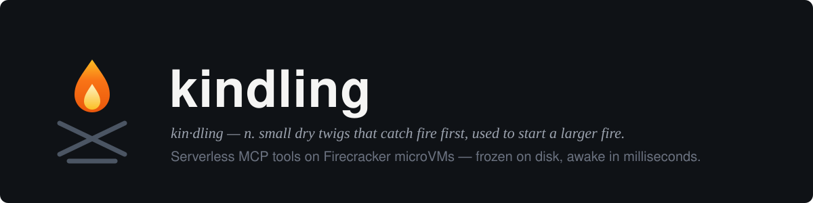

<p align="center">
  
</p>

<p align="center">
  <a href="https://github.com/juan52878911/kindling/releases"></a>
  <a href="https://github.com/juan52878911/kindling/actions/workflows/ci.yml"></a>
  <a href="LICENSE"></a>
</p>

<p align="center"><b>English</b> · <a href="README.es.md">Español</a></p>

# kindling

kindling runs microVMs — Firecracker on Linux, Virtualization.framework on macOS — that
wake in milliseconds from frozen templates (golden snapshots) instead of booting.
A frozen machine is a file on disk: it costs no CPU and no RAM until it is thawed, and
it is isolated by a hypervisor, not by a shared kernel. It is one daemon and one CLI,
`kling`, which grows through extensions.

**Full documentation: [kindling.asccilabs.com](https://kindling.asccilabs.com)** ·
in the repo: [`docs/`](docs/README.md), starting with the [full guide](docs/guide.md).

## Install

**Linux with KVM** (amd64 or arm64):

```sh
curl -fsSL https://raw.githubusercontent.com/juan52878911/kindling/main/scripts/install.sh | sh
kling up            # checks KVM, nftables, the kindling user and the images; prints what needs sudo
```

The daemon can also run as a systemd service on a remote host, deployed from a checkout:
`make deploy HOST=ssh://user@host`. The CLI then reaches it over SSH
(`kling context add lab ssh://user@host`) — the daemon never listens on a network port.

**Mac with Apple Silicon** (macOS 14+, native `vz` backend, no root):

```sh
curl -fsSL https://raw.githubusercontent.com/juan52878911/kindling/main/scripts/install.sh | sh
brew install e2fsprogs
kling up -check
kling image copy min -from ssh://user@linux-arm64-host   # images are built on Linux
```

The script verifies every binary against the release's `SHA256SUMS`, installs to
`~/.local/bin` without sudo, and takes `--with mcp,sandbox`, `--tag vX.Y.Z` and
`--prefix DIR`. To upgrade later: `kling upgrade` (`sudo` on Linux) swaps the binaries,
restarts the daemon, checks it and rolls back by itself if it fails. From source:
`make install` (plus `make vz` on a Mac). Details:
[`docs/mac.md`](docs/mac.md), [`docs/releases.md`](docs/releases.md),
[`docs/actualizar.md`](docs/actualizar.md) (upgrades).

## Try it

```sh
kling try -- uname -a        # throwaway microVM: create, run, print, delete
kling run -name demo         # boot a machine
kling freeze demo            # freeze it to disk: 0 CPU, 0 RAM
kling thaw demo              # back in tens of milliseconds

kling image import postgres:17-alpine -e POSTGRES_PASSWORD   # a Docker image, pinned by digest
kling run -image postgres-17-alpine -mem 512M -wait-ready     # its ENTRYPOINT, supervised
```

Docker images run as they are, each as its own base: [`docs/imagenes.md`](docs/imagenes.md).

`kling doctor` checks the daemon, versions and extensions and gives the fix for every
failure; `kling help <command>` shows one command's help.

## Extensions

- **`kling mcp`** — any MCP server (npm or PyPI) as a service that wakes on demand from
  a golden snapshot, behind one gateway for your AI agent. [`ext/mcp`](ext/mcp/README.md)
- **`kling sandbox`** — multi-tenant sandboxes for code agents: tokens, quotas,
  templates and a prewarmed pool. [`ext/sandbox`](ext/sandbox/README.md)
- **`kling db`** — a disposable Postgres (also MySQL, Redis, SQLite) per test or agent,
  copied from a warm template in milliseconds. [`docs/db.md`](docs/db.md)
- **`kling phone`** — Android phones (Redroid) in microVMs, each with its own identity,
  a screen wall and an MCP server. [`ext/phone`](ext/phone/README.md)

Install one with `kling plugin install <name>`; every binary in a release is compatible
with every other. Writing your own: [`docs/extensions.md`](docs/extensions.md).

## More

- [`SECURITY.md`](SECURITY.md) — the guest is assumed hostile: threat model, barriers
  and what is not solved yet.
- [`CHANGELOG.md`](CHANGELOG.md) — what each version brought.
- [`docs/benchmarks.md`](docs/benchmarks.md) — every measured number and its hardware.
- [`docs/api.md`](docs/api.md) — the daemon API, for talking to it from another program.

Apache-2.0 — see [`LICENSE`](LICENSE) and [`NOTICE`](NOTICE).
