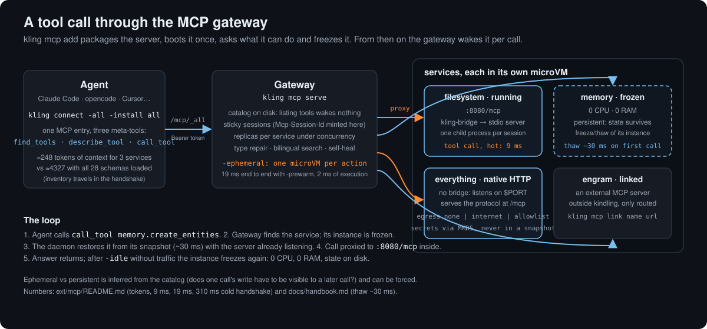

# Host MCP servers for Claude Code, opencode and Cursor

Take any open source MCP server — npm or PyPI, stdio or native Streamable HTTP — and turn
it into a service that wakes on demand from a golden snapshot, in its own microVM, and plug
your agent into it with one command. This is what kindling was built for; the extension is
[`ext/mcp`](../../ext/mcp/README.md).

<p align="center"></p>

## 1. Install the extension

On your machine (where you run `kling` and your agent):

```sh
kling plugin install mcp          # kling-mcp and its companion kling-bridge, sha256-checked against the release
kling plugin ls                   # mcp  0.14.0  ok  connect  …/plugins/kling-mcp
```

On the daemon host, the other half: the gateway and self-heal units, the packager and the
bridge that goes inside every image. From a checkout, `cd ext/mcp && make deploy
HOST=ssh://user@host`; or unpack `kindling-mcp-host.tar.gz` from the release. Then `kling up`
lists the extension units (`kling-gateway`, `kling-heal`) among what to enable. If the
daemon runs on the same machine, the two halves are the same install.

## 2. Add a server

```sh
kling mcp search filesystem                     # the official registry; says what it can package unattended
kling mcp add io.github.domdomegg/filesystem-mcp
kling mcp ls -v                                 # every tool of every service, without waking anything
```

`mcp add` builds the image (on a shared `node` or `python` base when the daemon has one),
boots a template, asks the server what it can do, freezes it as a golden snapshot and stores
its catalog. From then on, listing tools reads the catalog on disk. Useful flags:

| Flag | |
|---|---|
| `-as name` | the service name (default: the server's, without namespace) |
| `-arg value` | a required argument of the server; repeatable |
| `-env KEY=value` | switches baked into the entrypoint — plain text, **not for secrets** |
| `-volume name[:/mount][:ro]` | persistent storage, declared now (Firecracker cannot add disks later) |
| `-bundle` | collapse `node_modules` into one file with esbuild: cold `initialize` ~7 s → ~2.5 s; the lever on arm64/Mac |
| `-cmd "…"` | override the inferred start command |
| `-dry-run` | show the plan |

A server that only speaks stdio gets `kling-bridge` in front, inside the VM, and looks
HTTP-native from outside (one child process per session). A server that speaks Streamable
HTTP itself listens on `$PORT` and serves `/mcp`; no bridge. Servers that need a browser,
internet egress or native binaries are detected and configured accordingly.

`kling mcp import <name> -image ` does the same cycle for an image you built yourself
([`ext/mcp/README.md`](../../ext/mcp/README.md#turning-any-mcp-server-into-a-service)).

## 3. Connect your agent

```sh
kling connect                                   # step-by-step guide
kling connect -all -install all                 # one entry for ALL services, in every detected agent
kling connect -all -install claude-code         # or just one: claude-code, opencode, cursor, vscode, windsurf, cline, zed
kling connect -all -only filesystem,memory -install opencode
kling connect filesystem                        # a single service: URL, status, config to paste
```

`connect` does a real MCP `initialize` and lists the tools before it writes anything, backs
up the file it touches (`.kling-backup`) and, for Claude Code, uses `claude mcp add` when the
CLI is there. The token comes from `gateway.token`; the address agents use from
`gateway.url` (`kling config set gateway.url http://host:8080` when the daemon is remote).

The `_all` entry exposes three meta-tools — `find_tools`, `describe_tool`, `call_tool` —
and puts the full inventory (names, not schemas) in the handshake. Measured on a real
catalog: **≈248 tokens** for 3 services versus **≈4327** with all 28 schemas loaded; the
crossover is around 8 tools. `-expand` loads the full catalog for clients that prefer it.

Already have the same MCP configured directly? Move it without renaming its tools, so
skills and prompts that reference `filesystem.read_text_file` keep working:

```sh
kling mcp migrate filesystem -install claude-code
```

## 4. Run the gateway

```sh
kling mcp serve                                 # routes /mcp/<service> and /mcp/_all; Bearer token by default
kling mcp serve -idle 2m                        # freeze an instance after 2 minutes without traffic
kling mcp serve -ephemeral -prewarm 3           # one microVM per action, born and destroyed; 19 ms end to end
kling mcp serve -keepwarm 2                     # keep the 2 most used services' primary running (Mac)
kling mcp serve -hosts lab=ssh://…,edge=ssh://…  # several daemons behind one gateway
```

Sessions are sticky (the gateway mints the ids clients see), the same tool can be used in
parallel through replicas created from the golden on demand, and idle instances freeze to 0
CPU / 0 RAM and come back in ~30 ms on the next call. Whether a service is *ephemeral* (only
queries) or *persistent* (something one call writes must be visible to a later one) is
inferred from its catalog and shown in `mcp ls`; force it with `-stateful`/`-ephemeral` on
import.

## 5. Secrets, network and state

- **Secrets never touch a snapshot.** Inject them into the live machine through MMDS,
  per session:

  ```sh
  kling machine secret <ref> -f store.json      # or JSON on stdin
  ```

  A machine that received secrets **can no longer be frozen**; that is enforced.
- **Egress** is `none` by default. `-egress internet` never reaches private ranges;
  `-egress allowlist -allow api.github.com,pypi.org` is fail-closed. The policy travels with
  the service's snapshot.
- **State**: an ephemeral action keeps nothing; a persistent service keeps its overlay
  across freeze/thaw but loses it if its instance is deleted; a `-volume` survives
  everything. For state shared by many tools, link an external memory server:

  ```sh
  kling mcp link engram http://192.168.2.3:9100/mcp -description "shared memory"
  ```

## 6. Keep it healthy

```sh
kling mcp health                 # probe every service, record the result
kling mcp verify <svc> -deep     # a real tool call and the guest's DNS
kling mcp heal                   # after a host reboot: rebuild only the goldens it invalidated
kling mcp refresh <svc>          # recapture the catalog after updating the server
kling mcp export -o topology.html   # a self-contained page: host, services, instances, layers, network
```

`kling status` shows the gateway's health, how many services are healthy and which agents
it found on your machine. When a call misbehaves, the gateway repairs the JSON shapes
clients commonly mangle (arrays as `{"0":…}` objects, numbers as strings) and logs every
repair. Details, transcripts and numbers: [`ext/mcp/README.md`](../../ext/mcp/README.md).
