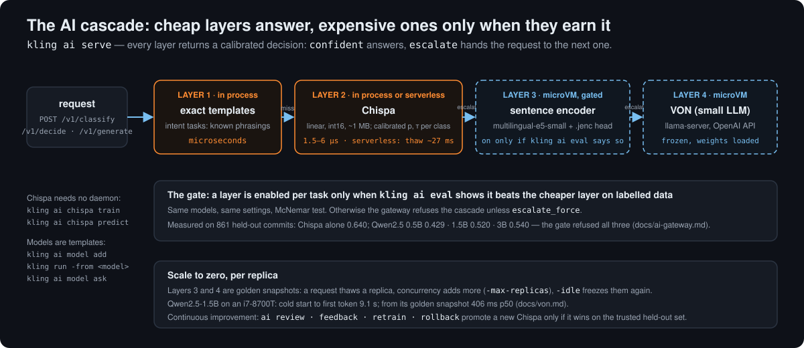

# Serverless AI: a Chispa classifier and a local LLM behind `kling ai`

Two kinds of model, one gateway. **Chispa** is a tiny linear classifier (hashed words,
bigrams and structured fields; int16 weights; ~1 MB) that answers in microseconds with a
calibrated probability and a per-class threshold: `confident` or `escalate`. **VON** is a
small instruct LLM (SmolLM2, Qwen2.5) served by llama.cpp from a microVM that is frozen
with the weights already loaded and thawed per request. `kling ai serve` puts both behind
one API and freezes what is idle.

Design and numbers: [`docs/ai-gateway.md`](../ai-gateway.md), [`docs/chispa.md`](../chispa.md),
[`docs/von.md`](../von.md), [`docs/chispa-serverless.md`](../chispa-serverless.md).

<p align="center"></p>

## 1. Train a Chispa classifier (no daemon needed)

Data is JSONL, one example per line, with `text`, `label` and optional `fields`:

```
{"text": "panic in the parser when the cache is cold", "label": "fix", "fields": {"service": "api", "files": 3}}
{"text": "add dark mode toggle to settings", "label": "feat", "fields": {"service": "web", "files": 5}}
```

```sh
kling ai chispa train -data train.jsonl -valid valid.jsonl -o commits.chispa
kling ai chispa eval -model commits.chispa -data test.jsonl          # accuracy, macro-F1, ECE, coverage at τ
kling ai chispa predict -model commits.chispa -text "segfault resolving symlinks" -fields '{"ext":".zig"}'
kling ai chispa inspect commits.chispa
```

`predict` prints the label, its calibrated probability, whether it cleared the threshold,
the candidates and the features that decided:

```json
{"label":"fix","index":5,"prob":0.393,"threshold":0.517,"confident":false,"decision":"escalate",
 "probs":[{"label":"fix","prob":0.393},{"label":"refactor","prob":0.152}],
 "evidence":[{"feature":"f:ext=.zig","weight":0.174},{"feature":"w:segfault","weight":0.085}]}
```

Without `-text` it reads JSONL from stdin and writes one JSON per line: that is how another
process uses it. Prediction costs 1.5–6 µs and is bit-identical on amd64 and arm64. With
fewer than ~30 examples per class it will not learn that class; the evaluation on 4,304 real
commits, thresholds included, is in [`docs/CHISPA-EVAL.md`](../CHISPA-EVAL.md).

## 2. Build a VON model (a template with the LLM loaded)

```sh
kling ai model ls                                                   # the catalog: Apache-2.0/MIT weights only
kling ai model add von-qwen15 -model qwen2.5-1.5b-instruct -quant q4_k_m
kling run -from von-qwen15 -name q1                                 # a replica, weights already in memory
kling ai model ask q1 "What is a microVM, in one sentence?"         # answer + tokens/s
kling rm q1
```

`ai model add` builds the image (llama.cpp + the GGUF, pinned by revision and sha256),
boots it, waits for the model to load and warm, and saves the template. On an i7-8700T,
Qwen2.5-1.5B answered its first token in **406 ms p50** from the template versus **9.1 s**
booting cold ([`docs/von.md`](../von.md#x86-sin-anidar-i7-8700t)). Replicas of one template
share the weights in the host page cache on Linux. Every replica exposes an
OpenAI-compatible API on port 8000; the gateway below is what wakes them on demand.

On a Mac, build the image on a Linux arm64 daemon (`-build-only`) and copy it
(`kling image copy`); the template is made where the daemon runs.

## 3. The gateway: `ai.json`

```json
{
  "models": {
    "commits": {"kind": "chispa", "path": "commits.chispa"},
    "qwen":    {"kind": "von", "snapshot": "von-qwen15", "max_replicas": 2}
  },
  "tasks": {
    "commit-type": {"chispa": "commits"},
    "summarize": {
      "von": "qwen", "max_tokens": 64, "temperature": 0.2,
      "system": "You write very short summaries.",
      "prompt": "Summarize this {kind} in one sentence:\n{input}"
    }
  }
}
```

```sh
kling ai up                                       # ./ai.json or ~/.config/kling/ai.json, on http://127.0.0.1:8080
kling ai ls                                       # models, tasks, cascades, samples
kling ai test commit-type "fix crash when the cache is cold"
kling ai generate summarize -var kind="commit message" "fix(parser): handle empty input"
```

`ai up` prints the URL and a `curl` to try before it starts serving. `ai serve` is the
long-running form: a 0600 Unix socket by default, TCP only with `-listen` and a token,
`-idle 2m` before a replica is frozen, `-max-replicas` per model, `-keepwarm N` for the N
most used models (0 = pure scale to zero).

```sh
curl -s http://127.0.0.1:8080/v1/classify -d '{"task":"commit-type","text":"fix crash when the cache is cold"}'
curl -s http://127.0.0.1:8080/v1/chat/completions -d '{"model":"qwen","messages":[{"role":"user","content":"hi"}]}'
```

`/v1/classify` returns Chispa's label with `escalate: true` when it is unsure, so the caller
decides. `/v1/chat/completions` and `/v1/models` are OpenAI-compatible, with streaming; the
first request to an idle model pays the thaw, the rest do not.

## 4. Chispa serverless: one frozen microVM per task

Chispa normally runs inside the gateway process. To isolate a task, give it its own
template; the gateway wakes it like any other replica:

```sh
kling ai chispa deploy commit-type -model commits.chispa -mem 64M
kling ai chispa ls
```

Measured: ~27 ms from frozen to decision, ~2.2 ms from `paused`, hundreds of µs when awake
([`docs/despertar.md`](../despertar.md), [`docs/chispa-serverless.md`](../chispa-serverless.md)).

## 5. The cascade, only with evidence

Chaining Chispa → VON (VON answers what Chispa doubts) is opt-in per task and **only
enabled when `kling ai eval` shows, on that task's labelled data, that it beats Chispa
alone** (McNemar, same models and settings). Otherwise the gateway refuses it:

```sh
kling ai eval commit-type -data test.jsonl -von qwen     # writes the record that gates escalate_to
kling ai reload                                         # says which cascades are on, forced or refused
```

On 861 held-out commits, Chispa alone reached 0.640; Qwen2.5 0.5B, 1.5B and 3B reached
0.429, 0.520 and 0.540, so the gate refused all three ([`docs/ai-gateway.md`](../ai-gateway.md)).
That is one task's evidence, not a general claim about small models.

## 6. Keep it improving

```sh
kling ai review commit-type -n 20        # captured escalations a person should confirm or correct
kling ai feedback commit-type -id ID -label fix
kling ai retrain commit-type             # trains a shadow Chispa; promotes it only if it wins on the trusted held-out set
kling ai rollback commit-type            # serve the previous version
```

Details: [`docs/mejora-continua.md`](../mejora-continua.md). For short commands that need
an intent plus slots (`/v1/decide`), see [`docs/intent.md`](../intent.md); two complete
programs built on the gateway are [`examples/ci-triage`](../../examples/ci-triage) and
[`examples/domotica`](../../examples/domotica).
